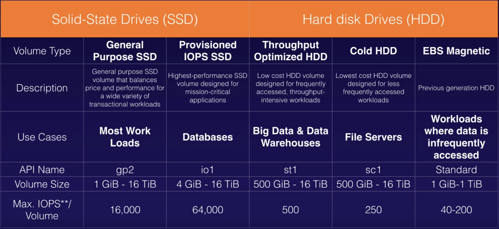
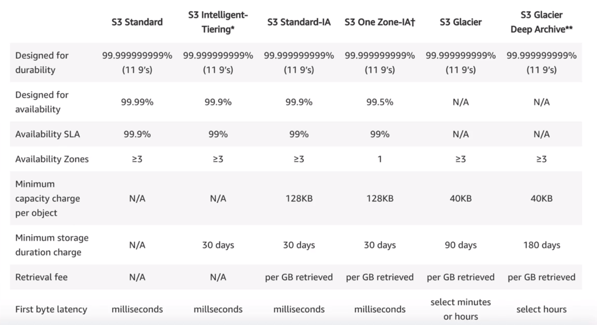
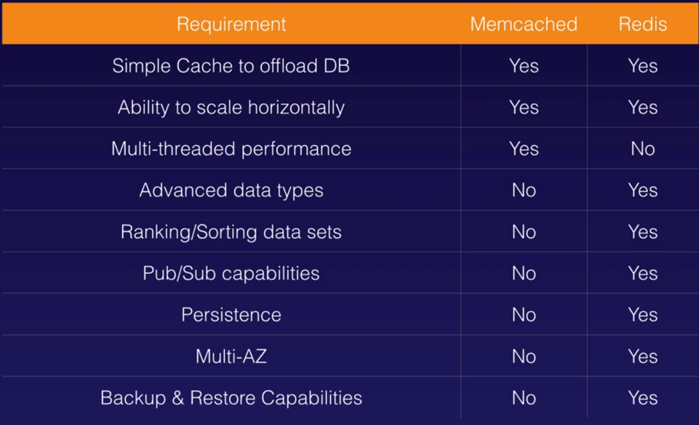
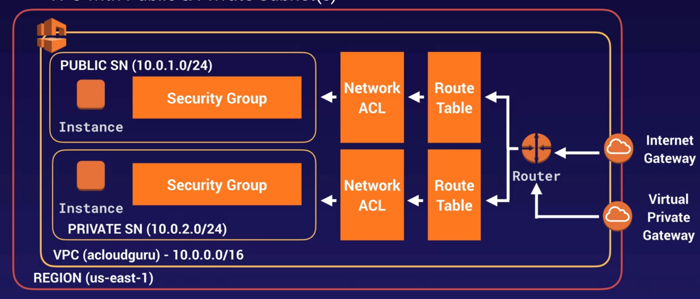
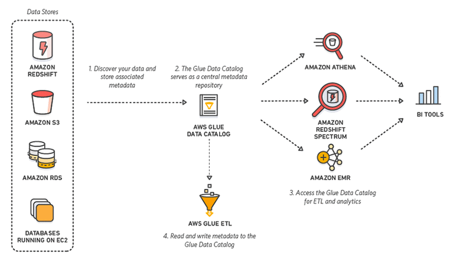

# AWS Certified Solutions Architect Associate

## Compute services

### EC2
- Termination protection is turned off by default
- The default action for the root **EBS volume is to be deleted when the instance is terminated**
- The other volumes are not deleted by default when the instance is terminated
- You can encrypt your root volume and the others
- You can create an encrypted root volume
- Snapshots of encrypted volumes are encrypted automatically
- You can only **share unencrypted snapshots**
- To encrypt a non encrypted volume:
    - Create snapshot
    - Copy to encrypted
    - Create AMI from that snapshot
- Changes in security groups take effect immediately
- **Security group is stateful**, same rule applies for inbound and outbound
- With security groups you can not blacklist or create deny rules
- You can attach more than one security group to EC2 instance (up to **five**)
- You can attach one security group to multiple instances
- By **default**, in a security group **all inbound traffic is blocked and all outbound allowed**
- You **can't delete the default group**, but you can change the group's rules
- By default, a new EC2 instance uses an **IPv4** addressing protocol
- With EC2 Hibernate, the instance boots much faster (preserver RAM in EBS, so no need to reload the OS). Useful for long-running processes or services that take time to initialize
- To use **hibernation** the root volume must be **encrypted**
- To use hibernation RAM must be less than 150 GB
- Instances can't be hibernated more than 60 days
- Hibernate is available for On-Demand and Reserved Instances
- You can define boostrap scripts
- You can get information about an instance (such as public ip) from `IP/latest/meta-data/` (default info) or `IP/latest/user-data/` (custom info)
- Hypervisors: Xen and Nitro
- In order to achieve the 64,000 IOPS for a provisioned IOPS SSD, you must provision a **Nitro-based** EC2 instance. The maximum IOPS and throughput are guaranteed only on Instances built on the Nitro System provisioned with more than 32,000 IOPS. Other instances guarantee up to 32,000 IOPS only
- **Hot attach**: Attach the ENI to an instance when it is **running**
- **Warm attach**: Attach the ENI to an instance when it is **stopped**
- **Cold attach**: Attach the ENI to an instance when is being **launched**
- When stopped and restarted the underlying host of the instance is possibly changed
- There is no cost if the instance is running and it has only one associated EIP
#### Pricing
- On demand
    - Pay as you go
    - **On-Demand Capacity Reservations**: provide compute capacity that is always available on the specified recurring schedule
- Reserved
    - Significand discount and contracts of 1 or 3 years
    - Convertible Reserved Instances allow you to exchange for another convertible reserved instance of a different instance family
    - When reserve expires if not terminated then billed as on-demand
- Spot
    - Bid for low price and compute when available
    - If you terminate then you pay for the partial hour, not the same for AWS termination
- Dedicated host
#### Spot instances and Spot fleet
- Spot instances can save up to 90% of the cost on-demand
- Useful for any type of computing where you don't need persistent storage
- You can block Spot instances from terminating using Spot block
- A Spot Fleet is a collection of Spot Instances and, optionally, On-Demand instances
- When Amazon EC2 is going to interrupt your Spot Instance, it emits an event two minutes prior to the actual interruption
- In rare situations, Spot blocks may be interrupted due to Amazon EC2 capacity needs
- It is possible that your Spot Instance is terminated before the warning can be made available
#### Placement Group
- The name for the placement group must be unique in your AWS account
- Only certain types of instances can be placed in placement groups
- AWS recommends homogeneous instances
- You can't merge placement groups
- You can move an existing instance to a placement group (It needs to be stopped and only by CLI or SDK, not available by console yet)
##### Types
- Clustered Placement Group
    - All in the same AZ (can not span multiple AZ)
    - For low network latency and high network throughput
    - To solve `insufficient capacity error` you can stop and restart all the instances (may migrate them to hardware that has capacity for all the requested instances)
- Spread Placement Group
    - Each placed on distinct underlying hardware
    - Can be in multiple AZ
    - For individual critical instances
- Partitioned
    - Each partition has its own set of racks
    - For multiple instances

### ECS (Elastic Container Service)
- Managed container orchestration service
- **Not supports resource-based policies**
#### Components
- Cluster: logical collection of ECS resources (EC2 instances or Fargate instances)
- Task definition: defines your application
- Container definition: inside a task definition it defines the individual containers and controls the CPU and memory allocation and the port mapping
- Task: single running copy of any containers defined by task definition
- Service: allows task definitions to be scaled by adding tasks, defines max and min values
- Registry: storage for container images
- Supports ELB
- **Task Roles applies policy per task**

### EKS (Elastic Kubernetes Service)
- **K8s**
- Same toolset on-premise and cloud
- Containers are grouped in pods
- Supports EC2 and Fargate
- Use EKS if you already use K8s and want to migrate to AWS

### Fargate
- Serverless container engine
- **Eliminates need to provision and manage servers**
- Specify and pay for resources per application
- Works with ECS and EKS
- Each workload run in its own kernel
- Isolation and security
- Choose EC2 instances instead if you have compliance requirements or require broader customizations or access to GPUs

### ECR
- Managed Docker container **registry**
- Store, manage and deploy images
- Integrated with ECS and EKS
- Works with on-premise deployments
- HA
- Integrated with IAM

### AWS Batch
- For orchestration and automation

### AWS ParallelCluster
- For orchestration and automation

### SAM
- Helps define and deploy your serverless functions

### Lambda
- Can be used as event-driven compute or as a compute service to run code in response to HTTP requests using API Gateway
- Scales out automatically
- Is serverless
- Supports Node, Java, Python, C#, Go, PowerShell, Ruby
- Priced on the number of requests and duration rounded to **1ms**
- Lambda functions can trigger other lambda functions
- Architectures can be extremely complicated, AWS **X-ray** allows you to debug what is happening
- Lambda can do things globally
- The default timeout is 3 seconds and the **maximum** execution duration per request in AWS Lambda is **900 seconds**, which is equivalent to **15 minutes**
#### Triggers
- API Gateway (sync)
- Alexa Skill (sync)
- Cognito (sync)
- IoT Rule
- SNS
- Kinesis
- SQS
- S3
- DynamoDB
- EventBridge
- CloudWatch
- CloudFront (sync)
- ALB (sync)
- Lex (sync)
- Kinesis Data Firehose (sync)

### Elastic Beanstalk
- You can deploy and manage applications without worrying about the infrastructure
- You simply upload the application, it handles automatically the details of capacity provisioning, load balancing, scaling and application health monitoring

### Elastic transcoder
- Media transcoder in the cloud
- Converts media files to different formats
- Provides transcoding presets for popular output formats
- Pay based on the minutes that you transcode and the resolution at which you transcode

## Storage services

### EBS
- Volume in same AZ than the EC2
- Snapshot exists in S3
- Snapshots are incremental
- Is recommended to stop the instance to create a snapshot from the root volume
- You can change EBS volume size and type on the fly
- To move a volume to other AZ you need to create a snapshot, then create image (AMI) from snapshot and finally launch in the desired AZ
- To move a volume to another region, snapshot it, create AMI, copy AMI to other region and the use copied AMI to launch EC2 instance
- Is not configured as an NFS file system
- Use Amazon Data Lifecycle Manager (Amazon DLM) to automate the creation of EBS snapshots
- Lower latency than S3
- **You can enable the EBS Encryption By Default feature for the AWS Region**
#### Volume types
##### SSD
- For small, **random I/O** operations
- Can be used as bootable volume
- Best for transactional workloads, IOPS performance, database performance
- Focused in IOPS
- Types:
    - General purpose SSD (gp2)
    - Provisioned IOPS SSD (io1)
        - For critical business applications that require sustained IOPS performance
        - For databases
        - For each 10 GiB volume can be provisioned with up to 500 IOPS, up to limit
##### HDD
- For large, **sequential I/O** operations
- Can not be used as bootable volume
- Best for large streaming workloads, big data
- Focused in throughput (MiB/s)
- Types:
    - Throughput optimized HDD (st1)
      - For frequently accessed data
    - Cold HDD (sc1)
      - For infrequently accessed data

#### RAID
- RAID 0: enables you to improve your storage volumes' performance by distributing the I/O across the volumes in a stripe
- RAID 1: used for data mirroring
#### AMI types
- Instance Store Volumes are sometimes called Ephemeral Storage
- Instance store volumes can not be stopped. If the underlying host fails you will lose the data
- EBS can be stopped without any lose
- You can reboot both without any lose
- By default, boot root volumes will be deleted on termination but with EBS you can tell AWS to keep it

### EFS (Elastic File System)
- File storage service for EC2 that can be shared
- Supports Networking File System v4 (NFSv4) protocol
- **POSIX-compliant** shared file system
- You only pay for the storage you use (no pre-provisioning required)
- Can scale to petabytes
- Can support **thousands of concurrent** NFS connections
- Data is stored across multiple AZ's within a region
- Read after write consistency
- Provide low-latency file operations, but EBS has better low-latency

### Amazon FSx for Windows
When you need centralised storage for Windows-based applications such as Sharepoint, MicrosoftSQL Server, Workspace,
IIS Web Server or any other native Microsoft Application. Runs on Windows Server Message Block (SMB)-based file services.

### Amazon FSx for Lustre
When you need high-speed, high-capacity distributed storage. This will be for applications that do High Performance
Compute (**HPC**), financial modelling etc. Can store data directly on S3.

### S3
- Object-based storage
- File size from 0 bytes to 5 TB
- Stored in Buckets
- Universal namespace
- 200 status response when create file and the MD5 checksum
- Key, value, metadata and version ID, and subresources (ACL and Torrent)
- built for 99.99% availability, guarantee 99.9%
- 11 9s for durability
- Can configure MFA Delete
- **Versioning can not be disabled, only suspended**
- Each version needs to be public individually
- Deleting deleted object with version restores it
- Lifecycle management
- S3 Select allows to query data with SQL (csv in zip for example)
- Glacier Select
- **Cross region replication requires versioning** to be enabled in both buckets
- Cross region replication only starts when is activated and with new versions, old objects aren't replicated
- Cross region replication now copies public permission on the file
- Cross region replication not replicated delete markers or deleting individual versions
- **S3 Transfer acceleration** uses CloudFront Edge network to accelerate S3 uploads
- Path style url will be eventually deprecated
- **The "resource owner" refers to the AWS account that creates Amazon S3 buckets and objects**
- Objects must be stored **at least 30 days** in the current storage class before you can transition them to **STANDARD_IA or ONEZONE_IA**
#### Consistency
- R and W consistency for PUTS on new objects
- Eventual consistency for overwrite PUTS and DELETES (changes take time)
#### Storage classes
- S3 standard: when require multiple AZ
- S3 IA: for fast infrequent access, charged retrieval fee
- S3 One zone IA: for fast infrequent access, when no require multiple AZ
- S3 Intelligent tier: automatic management of tier
- S3 Glacier: retrieval times configurable from **minutes to hours**
- S3 Glacier Deep Archive: lowest cost, retrieval time of **12 hours**
  
#### Glacier retrievals
- **Expedited retrievals** typically allows access in less than 5 min, provisioned capacity ensures this
- **Provisioned capacity** allows for each unit provides 3 expedited retrievals can be performed every 5 min and at 150 MB/s
#### Performance
- You can get better performance by spreading you reads across different prefixes (paths)
  - 3.500 PUT/COPY/POST/DELETE
  - 5.500 GET/HEAD
- Keep in mind KMS limits
  - 5.500 / 10.000 / 30.000 depending on region, quota can not be increased
- Multipart upload, recommended over 100 MB, required over 5GB
- Byte-Range Fetches for download big files
#### Security and encryption
- Can enable access logs (**Server access logging**)
- Encryption in transit (SSL/TLS)
- Encryption **at rest** (server side)
    - S3 Managed Keys (SSE-S3)
    - AWS Key Managed Service (SSE-KMS)
        - SSE-KMS also provides you with an audit trail that shows when your CMK was used and by whom
    - Customer Provided Keys (SSE-C)
- Client side encryption
#### S3 Object Locks
- Use to store once read many (WORM)
- Can be applied to individual objects or buckets
- Two modes
    - **Governance** (special permissions)
    - **Compliance** (nobody)
#### Cross account access
- Bucket policies + IAM (on the bucket). Only programmatic access.
- Bucket ACLs + IAM (individual objects). Only programmatic access.
- Cross account IAM Roles. Programmatic and consoles access.
#### Charges
- Storage
- Requests
- Storage Management Pricing
- Data Transfer Pricing
- Transfer Acceleration
- Cross Region Replication Pricing
#### Host a website
- **The S3 bucket name must be the same as the domain name**
- Requires a registered domain name

### Storage gateway
- File gateway
    - For flat files
    - Can store in S3 using the **NFS and SMB protocols**
    - Stored directly to S3
    - Can then **mount an SMB shared mounted as local disk**
- Volume gateway
    - Stored volumes
        - Entire dataset stored on site and asynchronously backed to S3
        - Internet Small Computer System Interface (iSCSI) devices
    - Cached volumes
        - Entire dataset stored in S3 and the most frequently accessed data is cached on site
        - Internet Small Computer System Interface (iSCSI) devices
- Tape gateway
    - For tape backup that needs to be migrated to AWS S3 or AWS Glacier

## Database services

### Aurora
- MySQL and PostgreSQL compatible relational database
- 10GB to 10GB up to 64TB
- Compute resources can scale up to 32vCPU and 244GB of Memory
- 2 copies in each AZ with minimum of 3 AZ
- **Can lose 2 copies without affect writes and 3 without reads**
- Storage auto-healing
- Using endpoints, you can map each connection to the appropriate instance or group of instances based on your use case
- Has a built-in Cluster endpoint (aka writer)
- Has a built-in Reader endpoint
- Types of replicas:
    - Aurora (15) (Only with automated failover available)
    - Mysql (5)
    - PostgreSQL(1)
- The read replication latency of less than 1 second is only possible if you would use Amazon Aurora replicas
#### Backups
- Automated enabled by default without any impact on performance
- Can take snapshots without any impact on performance
- Can share snapshots with other AWS accounts
#### Aurora Serverless
- Provides a relatively simple, cost-effective option for infrequent, intermittent or unpredictable workloads

### DynamoDB
- NoSQL
- Stored on SSD
- Spaced across 3 geographically distinct data centers
- Eventual Consistent Reads (Default)
- Strongly Consistent reads (Reflects all writes, for millisecond read after write)
- The maximum item size (key + value) in DynamoDB is 400 KB
- **Solve throttling by enabling auto-scaling**
#### DynamoDB Streams
- Captures a time-ordered sequence of item-level modifications in any table
- Stores this information in a log for up to 24 hours
#### DynamoDB Accelerator (DAX)
- Read and write caching (to reduce response times from **milliseconds to microseconds**)
#### Transactions
- Up to 25 items or 4 MB
- Consume more reads / writes (prepare and commit)
#### On-Demand Capacity
- Not the default
- Pay-per-request
- No minimum capacity
- No charge for read/write (only storage and backups)
- Pay more per request than with provisioned
- **Used for new product launches**
#### On-Demand Backup and restore
- Full backups at any time
- Zero impact on performance or availability
- Consistent in seconds and retained until deleted
- Operates in same region as the source table
#### Point in Time Recovery (PITR)
- Restore to any point in the last **35 days**
- Incremental backups
- Not enabled by default
- Latest restorable: **five minutes in the past**
#### Global Tables
- **Require streams** (24h changes history)
- Requires to add a region the table
- **Almost instantaneously**
#### Security
- Encryption at rest with KMS
- Site-to-site VPN
- Direct connect (DX)
- IAM policies and roles
- Fine-grained access
- Can monitor with CloudWatch and CloudTrail
- VPC endpoints

### ElastiCache
- Supports Memcached and Redis
- Redis is Multi-AZ
- Memcached is multi-thread
- You can do backups and restore Redis
- Using **Redis AUTH** command can improve data security by requiring the user to enter a password before they are granted permission to execute Redis commands on a password-protected Redis server

### RDS
- Multi-AZ: for disaster recovery, automatically provisions and maintains a synchronous “standby” replica in a different AZ (can have read replicas in multiple AZ)
- Multi-AZ requires one to two minutes to complete failover
- Read replicas: for performance (require automatic backups, limit of 5 for database instance, can chain but increase latency)
- For OLTP
- Run on virtual machines and you can't log in
- Patching is AWS responsibility
- Not serverless
- Automated backups enabled by default
- Replicas can be promoted to master
- You can enable storage autoscaling to never run out of disk space or manually increase the allocated storage
- When encrypted then all is encrypted (backups, read replicas and snapshots)
- Max size of 16TB
- You can invoke an AWS Lambda function from an Amazon Aurora MySQL-Compatible Edition DB cluster with a native function or a stored procedure
- Use Enhanced Monitoring to closely monitor how the different processes or threads on a DB instance use the CPU
- Enable IAM DB Authentication to use an authentication token (15 min lifetime)
- Amazon RDS Root CA certificate can be used to increase security

### Redshift
- Data warehouse for OLAP
- Can be single node (160 GB) or multi node (leader node and compute nodes, up to 128 for each leader node)
- Advanced compression automatically
- Massive parallel processing (MPP): distributes loads in all nodes
- Backups enabled by default with 1 day retention, configurable up to 35
- Always attempts to maintain 3 at least 3 copies (original, replica one in compute nodes and backup in S3)
- Can asynchronously replicate to S3 in another region for disaster recovery
- Only compute nodes are charged, not leader
- Backups and data transfer are charged
- Only available in 1 AZ
- Automated snapshots are not enough for a region outrage
- **Can enable Cross-Region Snapshots**
- **Redshift Spectrum** allows you to directly run SQL queries against exabytes of unstructured data in Amazon S3

## Migration services

### Database Migration Service (DMS)
- Helps to migrate databases from and to AWS and also between on-premises through AWS.
- Supports homogeneous and heterogeneous migrations
- SCT (Schema Conversion Tool) is required for heterogeneous migrations

### AWS DataSync
- Used to move large amount of data from on-premise to AWS (on-premises storage will no longer be used)
- Used with **NFS and SMB** compatible file systems
- Replication can be done hourly, daily or weekly
- Install the DataSync agent to start the replication
- Can be used to replicate EFS to EFS
- Can move directly to **S3 Glacier Deep Archive**

### Snowball Edge
- Used to transfer massive amounts of data
- Is a transported device
- Can import and export to S3

### Snowmobile
- Up to 100PB

## Networking and content delivery

### API Gateway
- Low cost (pay by calls and data transferred) and scales automatically
- Can throttle to prevent attacks
- Can log results to CloudWatch
- You can enable caching
- Can configure Same Origin Policy and CORS (helps to prevent XSS)
- CORS is enforced by the client browser

### CloudFront
- **Edge Location: not just read only**
- **Lambda@Edge** lets you run code closer to users of your application, which improves performance and reduces latency
- Customize the content that the CloudFront web distribution delivers to your users using Lambda@Edge, which allows your Lambda functions to execute the authentication process in AWS locations closer to the users
- Object cached for the life of TTL
- You can clear cache objects (invalidations), but you will be charged
- Origin: S3/EC2/ELB/Route53
- Origin Access Identity (**OAI**): for security
- the Cache-Control max-age directive is set to zero if the origin server is being hit for each request instead of the AWS Edge locations
- Distribution: Name given the CDN which consist of a collection of Edge Locations
- **Web Distribution**: for websites, supports **SNI Custom SSL**
- RTMP: for media streaming
#### Signed URLS and cookies
- 1 file = 1 URL
- 1 cookie = multiple files
- If your origin is EC2 the use CloudFront

### Route 53
- Always use Alias record over CNAME
- AAAA record is IPv6 and A is IPv4
- You can buy domain names in AWS and can take up to 3 days
- **To point a subdomain to an ELB you need an Alias or CNAME record**
#### Routing policies
- Simple routing: One record with multiple IP addresses, returns values in random order
- Weighted routing: Splits traffic based on weights
- Latency-based routing: Routes to the lowes latency region available
- Failover routing: When the primary route is not available then uses the secondary one
- Geolocation routing: Based on the geographic location (continents or countries) of the users
- Geo-proximity routing (traffic flow only): Can create extremely complicated flows
- Multivalue answer routing: Like simple routing but with health check on each IP
#### Routing failover strategies
- Active-Active: All receive traffic (not failover policy)
- Active-Passive: Only one part receive traffic (failover policy)
#### Health checks
- You can set checks on individual record sets
- If a check fail, the record is removed until it passes again
- You can set SNS notifications to alert you

### ELB
- Not have predefined ipv4 address, you resolve them using DNS name
- If the application stops responding an 504 is returned
- Target groups to aggregate targets and use as they in application load balancers
- Sticky sessions are used to link call to final EC2 destination
- **Cross zone** load balancing allows crossing AZ to keep traffic balanced
- **Distribute traffic only within their respective regions**
- Path patterns allows sending traffic to other destination base on path rules
- Can enable access logs that capture detailed information about requests sent to your load balancer
#### Types
- Application load balancers
  - For HTTP and HTTPs traffic (Layer 7)
  - Can support path-based and host-based routing
  - Can not assign Elastic IP
  - **Cross-zone load balancing always enabled**
- Network load balancers
  - For TCP traffic (Layer 4)
  - Ultra low latency and capable to handling millions of requests per second
  - Can assign Elastic IP
  - **Cross-zone load balancing disabled by default**
- Classic load balancers
  - Legacy
  - Basic load balancing at cost-effective level
  - Cross-zone load balancing disabled by default in CLI but enabled in console

### VPCs

- Default VPC creates a default Route Table, Network Access Control List (NACL) and default Security Group
- Default VPC not creates subnets or default internet gateway
- AZ are randomized
- Amazon always **reserve 5 IP addresses** within your subnets (**first 4 and last**)
- Only **one internet gateway per VPC**
- **One subnet only in one availability zone**
- **Security groups can't span VPCs**
- **Egress-only internet gateways** does not utilize IPv4 (only **IPv6**)
- Works with IPv4 and optionally with IPv6 (enabling dual-stack mode)
- Can enable or disable DNS resolution and hostnames
#### NAT Instance
- Is a EC2 instance
- Disable Source/Destination Check on the instance
- Must be in a **public subnet**
- Must be a route out of the private subnet to the NAT
- The network bandwidth of the NAT instance depends on the bandwidth of the instance type
- You can create a HA but is complicated
- Behind a security group
#### NAT Gateway
- Must be in a **public subnet**
- Redundant inside AZ
- Preferred by enterprise
- Starts at 5Gbps and scales to 54Gbps
- Not associated with security groups
- Automatically assigned public IP
- Need to update the route tables
- No need to disable the Source/Destination Check
- Create one in each AZ to get HA
#### Network ACL
- Configure inbound and outbound rules separately and each can allow or deny traffic (configure rule number by increments of 100)
- Rules applied by rule number (lower first)
- Only one NACL by subnet but can multiple subnets in the same NACL
- The VPC automatically comes with a default network ACL, and by default allows all inbound and outbound traffic
- You can add or remove rules from the default network ACL
- You can not edit or remove the default rule `* All Traffic Deny`
- You must have an **outbound rule to allow ephemeral ports** (32768 - 65535) to answer clients (used as the client’s source port for the traffic response)
#### Flow Logs
- You cannot enable for VPCs that are peering with your VPCs unless is in your account
- You can tag
- **You cannot change the configuration once it is created**
- Not all traffic is monitored: AWS DNS, Windows licences, instance-metadata, DHCP and reserved IPs by the default VPC router
#### VPC endpoints
- Without requiring gateway, NAT, VPN nor Direct Connect
- Interface: Elastic network interface with a private IP that serves as an entry point for traffic destined to a supported service
- **Gateway: For S3 and DynamoDB**
#### Bastion host
- A NAT is used to provide internet traffic to EC2 instances in private subnets
- A bastion is used to securely administer EC2 instances
- You can not use a NAT Gateway as a Bastion
- You can not use ALB because is layer 7, and you need to use layer 4
- For HA in pro you need 2 hosts in 2 AZ and use a NLB with static IP address
- For HA in dev you need an auto-scaling of 1 and a fixed EIP (you can use a user data script to provision the same)
#### VPC Peering
- You can create a VPC peering connection between your own VPCs, with a VPC in another AWS account, or with a VPC in a different AWS Region
- VPC peering connection does not support edge to edge routing like:
    - A VPN connection or an AWS Direct Connect connection to a corporate network
    - An Internet connection through an Internet gateway
    - A gateway VPC endpoint to an AWS service; for example, an endpoint to Amazon S3
    - (IPv6) A ClassicLink connection

### Direct connect (DX)
- **Directly connects data center to AWS**
- Useful for high throughput workloads
- Or if you need a stable reliable secure connection
#### Steps
- Create a virtual interface in the DC console. This is a PUBLIC virtual interface
- Go to VPC console and in the VPN connection create a Customer Gateway
- Create a virtual private gateway
- Attach it to the desired VPC
- Select VPN connections and create a new one
- Select the virtual private gateway and the customer gateway
- Once the VPN is available, set up the VPN on the customer gateway or firewall

### Global accelerator
- Is a service in which you create accelerators to improve availability and performance of your application for local and global users
- You are assigned 2 static IPs (or can bring your own), each in a different network zone
- You can control traffic using **traffic dials** in the endpoint group
- This service is more suitable for non-HTTP use cases, such as gaming (UDP), IoT (MQTT), or Voice over IP, as well as for HTTP use cases that specifically require static IP addresses or deterministic, fast regional failover
- Traffic can be routed to the closest edge location via an **Anycast static IP** address
- With AWS Global Accelerator, you can add or remove endpoints in the AWS Regions, run blue/green deployment, and A/B test without needing to update the IP addresses in your client applications

### AWS Transit gateway
- Allows you to have **transitive peering between a thousand of VPCs and on-premises data centers** (simplify topology)
- Works on hub-and-spoke model
- Works on regional basis but can have it across multiple regions
- You can use it across multiple accounts using RAM
- You can use route tables to limit how VPCs interact
- Works with Direct Connect and VPN connections
- Supports IP multicast
- **Enables you to scale the IPsec VPN throughput** with equal-cost multi-path (**ECMP**) routing support over multiple VPN tunnels
- Associate the VPCs to an Equal Cost Multipath Routing (ECMR)-enabled transit gateway and attach additional VPN tunnels to scale the throughput of the VPN connections

### AWS PrivateLink
- **For peering VPCs to a lot of customers VPCs**
- Doesn't require VPC peering
- Requires a Network Load Balancer in the service VPC and an ENI on the customer VPC

### VPN CloudHub
- Is only for VPNs and not for VPCs
- **If you have multiple sites, each with its own VPN connection, you can use this to connect those sites together**
- Hub-and-spoke model
- Low cost, easy to manage
- It operates over the public internet with all traffic encrypted

### AWS Managed VPN
- It lets you reuse existing VPN equipment and processes, and reuse existing internet connections
- It is an AWS-managed high availability VPN service
- It supports static routes or dynamic Border Gateway Protocol (BGP) peering and routing policies.

### AWS Certificate Manager
- To persist SSL/TLS certificates (IAM certificate store is another valid alternative)

### Network costs
- Use private IPs over public ones to save costs (this utilizes the AWS backbone network)
- If you want to cut all the network costs, group all EC2 instances in the same AZ and use private IPs (single point of failure)

### ENI vs ENA vs EFA
ENI: For basic networking. Perhaps you need a separate management network to your production network or a separate
logging network, and you need to do this at low cost. In this scenario use multiple ENIs for each network.

Enhanced network adapter (ENA): When you need speed from 10Gbps to 100Gbps. Anywhere you need reliable, high throughput.

Elastic fabric adapter (EFA): When you need to accelerate High Performing Computing (HPC) and machine learning applications
or if you need to do an OS by-pass. If you see a scenario question mentioning HPC or ML and asking what network adapter
you want, choose EFA.

## Security and identity services

### Cognito
- Provides web identity federation (users of your app can sign in using a well-known identity provider (IdP))
- Recommended for all mobile applications
- Brokers between the app and Google/Facebook to provide temporary credentials which map to an IAM role
- No need for application to embed or store AWS credentials locally
- Push synchronization using silent SNS
#### User pools
- For users
- Generates JWTs
#### Identity pools
- Provide temporary AWS credentials to AWS services when the user exchanges the JWT

### AWS Directory Service AD Connector
- Provides multiple ways to use Amazon Cloud Directory and Microsoft Active Directory (AD) with other AWS services
- You can assign an IAM Role to the users or groups from your Active Directory once it is integrated with your VPC via the AWS Directory Service AD Connector

### AWS Directory Service Simple AD
- Just provides a subset of the features offered by AWS Managed Microsoft AD

### AWS Inspector
- Automated **security assessment** service that helps improve the security and compliance of applications deployed on AWS

### Macie
- Uses AI to analyze data in S3 and helps **identify PII**
- Can also be utilized to analyze CloudTrail logs for suspicious API activity
- Includes dashboards, reports and alerting
- Great for **PCI-DSS** compliance and preventing ID theft

### AWS Firewall Manager
- Centrally configure and manage firewall rules across an AWS Organization (WAF, AWS Shield Advanced, Security groups)

### IAM
- You can customize the password policy
- Roles are more secure than storing access keys and are easier to manage
- Roles can be assigned to an EC2 instance after is created using both, the console and command line
- Roles are universal
- Roles can be assumed by users
- **You can add a condition to the IAM policy which allows access to specific tags**
#### Components
- Users
- Groups: collection of users
- Policies: give permissions to users/groups/roles
- Role: assign them to AWS resources
#### Policies
- ARN: `arn:partition:service:region:account_id:(resource|resource_type/resource)`
- A policy document is a list of statements, where each statement matches an AWS API request
- Each statement has an effect (allow/deny) to do some actions over a list or resources
- Explicit deny always overrides, and not explicit allow is an implicit deny
- Permission boundary limits policies to access specific services

### AWS SSO
Centrally manage access using existing identities with account level permissions.

### KMS
- Regional secure key management and encryption and decryption
- Manages customer master keys (CMKs)
- Ideal for S3 objects, database passwords and API keys stored in System Management Parameter Store
- Encrypt and decrypt data up to 4 KB size
- Pay per API call
- Audit capability using CloudTrail (logs in S3)
- FIPS 140-2 Level 2 (Level 3 is CloudHSM)
- AWS services integrated with KMS do not support asymmetric CMKs
- Asymmetric CMKs are used outside AWS by users who can't call KMS APIs
#### Types
- AWS Managed CMK: can view, can not manage and dedicated to my account
- Customer Managed CMK: can view, can manage and dedicated to my account
- AWS Owner CMK: can not view, can manage and not dedicated to my account

### CloudHSM
- Dedicated hardware module security
- FIPS 140-2 Level 3 (Level 2 is KMS)
- **You manage your own keys**
- No access to the AWS-managed component
- Runs within a dedicated VPC
- Single tenant, dedicated hardware, multi AZ cluster
- Industry-standard APIs (no AWS APIs)
- PKCS#11
- Java Cryptography Extensions (JCE)
- Microsoft CryptoNG (CNG)
- Keys irretrievable if lost

### Organizations
- Paying account should be used only for billing purposes
- Enable/disable services using SCP on OU or individual accounts
#### Consolidated Billing
- One bill per AWS account
- Very easy to track charges and allocate costs
- Volume pricing discount

### AWS Resource Access Manager (RAM)
- **Helps to share resources between accounts**

### System Manager Parameter Store
- Component of AWS System Manager (SSM)
- Secure serverless storage for configuration and secrets
- Values can be stored encrypted or plaintext
- Store parameters in hierarchies
- Track versions
- Can set TTL

### Secrets Manager
- Similar to Parameter Store
- Charge per secret store and 10000 API calls
- **Automatically rotate secrets**
- Apply the new key/pass in RDS for you
- Generate random secrets

### AWS Shield
- Protects against DDoS attacks
#### AWS Shield Standard
- Automatically enabled for all customers at no cost
- Protects against common layer 3 and 4 attacks (SYN/UDP floods and reflection attacks)
#### AWS Shield Advanced
- 3000$ per month
- Enhanced protection for EC2, ELB, CloudFront, Global Accelerator, Route 53
- Support and access to the DDoS Response Team (DTR)
- DDoS cost protection

### AWS WAF
- Monitor ClodFront, ALB or API Gateway
- Can allow request except the ones you specify
- Can block all request except the ones you specify
- Count the request that match the properties you specified
#### Extra protection (conditions)
- IP
- Country
- Values in headers
- Strings (exact or regex) in requests
- Length of requests
- Presence of SQL code
- Presence of script
- Cross-site scripting (XSS)
- Rate-based

### AWS Network Firewall
AWS Network Firewall is a stateful, managed, network firewall, and intrusion detection and prevention service for your 
virtual private cloud (VPC). With Network Firewall, you can filter traffic at the perimeter of your VPC. This includes 
traffic going to and coming from an internet gateway, NAT gateway, or over VPN or AWS Direct Connect. Network Firewall 
uses Suricata — an open-source intrusion prevention system (IPS) for stateful inspection.

## Management tools

### CloudWatch
- CloudWatch is a monitoring tool for performance
- On EC2 will monitor events every 5min by default
- You can have 1min monitoring intervals
- You can create CloudWatch alarms which trigger notifications
- You can create dashboards
- You can create alarms
- You can create events
- You can aggregate logs
- You can collect additional logs installing unified CloudWatch Logs agent
#### Host Level Metrics
- CPU
- Network
- Disk
- Status Check

### Auto Scaling
- There is a vCPU-based On-Demand Instance limit per Region
- **To change AMI create a new launch configuration**
#### Components
- Groups
- Configuration templates
- Scaling Options
#### Attach EC2 to existing Auto Scaling group
- The instance is in the running state
- The AMI used to launch the instance must still exist
- The instance is not a member of another Auto Scaling group
- The instance is launched into one of the AZ defined in your Auto Scaling group
- If the Auto Scaling group has an attached load balancer, the instance and the load balancer must both be in EC2-Classic or the same VPC
- If the Auto Scaling group has an attached target group, the instance and the load balancer must both be in the same VPC
#### Termination policy
1. If there are instances in multiple AZ, choose the AZ with the most instances and at least one instance that is not protected from scale in
2. If there is more than one AZ with this number of instances, choose the AZ with the instances that use the oldest launch configuration
3. Determine which unprotected instances in the selected AZ use the oldest launch configuration. If there is one such instance, terminate it.
4. If there are multiple instances to terminate based on the above criteria, determine which unprotected instances are closest to the next billing hour. (This helps you maximize the use of your EC2 instances and manage your Amazon EC2 usage costs.) If there is one such instance, terminate it.
5. If there is more than one unprotected instance closest to the next billing hour, choose one of these instances at random.

#### Scaling Options
##### Manual scaling
- Requires manual interaction to increase and decrease number of instances
##### Dynamic scaling
- Target tracking scaling: Increase or decrease the current capacity of the group based on a **target value for a specific metric**
- Step scaling: Increase or decrease the current capacity of the group based on a **set of scaling adjustments**, known as step adjustments, that vary based on the size of the alarm breach
- Simple scaling: Increase or decrease the current capacity of the group based on a **single scaling adjustment**
- Scheduled scaling: for predictable traffic patterns
- Suspend and resume scaling: to temporary pause scaling activities
##### Predictive scaling
- For recurring load patterns
##### Scheduled scaling
- Scheduled

### CloudFormation
- Is a way of completely scripting your cloud environment
- Has preconfigured templates (Quick Start) and you can create new ones
- You can associate the `CreationPolicy` attribute with a resource to prevent its status from reaching create complete until AWS CloudFormation receives a specified number of success signals or the timeout period is exceeded
- To signal a resource, you can use the `cfn-signal` helper script or SignalResource API, AWS CloudFormation publishes valid signals to the stack events so that you track the number of signals sent

### CloudTrail
- Records AWS Management Console actions and API calls (auditing)
- You can identify which users and accounts called AWS, the IPs and when the calls occurred
- By default generated logs are encrypted using S3 server-side encryption (SSE)
- Enable the CloudTrail Log File Validation feature on all trails to identify whether a log file has been tampered

### AWS Config
- Service that enables you to **assess, audit, and evaluate the configurations of your AWS resources**
- Continuously monitors and records your AWS resource configurations and allows you to automate the evaluation of recorded configurations against desired configurations
- Can review changes in configurations and relationships between AWS resources, dive into detailed resource configuration histories, and determine your overall compliance against the configurations specified in your internal guidelines
- This enables you to simplify compliance auditing, security analysis, change management, and operational troubleshooting

### OpsWorks
- Automate operations with Chef and Puppet
- Configuration management model based on concepts such as stacks and layers that supports multiple versions of Chef

### CodeDeploy
- Automates application deployments to Amazon EC2 instances, on-premises instances, or serverless Lambda functions

### AWS Trusted Advisor
- Can help you optimize your AWS environment by **giving recommendations** to reduce cost, increase performance, and improve security

## Analytics services

### Athena
- Interactive query service
- Allows you to query data located in S3 using standard SQL
- Serverless
- Commonly used to analyse log data stored in S3
- Not supports XML data format
- Supports JSON, Apache Parquet, Apache ORC

### EMR (Elastic map-reduce)
- Reduce cost and is faster than in-promise
- Is a cluster
- Log data is stored in master node
- You can configure the cluster to periodically archive the logs in the S3 (5 min intervals) but you need to enable when create the cluster
- Can be used to export data from DynamoDB and import data into DynamoDB
#### Nodes
- Master node: every cluster has one, tracks the status of the tasks
- Core node: run tasks and stores data in the HDFS (Hadoop Distributed File System)
- Task node: only run tasks and no store data in the HDFS, is optional

### Kinesis
- Makes easy to load and analyse streaming data (real-time)
#### Kinesis Data Streams
- Stores data from 24 h to 7 days
- Data is stored in individual shards
- Data can be consumed by lambda functions
- Shards use DynamoBD, if it does not have enough capacity to store the lease data then increase the write capacity assigned to the shard table
#### Kinesis Data Firehose
- Key components: delivery streams, records of data and destinations
- Without data persistence, data modified on the fly with lambda functions
- Results stored in S3, Redshift (through S3), DynamoDB or Elasticsearch
#### Kinesis Data Analytics
- To analyze data inside kinesis (streams and firehose)
#### Kinesis Video Streams
- For video

### AWS Glue
- Is a fully managed ETL (extract, transform, and load) AWS service
- You can use its crawlers to automatically infer database and table schema from your data S3 and store the associated metadata in the AWS Glue Data Catalog
- Athena uses the AWS Glue Data Catalog to store and retrieve table metadata
  

## Billing and cost management

### AWS Budgets
- It gives you the ability to set custom budgets that alert you when your costs or usage exceed (or are forecasted to exceed) your budgeted amount
- we can be proactive about attending to cost overruns before they become a major budget issue at the end of the month or quarter
- Budget alerts can be sent via email and/or Amazon Simple Notification Service (SNS) topic

## Application services

### SNS
- Service to send notifications from the cloud
- You can have push notifications (Apple, Google, Fire OS, Windows, Android)
- You can have notifications by email or SMS, also SQS and HTTP endpoint
- Allows grouping multiple recipients using topics
- All messages published are stored redundantly across multiple AZ
- Pay-as-you-go
- You can use SNS message filtering to assign a filter policy to the topic subscription

### SQS
- You can decouple the components of an application
- Is a fail-safe queue
- Messages can contain up to 256 KB of text, if bigger then they are stored in S3
- Any component can retrieve the messages using the SQS API
- The queue acts as a buffer
- Pull-based
- Messages can be kept from 1 min to 14 days (default is 4 days)
- Visibility timeout is the time when the message is not visible and waits to be processed confirmed or returned to be visible
- Messages in the SQS queue will continue to exist even after being processed, until you delete that message
- Visibility timeout is 12 h
- Long polling waits until a message is available, or it time-outs (ReceiveMessageWaitTimeSeconds)
- The default (minimum) delay for a queue is 0 seconds, the maximum is 15 minutes
- To set delay seconds on individual messages use message timers to allow Amazon SQS to use the message timer's DelaySeconds value instead of the delay queue's DelaySeconds value
- Backlog per instance metric: number of messages in queue / fleet capacity
#### Standard queues
- Nearly-unlimited number of transactions per second
- Guarantee that a message is delivered at least once
- Might deliver out of order, but provide best-effort ordering
#### FIFO queues
- Type FIFO
- Message delivered once and keeps order
- Support message groups that allow multiple ordered message groups with a single queue
- Limited to 300 transactions per second (TPS)
- Visibility timeout up to 12 h

### Amazon MQ
- Supports industry-standard APIs and protocols so you can switch from any standards-based message broker to Amazon MQ without rewriting the messaging code in your applications

### SWF (Simple Workflow Service)
- **Makes it easy to coordinate work across distributed application components**
- Workflow execution can last up to 1 year
- Presents a task oriented API
- Keeps track of all the tasks and events in an application
- All workflows inside a domain can interact
#### SWF Actors
- Workflow starter: An application that initiates the flow
- Decider: Control the flow
- Activity workers: Carry out the activity tasks

### AWS Step Functions
- **Provides serverless orchestration for modern applications**

### AWS AppSync
- Develop GraphQL APIs with multiple sources like DynamoDB or lambda

### Event processing patterns
#### Pub/Sub Messaging
- SNS Topic
#### Dead-Letter Queue (DLQ)
- SNS
- SQS
- Lambda
#### Fanout pattern
- Publisher send the message to SNS Topic and the all SQS subscribe to the topic
#### S3 Event Notifications
- You can filter by name of file and action
- Can be consumed by SNS Topic, SQS Queue or Lambda Function

## Desktop and app streaming

### Amazon Workspace
- To create virtual desktops in your VPC

## Extra documentation
- [AWS Overview Withepaper](https://d1.awsstatic.com/whitepapers/aws-overview.pdf)
- [AWS Well-Architected Framework Withepaper](https://docs.aws.amazon.com/wellarchitected/latest/framework/wellarchitected-framework.pdf)
- [AWS Disaster Recovery Withepaper](https://docs.aws.amazon.com/whitepapers/latest/disaster-recovery-workloads-on-aws/disaster-recovery-workloads-on-aws.pdf)
- [AWS Withepapers Repository](https://aws.amazon.com/whitepapers)
- [Well-Architected Labs](https://www.wellarchitectedlabs.com/?ref=wellarchitected-wp)
