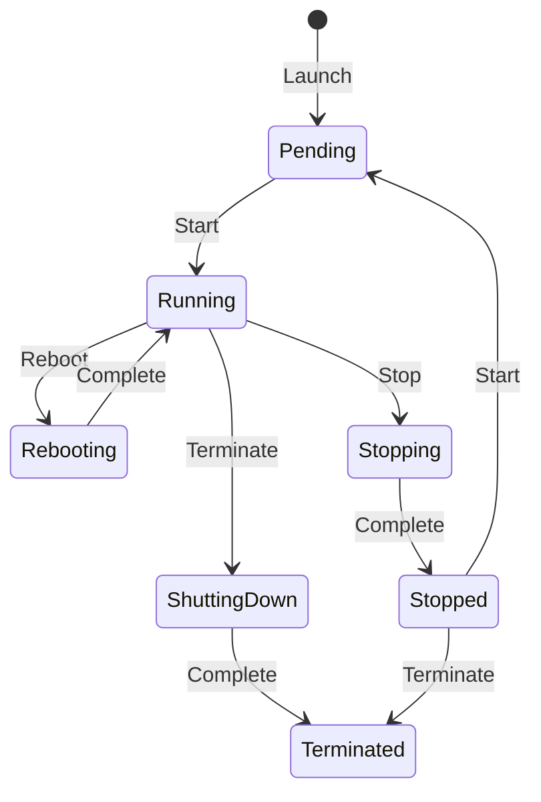

# AWS Certified Solutions Architect Professional

### IAM

- Managers users, groups (of users) and roles (can be assumed by someone of something) where you attach policies (permissions to resources).
- Groups cannot belong to groups.
- Users can belong to many groups.
- IdP can assume roles too.
- Access keys allows the user to use the cli.
- Most IAM policies are stored in AWS as JSON documents. They have several policy elements, including a Version, Effect, Action, and Resource (also Condition).

## Networking

### VPC

- Every region have a default vpc (is open to internet).
- You choose your network size by using CIDR notation. In AWS, the smallest IP range you can have is /28, which provides 16 IP addresses. The largest IP range you can have is a /16, which provides 65,536 IP addresses.
- You define subnets inside a vpc in an AZ and in a IP range.
- A VPC can have connection to internet by internet gateway.
- A VPC can connect to a on-premise data center using a vpn using a Virtual Private Gateway.
- To maintain redundancy and fault tolerance, create at least two subnets configured in two Availability Zones.
- AWS reserves five IP addresses in each subnet. (0 - Network address, 1 - VPC local router, 2 - DNS server, 3 - for future use, 255 - broadcast)

#### Routing

- When creating a VPC a main route table is created (you can not delete it).
- You can create a custom route table and associate to the desired subnets.

#### Security

- Network ACLs: Firewall at subnet level (sateless resources, you have to configure in and out rules, for each port and ip ranges). By default configured to allow all traffic.
- Security Groups: Firewalls that exists at EC2 instance level (stateful resources, so no need to define out rules). By default only allows outbound traffic.

### AWS Direct connect

- Your internal network is linked to an AWS Direct Connect location over a standard Ethernet fiber-optic cable. 
- This connection allows you to create virtual interfaces directly to public AWS services or to your VPC.

### ELB (Elastic Load Balancer)

- High availability by design.

#### Application Load Balancer

- Configured at layer 7 form http/https traffic.
- The listener is configured to listen to a port and send traffic to a target group if the rule match.
- Rules can be defined based on path, host, headers, methods and source IPs.
- Understands HTTPS traffic.
- Can authenticate users (uses OpenID Connect (OIDC) protocol and integrates with other AWS services like SAML, LDAP, Microsoft Active Directory, etc)
- Each target group needs a health check.
- A target type can be instances, IPs or lambda functions.
- Can be internet-facing or internal-facing.
- You configure security groups and the vpc.
- Can configure redirects and fixed responses.
- Supports sticky sessions (for stateful applications). Uses an HTTP cookie to remember to which server has to send the traffic.
- Automatically provides a static IP address per AZ.
- Lets users assign a custom, fixed IP address per AZ.

#### Network Load Balancer

- Configured at layer 4 for TCP/UDP/TLS.
- Low latency.
- Supports sticky sessions.
- A target type can be instances, IPs or ALB.
- Source IP preservation.
- Automatically provides a static IP address per AZ.
- Lets users assign a custom, fixed IP address per AZ.
- Uses Route 53 to direct traffic to load balancer nodes in other zones.

#### Gateway Load Balancer

- Configured alt layer 3 gateway and layer 4 load balancing.
- A target type can be instances or IPs.
- Helps you to deploy, scale, and manage your third-party appliances, such as firewalls, intrusion detection and prevention systems, and deep packet inspection systems.
- Provides a gateway for distributing traffic across multiple virtual appliances while scaling them up and down based on demand.
- Streamlined deployments: Can deploy a new virtual appliance by selecting it in the AWS Marketplace.
- Connects internet gateways, virtual private clouds (VPCs), and other network resources over a private network.
- Automatically provides a static IP address per AZ.
- Lets users assign a custom, fixed IP address per AZ.

### Route 53

## Compute

### Choose options

- Main focus is time to market.
- Scalability is important but not the main priority.
- For startups starting from scratch Serverless with SAM is the best option to focus only on code.
- For teams that already have containers ECS or EKS running on Fargate.
- For a team with an existing monolithic app the recommended solution is Elastic Beanstalk.

### AWS App Runner

### EC2

- Allows to have a custom launch script.
- Provision and launch one or more EC2 instances in minutes.
- Stop or shut down EC2 instances when you finish running a workload.
- Pay by the hour or second (depending on the type of instance) for each instance type (minimum of 60 seconds).
- Hardware specifications: CPU, memory, network, and storage
- Logical configurations: Networking location, firewall rules, authentication, and the operating system of your choice
- When launching an EC2 instance, the first setting you configure is which operating system you want by selecting an Amazon Machine Image (AMI).
- An AMI includes the operating system, storage mapping, architecture type, launch permissions, and any additional preinstalled software applications.
- You can create an AMI from your running instance and use the AMI to start a new instance.
- AMI origins: Quick Start AMIs, AWS Marketplace AMIs, My AMIs, Community AMIs and Custom image.
- Each AMI in the AWS Management Console has an AMI ID, which is prefixed by ami-, followed by a random hash of numbers and letters. The IDs are unique to each AWS Region.
- The default VPC is suitable for getting started quickly and launching public EC2 instances without having to create and configure your own VPC.
- When architecting any application for high availability, consider using at least two EC2 instances in two separate Availability Zones.
- Anything you can run on a physical server can be run on Amazon EC2.  Amazon EC2 gives you access to the OS and to the underlying files and can scale out and in as necessary.

#### Instance types

EC2 instances are a combination of virtual processors (vCPUs), memory, network, and, in some cases, instance storage and graphics processing units (GPUs).

- The first position indicates the instance family.
- The second position indicates the generation of the instance.
- The remaining letters before the period indicates additional attributes.
- After the period indicates the instance size.

| Family                          | Description                                                                                                                                                                                                                                                                                                                | Use cases                                                                                                                                                                                                                                                                |
| ------------------------------- | -------------------------------------------------------------------------------------------------------------------------------------------------------------------------------------------------------------------------------------------------------------------------------------------------------------------------- | ------------------------------------------------------------------------------------------------------------------------------------------------------------------------------------------------------------------------------------------------------------------------ |
| General purpose (t/m)           | General purpose instances provide a balance of compute, memory, and networking resources, and can be used for a variety of workloads.                                                                                                                                                                                      | Ideal for applications that use these resources in equal proportions, such as web servers and code repositories                                                                                                                                                          |
| Compute optimized (c)           | Compute optimized instances are ideal for compute-bound applications that benefit from high-performance processors.                                                                                                                                                                                                        | Well-suited for batch processing workloads, media transcoding, high performance web servers, high performance computing (HPC), scientific modeling, dedicated gaming servers and ad server engines, machine learning inference, and other compute intensive applications |
| Memory optimized (r/u/x)        | Memory optimized instances are designed to deliver fast performance for workloads that process large datasets in memory.                                                                                                                                                                                                   | Memory-intensive applications, such as high-performance databases, distributed web-scale in-memory caches, mid-size in-memory databases, real-time big-data analytics, and other enterprise applications.                                                                |
| Accelerated computing (p/g/trn) | Accelerated computing instances use hardware accelerators or co-processors to perform functions such as floating-point number calculations, graphics processing, or data pattern matching more efficiently than is possible in software running on CPUs.                                                                   | Machine learning, HPC, computational fluid dynamics, computational finance, seismic analysis, speech recognition, autonomous vehicles, and drug discovery.                                                                                                               |
| Storage optimized (i/d)         | Storage optimized instances are designed for workloads that require high sequential read and write access to large datasets on local storage. They are optimized to deliver tens of thousands of low-latency random I/O operations per second (IOPS) to applications that replicate their data across different instances. | NoSQL databases (Cassandra, MongoDB and Redis), in-memory databases, scale-out transactional databases, data warehousing, Elasticsearch, and analytics.                                                                                                                  |
| HPC optimized (hpc)             | High performance computing (HPC) instances are purpose built to offer the best price performance for running HPC workloads at scale on AWS.                                                                                                                                                                                | Ideal for applications that benefit from high-performance processors, such as large, complex simulations and deep learning workloads                                                                                                                                     |

#### Lifecycle

- When an instance is pending, billing has not started.
- Rebooting keeps its public DNS name (IPv4) and private and public IPv4 addresses.
- When you stop and start an instance, your instance can be placed on a new underlying physical server.
- Termination of an instance means that you can no longer access the machine.
- As soon as the status of an instance changes to shutting down or terminated, you stop incurring charges for that instance.
- When you stop your instance, the data from the instance memory (RAM) is lost.
- When you stop-hibernate an instance, Amazon EC2 signals the operating system to perform hibernation (suspend-to-disk), which saves the contents from the instance memory (RAM) to the EBS root volume. 

#### Pricing

- On-demand: pay as you go, recommended for unpredicted load and test.
- Spot: for flexible start and end times, recommended for stateless workloads.
- Saving plan: flexible pricing model that offers low usage prices for a 1-year or 3-year term commitment to a consistent amount of usage.
- Reserved: for applications with steady state usage that might require reserved capacity, can be standard, convertible or scheduled.
- Dedicated host: physical Amazon EC2 server that is dedicated for your use, can be purchased hourly or as reservation.

#### Auto Scaling

- Vertical scaling: Increase the instance size in active-passive system.
- Horizontal scaling: Add additional instances in active-active system.
- Automatic scaling based on demand.
- Scheduled scaling based on user-defined schedules.
- Fleet management automatically replacing unhealthy EC2 instances.
- Predictive scaling using ML to help schedule optimum number of instances.
- ELB integrates seamlessly with EC2 Auto Scaling.

##### Configuring components

###### Launch template or configuration

- Recommended over launch configuration (you can not use previously created launch configurations as a template or can create one from an existing instance).
- Can create one from an existing instance, from an existing template or previous version, or define a template from scratch (AMI, instance type, key pair, security group, storage, resource tags)

###### Amazon EC2 Auto Scaling groups

- You specify the VPC and subnets where instances should be launched.
- You can specify the type of purchase (on-demand, spot or combination of the two).
- You configure the minimum, desired and maximum capacity.

###### Scaling policies

- Simple scaling policy: Use CloudWatch alarm to scale based on number or percentage. Has a cooldown before taking any other action.
- Step scaling policy: Respond to additional alarms even when scaling activity is in progress.
- Target tracking policy: You define the target value to track and it automatically creates the required CloudWatch alarms.

### EC2 Image builder

- Used to build custom EC2 images.

### ECS

- End-to-end container orchestration service that helps you spin up new containers.
- Your containers are defined in a task definition that you use to run an individual task or a task within a service.
- You have the option to run your tasks and services on a serverless infrastructure that's managed by another AWS service called AWS Fargate.
- For more control over your infrastructure, you can run your tasks and services on a cluster of EC2 instances that you manage.
- You need to install the Amazon ECS container agent on your EC2 instances.
- To prepare your application to run on Amazon ECS, you create a task definition.
- Recommended for large monolithic applications that you want to break into container or move directly without any change.

### EKS

- If you already use Kubernetes, you can use Amazon EKS to orchestrate the workloads in the AWS Cloud.
- The machine that runs the containers is called a worker node or Kubernetes node.
- An EKS container is called a pod.
- Recommended for large monolithic applications that you want to break into container or move directly without any change.

### Fargate

- AWS Fargate is a purpose-built serverless compute engine for containers.
- Supports both Amazon ECS and Amazon EKS architecture and provides workload isolation and improved security by design.

### Lambda

- Lambda runs your code on a high availability compute infrastructure and requires no administration from the user.
- You have the option of configuring your Lambda functions using the Lambda console, Lambda API, AWS CloudFormation, or AWS Serverless Application Model (AWS SAM).
- You can create a function from scratch, blueprint, select a container image or browse the AWS Serverless Application Repository.
- You can deploy by zip or by container.
- The runtime provides a language-specific environment that runs in an application environment.
- The AWS Lambda function handler is the method in your function code that processes events.
- Billing is rounded up to the nearest 1 millisecond (ms). It can be cost effective to run functions whose execution time is very low.
- Is a suitable choice for any short-lived application that can finish running in under 15 minutes.
- Great option for even-driven applications.
- If is compute intensive consider using a container instead of lambda.

#### Triggers

- HTTP call
- Upload of a file to S3

### AWS Step Functions

- You can use to coordinate the components of distributed applications and microservices using visual workflows.

### AWS Batch

- Batch dynamically provisions the optimal quantity and type of compute resources, such as CPU- or memory-optimized compute resources, based on the volume and specific resource requirements of the batch jobs submitted.
- Runs your batch computing workloads using Amazon EC2 and AWS compute resources with Fargate or Fargate Spot. 

### Elastic Beanstalk

- Automatically handles the deployment details of capacity provisioning, load balancing, auto-scaling, and application health monitoring. 
- Automatically scales your application up and down based on your application's specific need using adjustable Auto Scaling settings.
- No cost for the service, only the cost of the underlying infrastructure.

### Lightsail

- VPS provider and is a useful way to get started with AWS for users who need a solution to build and host their applications on AWS Cloud.
- Provides low-cost, pre-configured cloud resources for simple workloads just starting on AWS.
- Cheap prices.

### AWS Outpost

### Serverless Application Repository

### AWS SimSpace Weaver

## Storage

### Choose options

- Understand characteristics like shareable, file size, cache size, access patterns, latency, throughput and persistence of data.
- Conduct a performance analysis to measure IOPS and throughput.
- Determine the expected growth rate for your workload and choose a storage solution that will meet those rates.

#### Questions

- How often and how quickly do you need to access your data?
- Does your data store require high IOPS or throughput?
- What storage access protocols are required?
- How critical (durable) is your data?
- How sensitive is your data?
- How large is your dataset?
- How transient is your data?
- How much are you prepared to pay to store the data?

### Amazon EFS

- File storage.
- Automatically grows and shrinks as you add and remove files.
- You can connect tens, hundreds, and even thousands of compute instances to an Amazon EFS file system at the same time.
- You pay only for the storage used.
- EFS Standard and EFS Standard-Infrequent Access (Standard-IA) offer Multi-AZ resilience and the highest levels of durability and availability.
- EFS One Zone and EFS One Zone-Infrequent Access (EFS One Zone-IA) provide additional savings by saving your data in a single availability zone.
- For Linux.
- Supports the Network File System (NFS) protocol.

### Amazon FSx

- File storage.

#### FSx for Lustre

- Parallel file system built on Lustre for high performance computing (HPC) workloads. FSx for Lustre supports the Lustre POSIX-compliant protocol.
- Delivers the highest levels of throughput (up to 1+ TB/s) and IOPS (millions). Customers can seamlessly integrate, access, and process their Amazon S3 datasets using the Lustre high-performance file system.
- You can link FSx for Lustre file systems to data repositories on Amazon Simple Storage Service (Amazon S3) or to on-premises data stores.

#### FSx for NetApp ONTAP

- Provides rich data management features and flexible shared file storage that are broadly accessible from Linux, Windows, and macOS compute instances running in AWS or on premises.
- Support iSCSI for block storage, NFS protocol for POSIX-compliant access, and SMB protocol for Windows-compatible access.
- Offers block storage services over an iSCSI access protocol. These block services use NetApp's application programming interface (API) calls and management interface.

#### FSx for OpenZFS

- Implementation of the Open Zettabyte File System (ZFS).
- Supports NFS and SMB protocols for a wide range of application implementations. 
- Delivers leading performance for latency-sensitive and small-file workloads with popular NAS data management capabilities (snapshots, and cloning), at a lower price than commercially licensed alternatives.

#### FSx for Windows File Server

- Provides file storage that is accessible over the Service Message Block (SMB) protocol and has the ability to serve as a drop-in replacement for existing Windows file server deployments. 

### Amazon EC2 Instance Store

- Block storage.
- Close to the physical server. Provides submillisecond latencies.
- Tied to the instance.
- Only specific Amazon EC2 instance types support instance stores.
- Ideal if you host applications that replicate data to other EC2 instances, such as Hadoop clusters. For these cluster-based workloads, having the speed of locally attached volumes and the resiliency of replicated data helps you achieve data distribution at high performance.
- It's also ideal for temporary storage of information that changes frequently, such as buffers, caches, scratch data, and other temporary content.
- As ephemeral storage, instance stores are not replicated or spread across multiple devices to improve durability and availability.
- If an instance reboots (intentionally or unintentionally), data in the instance store persists. However, data in the instance store is lost if disck drive fails, instance stops, hibernates or terminates.

### Amazon EBS

- Block storage.
- Can attach multiple volumes to one instance.
- We can de-attach from one instance and attach to another.
- Depending on the instance type and EBS volume, you can have the same volume attached to multiple instances (EBS Multi-Attach).
- Multi-attach feature that permits Provisioned IOPS SSD (io1 or io2) volumes to be attached to multiple EC2 instances at one time. This feature is not available for all instance types, and all instances must be in the same Availability Zone.
- Backups are incremental snapshots.
- Increase the volume size only if it doesn't increase above the maximum size limit. Depending on the volume selected, Amazon EBS currently supports a maximum volume size of 64 tebibytes (TiB).
- Attach multiple volumes to a single EC2 instance. Amazon EC2 has a one-to-many relationship with EBS volumes. You can add these additional volumes during or after EC2 instance creation to provide more storage capacity for your hosts.
- Boot and root volumes can be used to store an operating system.
- Can be used as a storage layer for databases running on Amazon EC2 that will scale with your performance needs and provide consistent and low-latency performance.
- Provides high availability and high durability block storage to run business-critical applications.
- Offers data persistence, dynamic performance adjustments, and the ability to detach and reattach volumes, so you can resize clusters for big data analytics.
- When you create an EBS volume, it is automatically replicated in its Availability Zone to prevent data loss from single points of failure.
- Storage persists even when your instance doesn't.
- When activated by the user, all EBS volumes support encryption on creation. Snapshots are also encrypted.
- EBS volumes support on-the-fly changes. Modify volume type, volume size, and input/output operations per second (IOPS) capacity without stopping your instance.
- Amazon EBS provides the ability to create backups of any EBS volume.
- EBS snapshots can be used to create multiple new volumes, whether they're in the same Availability Zone or a different one.
- Pay only for the storage and resources that you provision.
- Root EBS volumes created with an EC2 instance are terminated with the instance by default. However, you can modify the volume to be persistent.
- The Elastic Volumes feature makes it easier to adapt your resources to changing application demands. You can make modifications in the future as your business needs change.
- Amazon EBS volumes are designed to provide 99.8–99.9 percent durability with an annual failure rate (AFR) of 0.1–0.2 percent.
- Amazon EBS offers a higher durability io2 volume that is designed to provide 99.999 percent durability with an AFR of 0.001 percent.

#### Volume types

| Category | Type              | Description                                                                                                                                                        | Size             | Max IOPS per volume | Max throughput per volume | EBS Multi-attach |
| -------- | ----------------- | ------------------------------------------------------------------------------------------------------------------------------------------------------------------ | ---------------- | ------------------- | ------------------------- | ---------------- |
| SSD      | gp3               | Balance of price and performance for transactional workloads. Use cases like virtual desktops, test and development environments, interactive gaming applications. | 1 GiB - 16 TiB   | 16.000              | 1.000 MiB/s               | No               |
| SSD      | gp2               | Balance of price and performance for transactional workloads. Use cases like virtual desktops, test and development environments, interactive gaming applications. | 1 GiB - 16 TiB   | 16.000              | 250 MiB/s                 | No               |
| SSD      | io2 Block Express | High performance designed for latency-sensitive transactional workloads. Use cases like SAP HANA, Microsoft SQL Server, and IBM DB2.                               | 4 GiB - 64 TiB   | 256.000             | 4.000 MiB/s               | Yes              |
| SSD      | io2               | High performance designed for latency-sensitive transactional workloads. Use cases like SAP HANA, Microsoft SQL Server, and IBM DB2.                               | 4 GiB - 16 TiB   | 64.000              | 1.000 MiB/s               | Yes              |
| SSD      | io1               | High performance designed for latency-sensitive transactional workloads. Use cases like SAP HANA, Microsoft SQL Server, and IBM DB2.                               | 4 GiB - 16 TiB   | 64.000              | 1.000 MiB/s               | Yes              |
| HHD      | st1               | Low cost designed for frequently accessed, throughput intensive workloads                                                                                          | 125 GiB - 16 TiB | 500                 | 500 MiB/s                 | No               |
| HHD      | sc1               | Lowest cost designed for less frequently accessed workloads                                                                                                        | 125 GiB - 16 TiB | 250                 | 250 MiB/s                 | No               |

### S3

- Object storage.
- Stores objects in buckets.
- A bucket name cannot be used by another AWS account in the same partition until the bucket is deleted.
- Everything in Amazon S3 is private by default.
- When IAM policies are attached to your resources (buckets and objects) or IAM users, groups, and roles, the policies define which actions they can perform.
- S3 bucket policies can only be attached to S3 buckets. Use this instead of IAM if you need a simple way to do cross-account or the policies bump up against the defined IAM size limit.
- Amazon S3 reinforces encryption in transit (as it travels to and from Amazon S3) and at rest.
- Amazon S3 automatically encrypts all objects on upload and applies server-side encryption with S3-managed keys as the base level of encryption for every bucket in Amazon S3 at no additional cost.
- Versioning keep multiple versions of a single object.
- Version states: unversioned (default), versioning-enabled, versioning-suspended.
- Lifecycle: transition actions define when objects should transition to another storage class and expiration actions define when objects expire and should be permanently deleted.

#### Storage classes

| Class                         | Description                                                                                                                                        |
| ----------------------------- | -------------------------------------------------------------------------------------------------------------------------------------------------- |
| S3 Standard                   | General purpose                                                                                                                                    |
| S3 Intelligent-Tiering        | For unknown or changing access patterns.                                                                                                           |
| S3 Standard-IA                | For data that is accessed less frequently but required rapid access when need. Ideal for long-term backups, disaster recovery files, etc.          |
| S3 One Zone-IA                | Ideal to store data that is recreatable and needs fast access but infrequent                                                                       |
| S3 Glacier Flexible Retrieval | Has default retrieval time of 1-5 minutes using expedited retrieval. Free bulk is up to 5-12 hours. Ideal for data accessed 1 or 2 times per year. |
| S3 Glacier Deep Archive       | Has default retrieval time of 12h. Designed to meet regulatory compliance requirements and store data sets for 7-10 years.                         |
| S3 on Outpost                 | Delivers object storage to your on-premise                                                                                                         |

### AWS Snowball

- Edge computing, data migration, and edge storage device.
- You can it for data collection, ML processing and storage in environments with intermittent connectivity or in remote disconnected locations.
- Comes in two options, storage optimized and compute optimized.

### AWS Snowcone

- The smallest component. 2.1 kg.
- Purpose-build for use outside of a traditional datacenter.

### AWS Snowmobile

- Exabyte-scale data transfer service.
- You can transfer up to 100 PB per Snowmobile.

### AWS Outpost

- On-premises cloud storage that includes EBS and S3 services.
- Offers the same functionality but on-premise.
- Ideal for workloads that require low latency to on-premise systems, local data processing and data residency or migration of applications with local system interdependencies.
- AWS compute, storage, database, and other services run locally on Outposts. You can access the full range of AWS services available in the Region to build, manage, and scale your on-premises applications using familiar AWS services and tools.

### AWS Storage Gateway

- Connects on-premises users and applications using a software appliance with cloud-based storage.
- Use cases: moving backups to the cloud, using on-premises file shares backend by cloud storage and low-latency access to data in AWS for on-premises applications.
- Storage Gateway offers four different types of gateways: Amazon S3 File Gateway, Amazon FSx File Gateway, Volume Gateway, and Tape Gateway.
- Amazon S3 File Gateway provides a seamless way to connect to the cloud to store application data files and backup images as durable objects in Amazon S3. Amazon S3 File Gateway offers SMB or NFS-based access to data in Amazon S3 with local caching. 
- Amazon FSx File Gateway optimizes on-premises access to fully managed, highly reliable file shares in Amazon FSx for Windows File Server. Customers with unstructured or file data, whether from SMB-based group shares or business applications, might require on-premises access to meet low-latency requirements.
- Volume Gateway presents cloud-backed iSCSI block storage volumes to your on-premises applications. Volume Gateway stores and manages on-premises data in Amazon S3 on your behalf and operates in cache mode or stored mode.
- Tape Gateway is used to replace physical tapes on premises with virtual tapes in AWS without changing existing backup workflows. Tape Gateway supports all leading backup applications and caches virtual tapes on premises for low-latency data access.

### AWS Transfer

- Provides fully managed support for file transfers directly into and out of Amazon S3 or Amazon EFS.
- Support for Secure File Transfer Protocol (SFTP), File Transfer Protocol over SSL (FTPS), and File Transfer Protocol (FTP).
- Integrates with the specified authentication system and provides DNS routing with Route 53.

### AWS DataSync

- Online data transfer service that simplifies, automates, and accelerates moving data between on-premises storage systems and AWS Storage services and between AWS Storage services.
- Used to migrate active datasets, archive data, replicate data or transfer data for analysis and processing.
- Can copy data between NFS, SMB, self-managed object storage, Snowcone, S3, EFS and FSx for Windows File Server file systems.

### Application Migration Service (AWS MGN)

- Includes CloudEndure Migration, is a highly automated lift-and-shift (rehost) solution.
- You can use AWS MGN or CloudEndure Migration by itself to quickly lift-and-shift physical, virtual, or cloud servers without compatibility issues, performance impact, or long cutover windows.
- Continuously replicates your source servers to your AWS account. When you’re ready to migrate, it automatically converts and launches your servers on AWS.

### AWS Backup

- You can centralize and automate data protection across AWS services.
- When you combine AWS Organizations with AWS Backup, you can deploy data protection policies centrally.
- Includes EC2, EBS, RDS, DynamoDB, Neptune, DocumentDB, EFS, FSx for Luste, FSx for Windows File Server, AWS Storage gateways, S3 and VMware workloads.

### CloudEndure Disaster Recovery

- Provides a cost-effective disaster recovery option for your on-premises servers and applications.
- Continuously replicates your machines into a low-cost staging area in your target AWS account and preferred Region.
- In the case of a disaster, you can instruct CloudEndure Disaster Recovery to automatically launch thousands of your machines in their fully provisioned state in minutes.

## Databases

### Amazon RDS

- Relational databases.
- Supports MySql, PostgreSQL, MariaDB, SqlServer, Oracle
- Multi-AZ deployment is recommended.
- Multi-AZ provides automatic failover and protect DB performance by backing up from the standby instance.
- When you create a DB instance, a Domain Name System (DNS) name is provided. AWS uses that DNS name to fail over to the standby database.
- DB instance standard (m) provide balance.
- DB instance memory (r/x) optimized accelerate performance for workloads that process large datasets in memory.
- DB instance burstable (t) provide baseline level of CPU with the ability to burst above the baseline.
- Can enable storage autoscaling to increase the allocated storage of the EBS.
- The subnet that will be designated to your DB should not have access to internet.
- Use Amazon RDS encryption to secure your DB instances and snapshots at rest.
- Can scale components independently (memory, processor size, allocated storage, IOPS)

#### Aurora

- Scales up to 128 TiB
- Supports PostgreSQL and MySQL

#### Backup

- Automated backups are retained between 0 and 35 days.
- Setting automated backups to 0 days stops them and it will also delete all existing automated backups.
- Point-in-time recovery provides more granularity by restoring the full backup an rolling back transactions up to the specified time range.
- Manual snapshots can retain backups longe than 35 days. When restored, it creates a new DB instance using the data from the snapshot.

### DynamoDB

- NoSQL.
- Serverless.
- For high-scale applications and serverless applications.
- Work for nearly all online transaction processing (OLTP).
- Pricing by reads and writes.
- Create tables to store data.
- A table contain items.
- Each item can have different attributes.
- Scale up/down the tables throughput without downtime or performance degradation.
- Monitor resource usage and performance metrics.
- All the data is automatically replicated across multiple AZ in a region.
- All data is fully encrypted at rest (using KMS).
- IAM can control permissions at item level.
- When activity occurs, is recorded in a CloudTrail event. For an ongoing record of events you can create a trail to deliver log files to S3.

### ElastiCache

- Caching solution.
- Supports Redis and Memcached.

### MemoryDB

- Redis-compatible, durable, in-memory database.
- Microseconds read latency.
- Single-digit milliseconds write latency.

### DocumentDB

- Document database.
- Compatible with MongoDB.
- For use cases like content management sysems, profile management, web and mobile applications.

### Amazon Keyspaces (for Apache Cassandra)

- Compatible with Cassandra Query Language (CQL).

### Neptune

- Graph database.
- Often used for recommendation engines, fraud detection and knowledge graphs.

### Amazon Timestream

- Time series database for IoT.
- Used for measuring events that change over time, such as stock prices over time or temperature measurements.

### Amazon Quantum Ledger Database (QLDB)

- Immutable ledger.
- Provides a complete and cryptographically verifiable history of all changes.

## Monitoring

### CloudWatch

- Different resources create different types of metrics.
- Many AWS services automatically send metrics to CloudWatch for free at a rate of 1 data point per metric per 5-minute interval. This is called basic monitoring, and it gives you visibility into your systems without any extra cost. For many applications, basic monitoring is adequate.
- For applications running on EC2 instances, you can get more granularity by posting metrics every minute instead of every 5-minutes using a feature like detailed monitoring. Detailed monitoring incurs a fee.
- You can use external or custom tools to ingest and analyze CloudWatch metrics using the GetMetricData API.
- Dashboard is customizable to show desired metrics.
- You can use custom metrics (you can send 1 data point per second per custom metric).
- Alarms allow to create alarms for thresholds is a certain period of time.
- Alar can be in state OK, ALARM or INSUFFICIENT_DATA.
- Alarms can trigger SNS notification and/or send an email. With the SNS notification you can invoke a lambda to call AWS API to perform actions like scale, reboot, etc.
- CloudWatch Logs is centralized place for logs to be stored and analyzed.
- A log group is composed of log streams that all share the same retention and permissions settings.
- Log events are grouped into log streams, which are sequences of log events that all belong to the same resource being monitored.
- A log event is a record of activity recorded by the application or resource being monitored.

## Other

### Amazon Q Developer

- AI coding companion.
- Generates code suggestions based on comments and existing code.
- Offers real-support for code vulnerabilities.