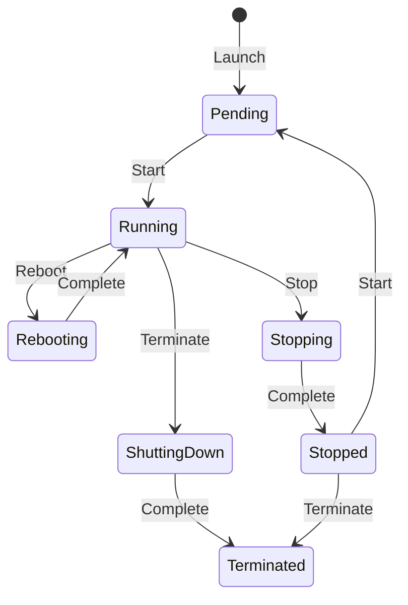

# AWS Certified Solutions Architect Professional

### IAM

- Managers users, groups (of users) and roles (can be assumed by someone of something) where you attach policies (permissions to resources).
- Groups cannot belong to groups.
- Users can belong to many groups.
- IdP can assume roles too.
- Access keys allows the user to use the cli.
- Most IAM policies are stored in AWS as JSON documents. They have several policy elements, including a Version, Effect, Action, and Resource (also Condition).
-  IAM policies have a 2 kb size limit for users, 5 kb for groups, and a 10 kb for roles.

## Networking

### VPC

- Every region have a default vpc (is open to internet).
- You choose your network size by using CIDR notation. In AWS, the smallest IP range you can have is /28, which provides 16 IP addresses. The largest IP range you can have is a /16, which provides 65,536 IP addresses.
- You define subnets inside a vpc in an AZ and in a IP range.
- A VPC can have connection to internet by internet gateway.
- A VPC can connect to a on-premise data center using a vpn using a Virtual Private Gateway.
- To maintain redundancy and fault tolerance, create at least two subnets configured in two Availability Zones.
- AWS reserves five IP addresses in each subnet. (0 - Network address, 1 - VPC local router, 2 - DNS server, 3 - for future use, 255 - broadcast)

#### Routing

- When creating a VPC a main route table is created (you can not delete it).
- You can create a custom route table and associate to the desired subnets.

#### Security

- Network ACLs: Firewall at subnet level (sateless resources, you have to configure in and out rules, for each port and ip ranges). By default configured to allow all traffic.
- Security Groups: Firewalls that exists at EC2 instance level (stateful resources, so no need to define out rules). By default only allows outbound traffic.

### AWS Direct connect

- Your internal network is linked to an AWS Direct Connect location over a standard Ethernet fiber-optic cable. 
- This connection allows you to create virtual interfaces directly to public AWS services or to your VPC.

### ELB (Elastic Load Balancer)

- High availability by design.

#### Application Load Balancer

- Configured at layer 7 form http/https traffic.
- The listener is configured to listen to a port and send traffic to a target group if the rule match.
- Rules can be defined based on path, host, headers, methods and source IPs.
- Understands HTTPS traffic.
- Can authenticate users (uses OpenID Connect (OIDC) protocol and integrates with other AWS services like SAML, LDAP, Microsoft Active Directory, etc)
- Each target group needs a health check.
- A target type can be instances, IPs or lambda functions.
- Can be internet-facing or internal-facing.
- You configure security groups and the vpc.
- Can configure redirects and fixed responses.
- Supports sticky sessions (for stateful applications). Uses an HTTP cookie to remember to which server has to send the traffic.
- Automatically provides a static IP address per AZ.
- Lets users assign a custom, fixed IP address per AZ.

#### Network Load Balancer

- Configured at layer 4 for TCP/UDP/TLS.
- Low latency.
- Supports sticky sessions.
- A target type can be instances, IPs or ALB.
- Source IP preservation.
- Automatically provides a static IP address per AZ.
- Lets users assign a custom, fixed IP address per AZ.
- Uses Route 53 to direct traffic to load balancer nodes in other zones.

#### Gateway Load Balancer

- Configured alt layer 3 gateway and layer 4 load balancing.
- A target type can be instances or IPs.
- Helps you to deploy, scale, and manage your third-party appliances, such as firewalls, intrusion detection and prevention systems, and deep packet inspection systems.
- Provides a gateway for distributing traffic across multiple virtual appliances while scaling them up and down based on demand.
- Streamlined deployments: Can deploy a new virtual appliance by selecting it in the AWS Marketplace.
- Connects internet gateways, virtual private clouds (VPCs), and other network resources over a private network.
- Automatically provides a static IP address per AZ.
- Lets users assign a custom, fixed IP address per AZ.

### Route 53

## Compute

### Choose options

- Main focus is time to market.
- Scalability is important but not the main priority.
- For startups starting from scratch Serverless with SAM is the best option to focus only on code.
- For teams that already have containers ECS or EKS running on Fargate.
- For a team with an existing monolithic app the recommended solution is Elastic Beanstalk.

### AWS App Runner

### EC2

- Allows to have a custom launch script.
- Provision and launch one or more EC2 instances in minutes.
- Stop or shut down EC2 instances when you finish running a workload.
- Pay by the hour or second (depending on the type of instance) for each instance type (minimum of 60 seconds).
- Hardware specifications: CPU, memory, network, and storage
- Logical configurations: Networking location, firewall rules, authentication, and the operating system of your choice
- When launching an EC2 instance, the first setting you configure is which operating system you want by selecting an Amazon Machine Image (AMI).
- An AMI includes the operating system, storage mapping, architecture type, launch permissions, and any additional preinstalled software applications.
- You can create an AMI from your running instance and use the AMI to start a new instance.
- AMI origins: Quick Start AMIs, AWS Marketplace AMIs, My AMIs, Community AMIs and Custom image.
- Each AMI in the AWS Management Console has an AMI ID, which is prefixed by ami-, followed by a random hash of numbers and letters. The IDs are unique to each AWS Region.
- The default VPC is suitable for getting started quickly and launching public EC2 instances without having to create and configure your own VPC.
- When architecting any application for high availability, consider using at least two EC2 instances in two separate Availability Zones.
- Anything you can run on a physical server can be run on Amazon EC2.  Amazon EC2 gives you access to the OS and to the underlying files and can scale out and in as necessary.

#### Instance types

EC2 instances are a combination of virtual processors (vCPUs), memory, network, and, in some cases, instance storage and graphics processing units (GPUs).

- The first position indicates the instance family.
- The second position indicates the generation of the instance.
- The remaining letters before the period indicates additional attributes.
- After the period indicates the instance size.

| Family                          | Description                                                                                                                                                                                                                                                                                                                | Use cases                                                                                                                                                                                                                                                                |
| ------------------------------- | -------------------------------------------------------------------------------------------------------------------------------------------------------------------------------------------------------------------------------------------------------------------------------------------------------------------------- | ------------------------------------------------------------------------------------------------------------------------------------------------------------------------------------------------------------------------------------------------------------------------ |
| General purpose (t/m)           | General purpose instances provide a balance of compute, memory, and networking resources, and can be used for a variety of workloads.                                                                                                                                                                                      | Ideal for applications that use these resources in equal proportions, such as web servers and code repositories                                                                                                                                                          |
| Compute optimized (c)           | Compute optimized instances are ideal for compute-bound applications that benefit from high-performance processors.                                                                                                                                                                                                        | Well-suited for batch processing workloads, media transcoding, high performance web servers, high performance computing (HPC), scientific modeling, dedicated gaming servers and ad server engines, machine learning inference, and other compute intensive applications |
| Memory optimized (r/u/x)        | Memory optimized instances are designed to deliver fast performance for workloads that process large datasets in memory.                                                                                                                                                                                                   | Memory-intensive applications, such as high-performance databases, distributed web-scale in-memory caches, mid-size in-memory databases, real-time big-data analytics, and other enterprise applications.                                                                |
| Accelerated computing (p/g/trn) | Accelerated computing instances use hardware accelerators or co-processors to perform functions such as floating-point number calculations, graphics processing, or data pattern matching more efficiently than is possible in software running on CPUs.                                                                   | Machine learning, HPC, computational fluid dynamics, computational finance, seismic analysis, speech recognition, autonomous vehicles, and drug discovery.                                                                                                               |
| Storage optimized (i/d)         | Storage optimized instances are designed for workloads that require high sequential read and write access to large datasets on local storage. They are optimized to deliver tens of thousands of low-latency random I/O operations per second (IOPS) to applications that replicate their data across different instances. | NoSQL databases (Cassandra, MongoDB and Redis), in-memory databases, scale-out transactional databases, data warehousing, Elasticsearch, and analytics.                                                                                                                  |
| HPC optimized (hpc)             | High performance computing (HPC) instances are purpose built to offer the best price performance for running HPC workloads at scale on AWS.                                                                                                                                                                                | Ideal for applications that benefit from high-performance processors, such as large, complex simulations and deep learning workloads                                                                                                                                     |

#### Lifecycle

- When an instance is pending, billing has not started.
- Rebooting keeps its public DNS name (IPv4) and private and public IPv4 addresses.
- When you stop and start an instance, your instance can be placed on a new underlying physical server.
- Termination of an instance means that you can no longer access the machine.
- As soon as the status of an instance changes to shutting down or terminated, you stop incurring charges for that instance.
- When you stop your instance, the data from the instance memory (RAM) is lost.
- When you stop-hibernate an instance, Amazon EC2 signals the operating system to perform hibernation (suspend-to-disk), which saves the contents from the instance memory (RAM) to the EBS root volume. 

#### Pricing

- On-demand: pay as you go, recommended for unpredicted load and test.
- Spot: for flexible start and end times, recommended for stateless workloads.
- Saving plan: flexible pricing model that offers low usage prices for a 1-year or 3-year term commitment to a consistent amount of usage.
- Reserved: for applications with steady state usage that might require reserved capacity, can be standard, convertible or scheduled.
- Dedicated host: physical Amazon EC2 server that is dedicated for your use, can be purchased hourly or as reservation.

#### Auto Scaling

- Vertical scaling: Increase the instance size in active-passive system.
- Horizontal scaling: Add additional instances in active-active system.
- Automatic scaling based on demand.
- Scheduled scaling based on user-defined schedules.
- Fleet management automatically replacing unhealthy EC2 instances.
- Predictive scaling using ML to help schedule optimum number of instances.
- ELB integrates seamlessly with EC2 Auto Scaling.

##### Configuring components

###### Launch template or configuration

- Recommended over launch configuration (you can not use previously created launch configurations as a template or can create one from an existing instance).
- Can create one from an existing instance, from an existing template or previous version, or define a template from scratch (AMI, instance type, key pair, security group, storage, resource tags)

###### Amazon EC2 Auto Scaling groups

- You specify the VPC and subnets where instances should be launched.
- You can specify the type of purchase (on-demand, spot or combination of the two).
- You configure the minimum, desired and maximum capacity.

###### Scaling policies

- Simple scaling policy: Use CloudWatch alarm to scale based on number or percentage. Has a cooldown before taking any other action.
- Step scaling policy: Respond to additional alarms even when scaling activity is in progress.
- Target tracking policy: You define the target value to track and it automatically creates the required CloudWatch alarms.

### EC2 Image builder

- Used to build custom EC2 images.

### ECS

- End-to-end container orchestration service that helps you spin up new containers.
- Your containers are defined in a task definition that you use to run an individual task or a task within a service.
- You have the option to run your tasks and services on a serverless infrastructure that's managed by another AWS service called AWS Fargate.
- For more control over your infrastructure, you can run your tasks and services on a cluster of EC2 instances that you manage.
- You need to install the Amazon ECS container agent on your EC2 instances.
- To prepare your application to run on Amazon ECS, you create a task definition.
- Recommended for large monolithic applications that you want to break into container or move directly without any change.

### EKS

- If you already use Kubernetes, you can use Amazon EKS to orchestrate the workloads in the AWS Cloud.
- The machine that runs the containers is called a worker node or Kubernetes node.
- An EKS container is called a pod.
- Recommended for large monolithic applications that you want to break into container or move directly without any change.

### Fargate

- AWS Fargate is a purpose-built serverless compute engine for containers.
- Supports both Amazon ECS and Amazon EKS architecture and provides workload isolation and improved security by design.

### Lambda

- Lambda runs your code on a high availability compute infrastructure and requires no administration from the user.
- You have the option of configuring your Lambda functions using the Lambda console, Lambda API, AWS CloudFormation, or AWS Serverless Application Model (AWS SAM).
- You can create a function from scratch, blueprint, select a container image or browse the AWS Serverless Application Repository.
- You can deploy by zip or by container.
- The runtime provides a language-specific environment that runs in an application environment.
- The AWS Lambda function handler is the method in your function code that processes events.
- Billing is rounded up to the nearest 1 millisecond (ms). It can be cost effective to run functions whose execution time is very low.
- Is a suitable choice for any short-lived application that can finish running in under 15 minutes.
- Great option for even-driven applications.
- If is compute intensive consider using a container instead of lambda.

#### Triggers

- HTTP call
- Upload of a file to S3

### AWS Step Functions

- You can use to coordinate the components of distributed applications and microservices using visual workflows.

### AWS Batch

- Batch dynamically provisions the optimal quantity and type of compute resources, such as CPU- or memory-optimized compute resources, based on the volume and specific resource requirements of the batch jobs submitted.
- Runs your batch computing workloads using Amazon EC2 and AWS compute resources with Fargate or Fargate Spot. 

### Elastic Beanstalk

- Automatically handles the deployment details of capacity provisioning, load balancing, auto-scaling, and application health monitoring. 
- Automatically scales your application up and down based on your application's specific need using adjustable Auto Scaling settings.
- No cost for the service, only the cost of the underlying infrastructure.

### Lightsail

- VPS provider and is a useful way to get started with AWS for users who need a solution to build and host their applications on AWS Cloud.
- Provides low-cost, pre-configured cloud resources for simple workloads just starting on AWS.
- Cheap prices.

### Serverless Application Repository

### AWS SimSpace Weaver

## Storage

### Choose options

- Understand characteristics like shareable, file size, cache size, access patterns, latency, throughput and persistence of data.
- Conduct a performance analysis to measure IOPS and throughput.
- Determine the expected growth rate for your workload and choose a storage solution that will meet those rates.

#### Questions

- Is it a new or existing workflow?
- What are the know workflow requirements?
- What is the type of use case?
- Wat are the requirements for storage location?
- Wat are the requirements for storage type?
- Wat are the requirements for storage performance?
- Wat are the requirements for access protocol?
- Wat are the requirements for data transfer?
- Wat are the requirements for data protection?
- What is the best combination of storage services?
- How often and how quickly do you need to access your data?
- Does your data store require high IOPS or throughput?
- What storage access protocols are required?
- How critical (durable) is your data?
- How sensitive is your data?
- How large is your dataset?
- How transient is your data?
- How much are you prepared to pay to store the data?

### Amazon EFS

- File storage.
- Operates as a Regional service.
- Automatically grows and shrinks as you add and remove files.
- Can grow to petabyte scale.
- You can connect tens, hundreds, and even thousands of compute instances to an Amazon EFS file system at the same time.
- You pay only for the storage used.
- EFS Standard and EFS Standard-Infrequent Access (Standard-IA) offer Multi-AZ resilience and the highest levels of durability and availability.
- EFS One Zone and EFS One Zone-Infrequent Access (EFS One Zone-IA) provide additional savings by saving your data in a single availability zone.
- For Linux.
- Supports the Network File System version 4 (NFSv4.1 and NFSv4.0) protocol.
- You can use Amazon EFS to control access to your file systems through Portable Operating System Interface (POSIX) permissions.
- Supports authentication, authorization, and encryption capabilities to help you meet your security and compliance requirements.
- The default General Purpose performance mode is ideal for latency-sensitive use cases, such as web serving environments, content management systems, home directories, and general file serving. 
- File systems in the Max I/O mode can scale to higher levels of aggregate throughput and IOPS. The tradeoff is slightly higher latencies for file metadata operations.
- Max I/O performance mode is available only on Amazon EFS file systems using Standard storage classes.
- Using the default Bursting Throughput mode, throughput scales as your file system grows. Using Provisioned Throughput mode, you can specify the throughput of your file system independent of the amount of data stored.
- You can start saving on your storage costs by enabling EFS lifecycle management for your file system and choosing an age-off policy of 7,14, 30, 60, or 90 days. With EFS lifecycle management policies enabled, files automatically move from Amazon EFS Standard storage to EFS Standard-IA storage, or from Amazon EFS One Zone storage to EFS One Zone-IA storage.
- Amazon EFS transparently serves files from both frequently accessed and infrequent access storage classes from a common file system namespace.
- You can control network access to your file systems by using Amazon Virtual Private Cloud (Amazon VPC) security group rules.
- You can also control application access to your file systems by using AWS Identity and Access Management (IAM) policies and Amazon EFS access points.
- Amazon EFS can support performance over 10 GB/sec and over 500.000 IOPS.
- Amazon EC2 instances can access your file system across Availability Zones and Regions. By contrast, on-premises servers can access file systems using AWS Direct Connect or AWS Virtual Private Network (AWS VPN).
- Offers encryption for data at rest and in transit.
- Data at rest is transparently encrypted by using encryption keys managed by the AWS Key Management Service (AWS KMS).
- Encryption of data in transit uses open-standard Transport Layer Security (TLS) to secure network traffic without having to modify your applications. 
- Amazon EFS provides applications running on Amazon ECS, Amazon EKS, AWS Fargate, and AWS Lambda, access to shared file systems for stateful workloads.

### Amazon FSx

- File storage.

#### FSx for Lustre

- Parallel file system built on Lustre for high performance computing (HPC) workloads. FSx for Lustre supports the Lustre POSIX-compliant protocol.
- Operates in a single AZ.
- Delivers the highest levels of throughput (up to 1+ TB/s) and IOPS (millions). Customers can seamlessly integrate, access, and process their Amazon S3 datasets using the Lustre high-performance file system.
- You can link FSx for Lustre file systems to data repositories on Amazon Simple Storage Service (Amazon S3) or to on-premises data stores.
- FSx for Lustre integrates with Amazon CloudWatch metrics.
- FSx for Lustre appears as a native drive for Amazon Elastic Compute Cloud (Amazon EC2) Linux-based instances and Amazon Elastic Kubernetes Service (Amazon EKS) containers.
- Support for cloud bursting from your on-premises data repositories.
- FSx for Lustre maintains read-after-write close consistency for file sharing for your high-performance computing workloads.
- SSD storage is optimized for latency-sensitive workloads or workloads requiring the highest levels of IOPS and throughput.
- HDD storage is optimized for throughput-focused workloads that aren't latency-sensitive.
- For HDD-based file systems, the optional SSD cache improves performance by placing your most frequently read data on SSD automatically.
- The number of Amazon S3 PUT and GET requests to load and save your data are minimized retaining data used in FSx, which helps optimize costs.
- You can launch and delete FSx for Lustre file systems in minutes.
- Data imported into FSx for Lustre is encrypted. 
- FSx for Lustre is compliant eligible with PCI from DSS, ISO and HIPAA.
- You control access to your application using Amazon Virtual Private Cloud (Amazon VPC) security groups.
- You control access using AWS Identity and Access Management (IAM) to set up users, groups, and roles and assign access permissions. IAM access permissions are applied for management and application programming interface (API) access to the FSx for Lustre file system.
- You can monitor and audit API calls using AWS CloudTrail.
- If you use AWS Batch to manage your HPC compute resource deployment, you can also use it to manage the FSx for Lustre persistent and scratch file systems.
- FSx for Lustre integrates with SageMaker as a direct data source.
- You can use AWS ParallelCluster to create a new Amazon FSx for Lustre file system automatically.
- Horizontal use cases: machine learning and HPC.
- Vertical use cases: genomics, media processing, autonomous vehicles and SAS Grid computing.
- For scratch FSx for Lustre file systems, you pay for your use of a file system based on the configured storage capacity measured in gigabyte-months (GB-months).
- For persistent FSx for Lustre file systems, you pay for your use of a file system based on the configured storage capacity measured in gigabyte-months (GB-months). In addition, you have three tiers of SSD-based performance and four tiers of HDD-based performance to choose from.
- You can create automatic daily backups and manual backups of persistent file systems that are not linked to an Amazon S3 durable data repository.
- Backups are available with only persistent file systems that are not linked to Amazon S3 data repositories.
- Backup pricing is based on the actual backed up data capacity.

#### FSx for NetApp ONTAP

- Provides rich data management features and flexible shared file storage that are broadly accessible from Linux, Windows, and macOS compute instances running in AWS or on premises.
- Sub-millisecond latencies.
- These block services use NetApp's application programming interface (API) calls and management interface.
- FSx for ONTAP provides highly available and durable storage with fully managed backups and support for cross-region disaster recovery, and supports popular data security and anti-virus applications that make it even easier to protect and secure your data.
- Provides rich integration with other AWS services, such as AWS Identity and Access Management (IAM), Amazon WorkSpaces, AWS Key Management Service (AWS KMS), and AWS CloudTrail.
- You can create snapshots, clones, and replication, with the click of a button.

##### Administration and Management

- Administration: With FSx for ONTAP, you can use both AWS-native and NetApp management tools to set up, manage, and monitor your file systems.
- Data migration: FSx for ONTAP fully supports NetApp SnapMirror replication. You can configure SnapMirror to replicate your files, file metadata, and file system configuration, in a matter of minutes.
- Point-in-time, instantaneous cloning: FSx for ONTAP supports NetApp's FlexClone feature, enabling you to create a clone of the volumes in your file system instantaneously.

##### Accessibility

- Multi-protocol: NFS, SMB, and iSCSI. Support iSCSI for block storage, NFS protocol for POSIX-compliant access, and SMB protocol for Windows-compatible access.
- Offers block storage services over an iSCSI access protocol.
- Access from AWS compute services. Offers a multiple availability (AZ) deployment option. The multi-AZ option is designed to provide continuous availability to data, even in the event that an AZ is unavailable. Multi-AZ file systems include an active and standby file server in separate AZs. Any changes written to disk in your file system are synchronously replicated across AZs to the standby.
- Network connectivity: FSx for ONTAP provides shared storage for up to thousands of simultaneous clients running in Amazon EC2, Amazon ECS, Amazon EKS, VMware Cloud on AWS, Amazon WorkSpaces, and Amazon AppStream 2.0 instances.

##### Performance and Scale

- Performance: FSx for ONTAP is designed to deliver fast, predictable, and consistent performance. It provides multiple GB/s of throughput per file system, and hundreds of thousands of IOPS per file system. You can also create read replicas of your data to scale the performance of read-heavy workloads to tens of GB/s of throughput.
- Low-latency access: FSx for ONTAP is built to deliver consistent sub-millisecond latencies when accessing data on SSD storage, and tens of milliseconds of latency when accessing data in capacity pool storage.
- Support for high performance database workloads: It supports common database features such as application-consistent snapshots using NetApp SnapCenter, data cloning using FlexClone, Continuously Available (CA) SMB shares, and Instant File Initialization.
- Storage scalability – Each FSx for ONTAP file system can scale to petabytes in size.

##### Cost Optimization

- Elastic capacity pool tiering: Primary storage is provisioned and capacity pool storage is fully elastic. Automatically tiers data.
- Compression and deduplication: Includes all of ONTAP storage efficiency and cost-savings features, including compression and deduplication (in normal workloads 65% of savings).
- Flexible storage management: Thin provisioned (only consumes storage capacity from your file system for the data stored in the volume). You define the volume limit and can also apply quotas to users and groups. 
- Flexible throughput and IOPS selection: Offers multiple throughput capacity levels that you can choose from. You can also optionally provision higher levels of IOPS as needed (independent from the storage and throughput capacity).

##### Availability and Data Protection

- Snapshots and file restore: Supports restoring individual files and folders to previous versions using NetApp Snapshots.
- Cross-region replication: NetApp SnapMirror replication technology. You can use to replicate data between two ONTAP file systems. You can configure replication with a Recovery Point Objective (RPO) of as low as 5 minutes, and a Recovery Time Objective (RTO) in single-digit minutes. You can configure SnapMirror using the ONTAP CLI or REST API.
- Automated backups: FSx for ONTAP automatically takes highly durable daily backups of every volume in your file system. Backups are incremental relative to one another and crash-consistent. You can take additional backups of your volumes at any point.

##### Hybrid Workflow Support

- On-premises caching: Supports NetApp Global File Cache and FlexCache that are deployed on premises.
- Backup and disaster recovery to AWS: You can back up, archive, or replicate data from your on-premises file servers to FSx for ONTAP.
- Cloud bursting: You can configure FSx for ONTAP as an in-cloud cache for your on-premises data by using NetApp FlexCache.

##### Security and Compliance

- Network isolation: You access your FSx for ONTAP file system from the Amazon VPC that it's associated with, or from any network that you peer with your VPC. You can also optionally use ONTAP export policies to configure which clients can read and write to the volumes.
- Resource-level permissions: FSx for ONTAP is integrated with IAM. You can also tag your Amazon FSx for NetApp ONTAP resources and control the actions that your IAM users and groups can take based on those tags.
- Identity-based authentication: FSx for ONTAP supports identity-based authentication over NFS or SMB if you join your file system to an Active Directory (AD). Your users can then use their existing AD-based user identities to authenticate themselves. Once authenticated, users can access the file system and control access to individual files and folders.
- Encryption: All data is automatically encrypted using KMS. Also supports Kerberos-based encryption in transit if you join your file system to Active Directory.
- Logging and auditing: Integrates with CloudTrail to monitor and log administrative actions made in the NetApp ONTAP console, API and CLI.
- Compliance: PCI DSS, ISO 9001, 27001, 27017, and 27018, and SOC 1, 2, and 3, in addition to being HIPAA eligible.
- File access auditing: Supports auditing end-user access to your files and folders using ONTAP native audit logging. Also supports ONTAP FPolicy feature with AWS Partner solutions to monitor for file access events.
- Antivirus: Supports ONTAP vscan feature. You can use vscan with AWS Partner antivirus applications to automatically scan new files as they are written to your file system.

##### Use Cases

- Migrate workloads to AWS seamlessly: Move workloads running on NetApp or other NFS/SMB/iSCSI servers.
- Build modern applications.
- Modernize your data management.
- Simplify business continuity.

##### Pricing

- SSD storage capacity.
- SSD IOPS.
- Capacity Pool usage.
- Throughput Capacity.
- Backups.
- Data transfer in and out of FSx for ONTAP across Availability Zones and VPC peering connections.
- Capacity pool read and write requests.

#### FSx for OpenZFS

- Implementation of the Open Zettabyte File System (ZFS).
- Supports NFS and SMB protocols for a wide range of application implementations. 
- Delivers leading performance for latency-sensitive and small-file workloads with popular NAS data management capabilities (snapshots, and cloning), at a lower price than commercially licensed alternatives.

##### Performance and scale

- High-speed, low-latency file storage in the cloud: Lowest file storage latencies available in the cloud.
- Throughput and IOPS performance: Supporting up to 12,5 GB/s of throughput and up to 1 million IOPS for frequently accessed cached data. For data accessed from persistent disk storage deliver up to 4 GB/s and up to 160.000 IOPS. You can also enable data compression to increase your effective throughput.
- Scalable performance for up to thousands of clients: Supports simultaneous access from up to thousands of clients. With support for multiple parallel connections per client.

##### Cost optimization

- Flexible storage and performance capacity: Independent storage and performance capacity.
- ZFS-powered storage efficiency capabilities: Supports the latest Z-Standard compression technologies. Z-standard compression.

##### Accessibility

- Support for the latest versions of NFS: Full support for NFS v3, v4.0, v4.1, and v4.2
- Accessible from AWS compute instances and containers: Supports EC2, ECS, EKS, VMware Cloud, Amazon WorkSpaces and Amazon AppStream 2.0
- Accessible in AWS and on premises: You can access file systems from another VPC (including a VPC in another region) using AWS Transit Gateway or VPC Peering, and you can access file systems from on premises using AWS Direct Connect or VPN.

##### Administration and management

- Rich ZFS capabilities for working with data: Provides rich ZFS capabilities for working with data, like point-in-time snapshots and in-place data cloning, natively via the FSx API. Clones are created almost instantly, they consume no additional capacity upon creation, and any data modifications are isolated from your original dataset.
- Simple, flexible administration: You can manage your file systems using the AWS Management Console, AWS Command Line Interface (AWS CLI), and AWS SDK.
- Integrated with AWS services: Integrated with IAM, CloudWatch, CloudTrail and CloudFormation.

##### Availability and data protection

- Automatic file system backups for disaster recovery: Daily backups to S3. You can take additional backups or restore one to a new file system.
- Easy file-level restore with snapshots: Supports near instant point-in-time volume snapshots that are stored directly within your file system. End users can easily restore volumes to past snapshots, or even undo changes and compare versions of individual files or directories.

##### Security and compliance

- Encryption: All data is automatically encrypted using KMS. Data is automatically encrypted in transit with 256-bit encryption when accessed from supported Amazon EC2 instance types.
- Network isolation and resource-level permissions and tagging: Integrated with IAM.
- API activity monitoring: You can monitor and secure API calls using AWS CloudTrail and IAM and detect and flag suspicious API usage patterns using Amazon GuardDuty.
- File and directory-level access control: Supports POSIX permissions and POSIX ACLs.
- Compliance: Complying with PCI DSS, ISO 9001, 27001, 27017, and 27018; SOC 1, 2, and 3; in addition to being HIPAA eligible.

##### Use Cases

- Migrate workloads to AWS seamlessly: Move workloads running on ZFS or other Linux-based file servers.
- Deliver insights faster for data analytics workloads: Data intensive applications with high-IOPS storage
- Accelerate content management.
- Increase dev/test velocity: Fast storage for repositories and DevOps solutions, such as Git, Bitbucket, and Jenkins.

##### Pricing

- SSD storage capacity.
- SSD IOPS.
- Throughput Capacity.
- Backups.
- Data transfer in and out of FSx for OpenZFS across Availability Zones and VPC peering connections.
- Data transfer out of FSx for OpenZFS to other AWS Regions.

#### FSx for Windows File Server

- Provides file storage that is accessible over the Service Message Block (SMB) protocol and has the ability to serve as a drop-in replacement for existing Windows file server deployments.
- Built on Windows Server.
- To control user access, Amazon FSx integrates with your on-premises Microsoft Active Directory and with AWS Microsoft Managed AD.
- Accessible from EC2, ECS, VMWare Cloud, Workspaces and Amazon AppStream 2.0.
- FSx for Windows File Server supports all Windows versions, starting from Windows Server 2008 and Windows 7, and current versions of Linux and macOS.
- Sx for Windows File Server also supports on-premises access through AWS Direct Connect or AWS VPN. It also supports access from multiple virtual private clouds (VPCs), AWS accounts, and AWS Regions by using VPC Peering or AWS Transit Gateway.
- For frequently accessed file data, Amazon FSx File Gateway provides efficient, low-latency on-premises access with a local cache.
- FSx for Windows File Server provides storage of up to 64 TB per file system.
- You can use Distributed File System (DFS) namespaces to create shared common namespaces spanning multiple FSx for Windows File Server file systems.
- Encryption of data at rest uses keys managed with AWS Key Management Service (AWS KMS).
- Data is encrypted automatically before being written to the file system and decrypted automatically as it is read.
- Amazon FSx automatically encrypts data in transit using SMB Kerberos session keys, when accessed from compute instances that support SMB protocol 3.0 or newer.
- Compliance with PCI from DSS, ISO 9001, 27001, 27017 and 27018 and SOC 1, 2 and 3 and HIPAA.
- FSx for Windows File Server supports Windows access control lists (ACLs) for fine-grained file and folder access control.
- For network-level access control, you can use Amazon Virtual Private Cloud (Amazon VPC) security groups to control access to your FSx for Windows File Server resources.
- Use IAM to control the actions that your IAM users and groups can take on specific FSx for Windows File Server resources.
- FSx for Windows File Server integrates with AWS CloudTrail to monitor and log administration actions.
- Amazon FSx also offers user storage quotas to monitor and control user-level storage consumption.
- FSx for Windows File Server supports auditing user access to your files, folders, and file shares by using Windows Event Logs. Logs are published to Amazon CloudWatch Logs or streamed to Amazon Kinesis Data Firehose.
- FSx for Windows File Server offers Single-AZ (by default) and multi-AZ deployment options for your Windows file-based workloads.
- Any changes written to disk in your file system are synchronously replicated across Availability Zones to the standby.
- During planned maintenance, or in the event of a failure of the active file server or its Availability Zone, FSx for Windows File Server automatically fails over to the standby.
- Support for High Availability Microsoft SQL Server deployments.
- Automated daily backups to S3. Uses the Volume Shadow Copy Service (VSS) to make your backups file system-consistent. You can take additional backups of your file system at any point.
- Supports restoring individual files and folders to previous versions using Windows shadow copies.
- Cross-Region and cross-account backup compliance.
- Storage options of HDD and SSD.
- Dada deduplication to reduces costs associated with redundant data. 50%-60% for general purpose file shares, 30%-50% for user documents and 70%-80% for software development datasets.
- Microsoft SQL Server database workloads without the need for Enterprise licenses.
- Use cases: business applications (lift-and-shift), home directories, High Availability Microsoft SQL Server deployments, media workflows, web serving and content management, data analytics.
- You pay data transfer in and out of FSx for Windows File Server across Availability Zones and VPC peering connections.
- You pay data transfer out of FSx for Windows File Server to other AWS Regions.

### Amazon EC2 Instance Store

- Block storage.
- Close to the physical server. Provides submillisecond latencies.
- Tied to the instance.
- Only specific Amazon EC2 instance types support instance stores.
- Ideal if you host applications that replicate data to other EC2 instances, such as Hadoop clusters. For these cluster-based workloads, having the speed of locally attached volumes and the resiliency of replicated data helps you achieve data distribution at high performance.
- It's also ideal for temporary storage of information that changes frequently, such as buffers, caches, scratch data, and other temporary content.
- As ephemeral storage, instance stores are not replicated or spread across multiple devices to improve durability and availability.
- If an instance reboots (intentionally or unintentionally), data in the instance store persists. However, data in the instance store is lost if disc drive fails, instance stops, hibernates or terminates.

### Amazon EBS

- Block storage.
- Can attach multiple volumes to one instance.
- We can de-attach from one instance and attach to another.
- Depending on the instance type and EBS volume, you can have the same volume attached to multiple instances (EBS Multi-Attach).
- Multi-attach feature that permits Provisioned IOPS SSD (io1 or io2) volumes to be attached to multiple EC2 instances at one time. This feature is not available for all instance types, and all instances must be in the same Availability Zone.
- Multi-attach allows a single EBS volume to be concurrently attached to up to 16 Nitro-based EC2 instances within the same Availability Zone.
- Backups are incremental snapshots.
- Amazon EBS does not manage data consistency for multiple writers. Your application or operating system environment must manage data consistency operations.
- Increase the volume size only if it doesn't increase above the maximum size limit. Depending on the volume selected, Amazon EBS currently supports a maximum volume size of 64 tebibytes (TiB).
- Attach multiple volumes to a single EC2 instance. Amazon EC2 has a one-to-many relationship with EBS volumes. You can add these additional volumes during or after EC2 instance creation to provide more storage capacity for your hosts.
- Boot and root volumes can be used to store an operating system.
- Can be used as a storage layer for databases running on Amazon EC2 that will scale with your performance needs and provide consistent and low-latency performance.
- Provides high availability and high durability block storage to run business-critical applications.
- Offers data persistence, dynamic performance adjustments, and the ability to detach and reattach volumes, so you can resize clusters for big data analytics.
- When you create an EBS volume, it is automatically replicated in its Availability Zone to prevent data loss from single points of failure.
- Storage persists even when your instance doesn't.
- When activated by the user, all EBS volumes support encryption on creation. Snapshots are also encrypted.
- EBS volumes support on-the-fly changes. Modify volume type, volume size, and input/output operations per second (IOPS) capacity without stopping your instance.
- Amazon EBS provides the ability to create backups of any EBS volume.
- EBS snapshots can be used to create multiple new volumes, whether they're in the same Availability Zone or a different one.
- When you delete a snapshot, only the data unique to that snapshot is removed.
- Multi-volume snapshots let you take exact point-in-time, data-coordinated, and crash-consistent snapshots across multiple EBS volumes attached to an EC2 instance.
- Pay only for the storage and resources that you provision.
- Root EBS volumes created with an EC2 instance are terminated with the instance by default. However, you can modify the volume to be persistent.
- The Elastic Volumes feature makes it easier to adapt your resources to changing application demands. You can make modifications in the future as your business needs change.
- With Elastic Volumes, volume sizes can only be increased within the same volumes. To decrease a volume size, you must copy the EBS volume data to a new smaller EBS volume.
- Amazon EBS volumes are designed to provide 99.8–99.9 percent durability with an annual failure rate (AFR) of 0.1–0.2 percent.
- Amazon EBS offers a higher durability io2 volume that is designed to provide 99.999 percent durability with an AFR of 0.001 percent.
- Performance metrics, such as bandwidth, throughput, latency, and average queue length, are available through the AWS Management Console.
- The maximum amount of data that a volume type counts as a single I/O is 256 KiB for SSD and 1024 KiB for HDD. When small IO operations are physically contiguous, EBS attempts to merge them.
- Throughput is the measurement the volume of data transferred.
- For some SSD-backed and the HDD-backed EBS volume types, you are able to burst your performance above your provisioned baseline limits. They accumulate and you use them when needed.
- Latency is the true round trip time of an I/O operation or the elapsed time, between sending an I/O to Amazon EBS and receiving an acknowledgement from Amazon EBS that the I/O read or write operation is complete.
- Volume queue length can affect latency. The volume queue length is the number of pending I/O requests for a device. Queue length must be correctly calibrated with I/O size and latency to avoid creating bottlenecks, either on the guest operating system or on the network link to Amazon EBS.
- Your account has a limit on the number of EBS volumes that you can use and the total storage available to you. You can request an increase in your limits if required.
- For gp3 and io2 volumes types, you can dynamically change the provisioned IOPS or provisioned throughput performance settings for your volume.
- Once your EBS volumes are in operation, you can monitor them and verify that your volumes are providing optimal performance and cost effectiveness using AWS Compute Optimizer.
- EBS Snapshot events are tracked through CloudWatch events.
- You can copy any accessible snapshot that has a completed status.
- Pricing is based on provisioned volume size, IOPS and throughput billed per second (prices in months are 30 days based). When calculated you need to take into account the default IOPS and throughput (gp3 3000 and 125).
- Striped volumes: The striped configuration uses a RAID 0 style process to increase the volume size and increase performance for the combined EBS volumes.
- You can encrypt both the EBS boot and data volumes of an EC2 instance.

#### Snapshot encryption

- Snapshots of encrypted volumes are automatically encrypted.
- Volumes created from encrypted snapshots are automatically encrypted.
- Volumes created from an unencrypted snapshot can be encrypted during the creation process.
- When you copy an unencrypted snapshot, you can encrypt it during the copy process.
- When you copy an encrypted snapshot, you can re-encrypt it with a different encryption key during the copy process.
- The first snapshot taken of an encrypted volume that was created from an unencrypted snapshot is always a full snapshot.
- The first snapshot taken of a re-encrypted volume that has a different encryption key from the source snapshot is always a full snapshot.
- 

#### Workload characteristics questions

- Is your workload more IOPS-intensive or throughput-intensive? If IOPS then SSD else then HDD.
- Do the workload requirements exceed the maximum performance characteristics for a selected EBS volume type? If yes eliminate the volume type from consideration.
- What is the application's latency sensitivity? If low up to 1 digit then io2 Provisioned IOPS. If single or two digits then gp3. if no latency requirements then HDD could be most cost effective choice.
- Do you prefer to optimize for price or performance? When multiple types could satisfy the requirements.

#### Volume types

| Category | Type              | Description                                                                                                                                                        | Size             | Max IOPS per volume | Max throughput per volume | EBS Multi-attach |
| -------- | ----------------- | ------------------------------------------------------------------------------------------------------------------------------------------------------------------ | ---------------- | ------------------- | ------------------------- | ---------------- |
| SSD      | gp3               | Balance of price and performance for transactional workloads. Use cases like virtual desktops, test and development environments, interactive gaming applications. | 1 GiB - 16 TiB   | 16.000 (3.000 min)  | 1.000 MiB/s               | No               |
| SSD      | gp2               | Balance of price and performance for transactional workloads. Use cases like virtual desktops, test and development environments, interactive gaming applications. | 1 GiB - 16 TiB   | 16.000 (100 min)    | 250 MiB/s                 | No               |
| SSD      | io2 Block Express | High performance designed for latency-sensitive transactional workloads. Use cases like SAP HANA, Microsoft SQL Server, and IBM DB2.                               | 4 GiB - 64 TiB   | 256.000             | 4.000 MiB/s               | Yes              |
| SSD      | io2               | High performance designed for latency-sensitive transactional workloads. Use cases like SAP HANA, Microsoft SQL Server, and IBM DB2.                               | 4 GiB - 16 TiB   | 64.000              | 1.000 MiB/s               | Yes              |
| SSD      | io1               | High performance designed for latency-sensitive transactional workloads. Use cases like SAP HANA, Microsoft SQL Server, and IBM DB2.                               | 4 GiB - 16 TiB   | 64.000              | 1.000 MiB/s               | Yes              |
| HHD      | st1               | Low cost designed for frequently accessed, throughput intensive workloads                                                                                          | 125 GiB - 16 TiB | 500                 | 500 MiB/s                 | No               |
| HHD      | sc1               | Lowest cost designed for less frequently accessed workloads                                                                                                        | 125 GiB - 16 TiB | 250                 | 250 MiB/s                 | No               |

##### gp2 General Purpose SSD volumes

- These volumes deliver single-digit millisecond latencies and the ability for smaller volumes to burst to 3,000 IOPS for extended periods of time.
- Baseline performance scales linearly at 3 IOPS per GiB of volume size.
- Performance ranges from a minimum of 100 IOPS at 33.33 GiB and below to a maximum of 16,000 IOPS at 5,334 GiB and above.
- A flat-rate pricing model is based on the provisioned volume size.

##### gp2 I/O burst credits and burst performance

- I/O credits represent the available bandwidth that your gp2 volume can use to burst large amounts of I/O when more than the baseline performance is needed. 
- Larger volumes have higher baseline performance levels and accumulate I/O credits faster.
- Each volume receives an initial I/O credit balance of 5.4 million I/O credits, which is enough to sustain the maximum burst performance of 3,000 IOPS for at least 30 minutes.
- gp2 volumes earn I/O credits at the baseline performance rate of 3 IOPS per GiB of provisioned volume size.
- When your volume uses fewer I/O credits than it earns in a second, unused I/O credits are added to the I/O credit balance. 
- When your volume requires more than the baseline performance I/O level, it draws on I/O credits in the credit balance to burst to the required performance level up to a maximum of 3.000 IOPS.
- When the baseline performance of a volume is higher than maximum burst performance, I/O credits are never spent.  

##### gp3 General Purpose SSD volumes

- gp3 consistent baseline performance of 3.000 IOPS and 125 MB/s throughput is included with the price of storage.
- The maximum ratio of provisioned IOPS to provisioned volume size is 500 IOPS per GiB up to 32 GiB.
- The maximum ratio of provisioned throughput to provisioned IOPS is 0.25 MB/s per provisioned IOPS (with 8 GiB you reach the limit of 1000 MB/s).

##### io1 and io2 Provisioned IOPS SSD volume comparison

- Provisioned IOPS SSD volumes can range in size from 4 GiB to 16 TiB. You can provision 100–64.000 IOPS per volume on instances built on the Nitro System and up to 32.000 on other instances.
- Provisioned IOPS SSD volumes provisioned with up to 32.000 IOPS support a maximum I/O size of 256 KiB and yield as much as 500 MiB/s of throughput. With the I/O size at the maximum, peak throughput is reached at 2.000 IOPS.
- A volume provisioned with more than 32.000 IOPS (up to the cap of 64.000 IOPS) supports a maximum I/O size of 16 KiB and yields as much as 1.000 MiB/s of throughput.

##### io1 and io2 Provisioned IOPS SSD volume differences

- io2 durability is better than io1 (99.999 vs 99.8-99.9)
- io1 are available to all EC2 instance types, io2 not for R5b.
- The maximum ratio of provisioned IOPS to requested volume size (in GiB) is 50:1 for io1 volumes and 500:1 for io2 volumes.

##### Throughput Optimized HDD (st1)

- This volume type is a good fit for large, sequential workloads such as Amazon EMR, data warehouses, log processing, and extract, transform, and load (ETL) workloads.
- Maximum IOPS is based on 1MB I/O size, with a baseline throughput of 40MB/s per TB of volume size for st1 volumes. 
- Sustained throughput performance ranges from 5 MB/s at 125 GiB to a maximum of 500 MB/s at 12,775 GiB and above.
- Baseline burst performance scales from 40 MB/s per TiB to 500 MB/s.
- st1 volumes are designed to deliver their provisioned performance 90 percent of the time.
- st1 volume size can range from 125 GiB to 16 TiB.
- For a 1-TiB st1 volume, burst throughput is limited to 250 MB/s. Larger volumes scale these limits linearly with throughput capped at a maximum of 500 MB/s.
- The bucket fills with credits at 40 MB/s, and it can hold up to 1 TiB of credits.
- When the baseline performance of a volume is higher than maximum burst performance, I/O credits are never spent.

##### Cold HDD (sc1)

- Maximum IOPS is based on 1MB I/O size, with a baseline throughput of 12 MB/s per TB of volume size for sc1 volumes.
- Sustained throughput performance ranges from 1.5 MB/s at 125 GiB to a maximum of 192 MB/s at 16,384 GiB.
- Baseline burst performance scales from 12 MB/s per TiB to 250 MB/s.
- sc1 volumes are designed to deliver their provisioned performance 90 percent of the time.
- sc1 volume size can range from 125 GiB to 16 TiB.
- For a 1-TiB st1 volume, burst throughput is limited to 80 MB/s. Larger volumes scale these limits linearly, with throughput capped at a maximum of 250 MB/s.
- The bucket fills with credits at 12 MB/s, and it can hold up to 1 TiB of credits.

##### Magnetic volumes

- Magnetic is a previous-generation EBS volume type that is still in use in some customer production environments and available on AWS Management Console.
- AWS recommends General Purpose SSD gp3 volumes for new workloads. gp3 volumes deliver higher performance and better consistency than Magnetic volumes.

#### Amazon EBS metrics

- All EBS volume types automatically send 1-minute metrics to CloudWatch.

| Metric                     | Description                                                                                                                                                                                                                                                                                                                                                        |
| -------------------------- | ------------------------------------------------------------------------------------------------------------------------------------------------------------------------------------------------------------------------------------------------------------------------------------------------------------------------------------------------------------------ |
| VolumeReadBytes            | Provides information on the read operations in a specified period of time                                                                                                                                                                                                                                                                                          |
| VolumeWriteBytes           | Provides information on the write operations in a specified period of time                                                                                                                                                                                                                                                                                         |
| VolumeReadOps              | The total number of read operations in a specified period of time                                                                                                                                                                                                                                                                                                  |
| VolumeWriteOps             | The total number of write operations in a specified period of time                                                                                                                                                                                                                                                                                                 |
| VolumeTotalReadTime        | The total number of seconds spent by all read operations that completed in a specified period of time. If multiple requests are submitted at the same time, this total could be greater than the length of the period. (Not supported with multi-attach enabled volumes)                                                                                           |
| VolumeTotalWriteTime       | The total number of seconds spent by all write operations that completed in a specified period of time. If multiple requests are submitted at the same time, this total could be greater than the length of the period. (Not supported with multi-attach enabled volumes)                                                                                          |
| VolumeIdleTime             | The total number of seconds in a specified period of time when no read or write operations were submitted. (Not supported with multi-attach enabled volumes)                                                                                                                                                                                                       |
| VolumeQueueLength          | The number of read and write operation requests waiting to be completed in a specified period of time.                                                                                                                                                                                                                                                             |
| VolumeThroughputPercentage | Used with Provisioned IOPS SSD volumes only. The percentage of I/O operations per second (IOPS) delivered of the total IOPS provisioned for an Amazon EBS volume. (Not supported with multi-attach enabled volumes)                                                                                                                                                |
| VolumeConsumedReadWriteOps | Used with Provisioned IOPS SSD volumes only. The total amount of read and write operations (normalized to 256K capacity units) consumed in a specified period of time.                                                                                                                                                                                             |
| BurstBalance               | Used with General Purpose SSD (gp2), Throughput Optimized HDD (st1), and Cold HDD (sc1) volumes only. Provides information about the percentage of I/O credits (for gp2) or throughput credits (for st1 and sc1) remaining in the burst bucket. Data is reported to CloudWatch only when the volume is active. If the volume is not attached, no data is reported. |

#### Amazon CloudWatch events for Amazon EBS

- createVolume, deleteVolume, attachVolume, reattachVolume and modifyVolume
- createSnapshot, createSnapshots, copySnapshot and shareSnapshot

### S3

- Object storage.
- Regional service.
- Stores objects in buckets.
- A bucket name cannot be used by another AWS account in the same partition until the bucket is deleted.
- You can create between 1 and 100 buckets in each AWS account. You can increase the bucket limit to a maximum of 1.000 buckets by submitting a service limit increase.
- Everything in Amazon S3 is private by default.
- A single object can be up to 5 terabytes in size.
- When uploading data via the AWS Management Console, the maximum file that you can upload is 160GB.
- You can upload or copy objects of up to 5 GB in a single PUT operation. For objects, up to 5 TB you must use the multipart upload API. In general, when your object size reaches 100 MB, you should consider using multipart uploads instead of uploading the object in a single operation.
- It is recommended to enable and use lifecycle rules to clean up incomplete multipart uploads automatically (AbortIncompleteMultipartUpload action).
- Performance scales per prefix.
- If you need to retrieve the object in parts, use the Range HTTP header in a GET request (bytes range).
- You can permanently delete individual versions of an object by invoking a DELETE request with the object's key and version ID. To completely remove the object from your bucket, you must delete each individual version.
- Amazon S3 buckets are owned by the account that creates them and cannot be transferred to other accounts.
- Bucket names are globally unique, you can not change a bucket name and need to be DNS-compliant (3-63 characters, lower letters, numbers, dots and hyphens, start with letter or number, not begin with xn--, not be an ip address, only use . in the name if is for static website).
- Buckets are permanent storage entities and only removable when they are empty. After deleting a bucket, the name becomes available for reuse by any account after 24 hours if not taken by another account.
- An object consists of the following: Key, version ID, value, metadata, and access control information.
- Each S3 bucket has a tag set. A tag set contains all of the tags that are assigned to that bucket and can contain as many as 50 tags, or it can be empty.
- You can associate up to 10 tags with an object they must have unique tag keys. They need to be up to 128 characters in length in key and 255 in value, and are case sensitive.
- With object tags you can enable fine-grained access with IAM, fine grained lifecycle management, S3 analytics and CloudWatch metrics.
- If you want to add or replace a tag in a tag set (all the tags associated with an object or bucket), you must download all the tags, modify the tags, and then replace all the tags at once.
- Calls to the api could temporarily response redirection to other facilities (DNS redirection to different ips).
- Amazon S3 performance supports at least 3,500 requests per second to add data and 5,500 requests per second to retrieve data.
- Amazon S3 provides strong read-after-write (new or override) consistency for GET, LIST, PUT, HEAD and DELETE actions.
- For bucket operation such as reading a bucket policy or metadata, the consistency model is eventually consistent.
- When IAM policies are attached to your resources (buckets and objects) or IAM users, groups, and roles, the policies define which actions they can perform.
- S3 bucket policies can only be attached to S3 buckets. Use this instead of IAM if you need a simple way to do cross-account or the policies bump up against the defined IAM size limit.
- Amazon S3 reinforces encryption in transit (as it travels to and from Amazon S3) and at rest.
- Amazon S3 automatically encrypts all objects on upload and applies server-side encryption with S3-managed keys as the base level of encryption for every bucket in Amazon S3 at no additional cost.
- Versioning keep multiple versions of a single object.
- Version states: unversioned (default), versioning-enabled, versioning-suspended.
- Lifecycle: transition actions define when objects should transition to another storage class and expiration actions define when objects expire and should be permanently deleted.
- You can use S3 Storage Class Analysis to monitor access patterns across objects to discover data that should be moved to lower-cost storage classes.
- You can also use S3 Batch Operations to run AWS Lambda functions across your objects to run custom business logic.
- To prevent accidental deletions, enable multi-factor authentication (MFA) Delete on an S3 bucket.
- With S3 Replication, you can replicate objects and their respective metadata and object tags to one or more destination buckets into the same or different AWS Regions.
- Cross-Region Replication (CRR) helps you store data in multiple regions. You can replicate all bucket or use tags to only replicate desired objects.
- Same-Region Replication (SRR) allows you to automatically aggregate logs from different S3 buckets for in-region processing, or configure live replication between test and development environments.
- You can use Amazon S3 to host a static website. you can configure index and error documents, and also redirection.
- If you include dots in a bucket name that is not a static website, you can't use virtual-host-style addressing over HTTPS.
- You can enforce write-once-read-many (WORM) policies with S3 Object Lock. In Governance mode can remove objects if correct IAM permissions, in Compliance mode none can.
- You can configure S3 Event Notifications to trigger workflows, alerts, and invoke AWS Lambda when a specific change is made to your S3 resources.
- You can use Amazon Macie to discover and protect sensitive data stored in Amazon S3.
- Amazon S3 supports a bucket policy size limit of up 20 kb.
- Because bucket policies grant access to another AWS account or IAM user, you must specify the principal, or the user to whom you are granting access, as a "Principal" in the bucket policy.
- Use bucket policy if you need to grant cross-account permissions without IAM roles, or IAM policies reach size limits or you prefer to keep access control in the S3 environment.
- Use IAM user policies if you want centralized management or have numerous S3 buckets with different permissions requirements or prefer to only use IAM environment.
- Someone who has permission to perform the operation must create the presigned URL.
- Presigned url generated from IAM user have a maximum expiration time of 7 days (12 hours if in web console).
- If you created a presigned URL using a temporary token (Security Token Service), then the URL expires when the token expires (up to 36 hours), even if you created the URL with a later expiration time.
- If you create a presigned URL using an IAM instance profile, it is valid up to 6 hours, even if you specify a later expiration date.
- You can define a policy with the `s3:signatureAge` condition to deny any presigned url with signature more than X seconds old.
- Access Analyzer for Amazon S3 alerts you to buckets configured to allow access to anyone on the internet or other AWS accounts, including AWS accounts outside of your organization. For each public or shared bucket, you receive findings that report the source and level of public or shared access.

#### Storage classes

| Class                         | Description                                                                                                                                        |
| ----------------------------- | -------------------------------------------------------------------------------------------------------------------------------------------------- |
| S3 Standard                   | General purpose                                                                                                                                    |
| S3 Intelligent-Tiering        | For unknown or changing access patterns.                                                                                                           |
| S3 Standard-IA                | For data that is accessed less frequently but required rapid access when need. Ideal for long-term backups, disaster recovery files, etc.          |
| S3 One Zone-IA                | Ideal to store data that is recreatable and needs fast access but infrequent                                                                       |
| S3 Glacier Instant Retrieval  | Lower-cost archival storage that may require retrieval at any time.                                                                                |
| S3 Glacier Flexible Retrieval | Has default retrieval time of 1-5 minutes using expedited retrieval. Free bulk is up to 5-12 hours. Ideal for data accessed 1 or 2 times per year. |
| S3 Glacier Deep Archive       | Has default retrieval time of 12h. Designed to meet regulatory compliance requirements and store data sets for 7-10 years.                         |
| S3 on Outpost                 | Delivers object storage to your on-premise                                                                                                         |

#### Encryption

##### Server-side

- Server-Side Encryption with Amazon S3-Managed Keys (SSE-S3): each object encrypts with a unique key. As an additional safeguard, it encrypts the key itself with a master key that it regularly rotates. Uses AES-256.
- Server-Side Encryption with Customer Master Keys (CMKs) Stored in AWS Key Management Service (SSE-KMS): similar to SSE-S3, but with some additional benefits and charges for using this service. There are separate permissions for the use of a CMK that provides added protection against unauthorized access of your objects in Amazon S3. SSE-KMS also provides you with an audit trail showing when and who used the CMK. Additionally, you can choose to create and manage customer managed CMKs, or use AWS managed CMKs that are unique to you, your service, and your Region.
- Server-Side Encryption with Customer-Provided Keys (SSE-C): you manage the encryption keys and Amazon S3 manages the encryption, as it writes to disks, and decryption, when you access your objects. With this option, the customer is responsible for managing and rotating the keys, and without access to these keys the Amazon S3 data can not be decrypted.

##### Client-side encryption

- You encrypt the data before sending it to S3 and decrypt it when received. It's implemented in the SDKs.

#### Service Integration

##### As a data lake

- Decoupling storage from compute
- Centralize data architecture
- Integration with clusterless and serverless AWS services (Amazon Athena, Amazon Redshift Spectrum, Amazon Rekognition, and AWS Glue)
- Standardized APIs
- You can use AWS Glue Data Catalog or create a data catalog with Lambda, Dynamodb and Elasticsearch Service.
- Amazon Athena: interactive query serverless service that makes it easy for you to analyze data directly in Amazon S3, using standard SQL. Can process unstructured, semi-structured, and structured data sets. It integrates with Amazon QuickSight for easy visualization. It can also be used with third-party reporting and business intelligence tools by connecting these tools to Athena with a JDBC driver. Typically used for ad hoc data discovery and SQL querying.
- Amazon Redshift Spectrum: enables you to run Amazon Redshift SQL queries directly against data stored in an Amazon S3-based data lake. You can directly query a wide variety of data assets stored in the data lake, including CSV, TSV, Parquet, Sequence, and RCFile. Typically used for more complex queries and scenarios where a large number of data lake users want to run concurrent BI and reporting workloads.
- Amazon FSx for Lustre file systems can link to Amazon S3 buckets, allowing you to access and process data concurrently from a high-performance file system.

#### Analytics

- S3 Storage Lens: Delivers organization-wide visibility into object storage usage and activity trends. Usage metrics describe the size, quantity, and characteristics of your storage. Provides recommendations. Includes drill-down options to generate insights at the organization, account, Region, bucket, or even prefix level.
- S3 Storage Class Analysis: Analyzes storage access patterns to help you determine when to transition less frequently accessed storage to a lower-cost storage class. You can configure by bucket, prefix and or tags.

#### Amazon S3 Block Public Access settings

- Block all public access
- Block public access granted through new ACLs
- Block public access granted through any ACLs
- Block public access granted through new public bucket policies (recommended at account level)
- Block public and cross-account access granted through any public bucket policies (If you have any ACLs granting public access to buckets and objects will remain publicly accessible)

#### Amazon S3 Object Ownership

- With Amazon S3 Object Ownership, the bucket owner, now has full control of the objects, and may own any new objects written by other accounts automatically.
- Object writer – The account that is writing the object owns the object.
- Bucket owner preferred – The bucket owner will own the object if uploaded with the bucket-owner-full-control canned ACL. Without this setting and canned ACL, the object is uploaded to the bucket but remains owned by the uploading account (add a bucket policy to require all Amazon S3 PUT operations to include the bucket-owner-full-control canned ACL).

#### Online data transfer services

- AWS DataSync: To move large amounts of data online between on-premises storage and Amazon S3.
- AWS Transfer Family: Provides fully managed support for file transfers directly into and out of Amazon S3.
- Amazon S3 Transfer Acceleration: Secure transfers of files over long distances. Takes advantage of Amazon CloudFFront.
- Amazon Kinesis Data Firehose: To stream data into Amazon S3, a fully managed streaming service. Because it captures and automatically loads streaming data in Amazon S3 and Amazon Redshift, you get near-real-time analytics with the business intelligence tools that you already use.
- Amazon Kinesis Data Streams (KDS): Enables you to build custom applications that process or analyze streaming data for specialized needs. You can also emit data to other AWS services, such as Amazon S3, Amazon Redshift, Amazon EMR, and AWS Lambda.
- Amazon Partner Network: Con can use third-party connectors.

#### Offline data transfer services

- AWS Snowcone
- AWS Snowball
- AWS Snowmobile

#### Hybrid cloud storage services

- AWS Direct Connect: Dedicated network connection from your on-premise data center to AWS.
- AWS Storage Gateway: AWS Storage Gateway configured as a File Gateway enables you to connect your Amazon S3 bucket using either the Network File System (NFS) or Server Message Block (SMB) protocol with local caching.

#### Unmanaged cloud data migration tools

- rsync and 3rd party tools
- Amazon S3 and the AWS CLI

### AWS Snowcone

- The smallest component.
- AWS DataSync comes pre-installed (you also can send data offline by shipping).
- Purpose-build for use outside of a traditional datacenter.
- Can run edge computing workloads that use AWS IoT Greengrass or Amazon Elastic Compute Cloud (Amazon EC2) instances.
- Formatted in NFS when import to S3 job type and in EBS with compute and storage job type.
- AWS Snowcone devices are not available in a cluster configuration.

#### Jobs

- Local compute and storage job
- Import to Amazon S3 job
- Export from Amazon S3 job

### AWS Snowball

- Edge computing, data migration, and edge storage device.
- You can it for data collection, ML processing and storage in environments with intermittent connectivity or in remote disconnected locations.
- Comes in three options, storage optimized (with and without compute) and compute optimized.
- Storage Optimized devices provide 24 vCPUs of compute capacity (if is with compute), coupled with 80 terabytes (TB) of usable block or Amazon S3-compatible object storage.
- Compute Optimized devices provide 52 vCPUs, 42 TB of usable block or object storage and an optional GPU.

#### Jobs

- Local compute and storage job
- Import to Amazon S3 job
- Export from Amazon S3 job

### AWS Snowmobile

- Exabyte-scale data transfer service.
- You can transfer up to 100 PB per Snowmobile.

##### Features

- Fast transfer even at massive scale
- Strong encryption: you provide the keys (can manage in KMS)
- Rugged, durable and more secure
- Customized for your needs
- Massively scalable
- Easy data retrieval

#### Use cases

- Cloud data migration

### AWS Outpost

- On-premises cloud storage that includes EBS and S3 services.
- Offers the same functionality but on-premise.
- Ideal for workloads that require low latency to on-premise systems, local data processing and data residency or migration of applications with local system interdependencies.
- AWS compute, storage, database, and other services run locally on Outposts. You can access the full range of AWS services available in the Region to build, manage, and scale your on-premises applications using familiar AWS services and tools.
- You can create subnets.
- You can create resources like EC2, EBS, ECS, EKS, ElastiCache, EMR, S3, ALB, App Mesh Envoy proxy and RDS.
- Requires connectivity to an AWS Region. A service link is a network route that enables communication between your Outpost and its associated AWS Region. Each Outpost is an extension of an Availability Zone and its associated Region.

#### Compute capabilities

- General purpose (M5/M5d)
- Compute optimized (C5/C5d)
- Memory-optimized (R5/R5d)
- Graphics optimized (G4dn)
- I/O optimized (I3en)
- Support for EC2 instances powered by Graviton processors, such as C6g, M6g, and R6g

#### Amazon EBS

- EBS gp2
- Offered in tiers of 11 TB, 33 TB, and 55 TB

#### Amazon S3

- S3 on Outposts provides an Amazon S3 storage class named S3 Outposts, which uses the S3 APIs.
- You can add 26 TB, 48 TB, or 96 TB of Amazon S3 storage capacity to your Outposts.
- You can create up to 100 buckets on each Outpost.

#### Amazon EBS snapshots

- Snapshots of EBS volumes on your Outpost are stored on Amazon S3 in the same AWS Region.
- Local snapshots on Outposts require that you provision your Outpost with S3.
- You can use local snapshots on Outposts for disaster recovery and backup.
- You can migrate workloads from any source directly onto Outposts, or from one Outpost to another. You can perform the migration without requiring the snapshot data to go through the Region.

#### CloudEndure

- AWS offers CloudEndure Migration to migrate workloads onto AWS Outposts from physical, virtual, or cloud-based sources.
- CloudEndure Disaster Recovery offers scalable, cost-effective business continuity for physical, virtual, and cloud-based workloads onto AWS Outposts.
- CloudEndure Disaster Recovery improves resilience, enabling recovery point objectives (RPOs) of seconds and recovery time objectives (RTOs) of minutes.

#### Networking

- VPC extension: Extend an existing VPC to your Outpost in your on-premises location. You can create a subnet in your Regional VPC. You can associate it with an Outpost. Instances in Outpost subnets communicate with other instances in the AWS Region using private IP addresses, all within the same VPC.
- Local gateway: Each Outpost provides a new local gateway that you can use to connect your Outpost resources with your on-premises networks.
- Load balancer: You can provision an ALB to automatically distribute incoming HTTP and HTTPS traffic across multiple targets on your Outposts. Scales automatically.
- Private Connectivity: Establish a service link VPN connection from your Outposts to the AWS Region over AWS Direct Connect.

#### Security and compliance

- Enhanced security with AWS Nitro: Continuously monitors, protects, and verifies your Outpost instance hardware and firmware. 
- Security model: AWS is responsible for protecting Outposts infrastructure similar to how it secures infrastructure in the cloud. You are responsible for securing your applications and physical security.
- Securing data: Data at rest is encrypted, data in transit is encrypted through the Service Link and data is deleted when instances are terminated.

#### Access Regional services

- Is an extension of a Region.
- You can access all Regional AWS services in your private VPC environment through interface endpoints, gateway endpoints, or their Regional public endpoints.

#### Use cases

- Low latency compute
- Local data processing
- Data residency
- Migration and modernization

#### Pricing

- Pricing depends on the EC2 instance types and EBS volumes.
- Includes delivery, installation and maintenance of the equipment.
- You can add S3 for an additional fee.
- Purchase is for a 3-year term and you can pay all upfront, partial upfront and no upfront. If not all upfront, monthly charges apply.
- Any upfront charges apply 24 hours after your Outpost is installed and the compute and storage capacity is available for use.

### AWS Storage Gateway

- Connects on-premises users and applications using a software appliance with cloud-based storage.

#### Amazon S3 File Gateway

- Amazon S3 File Gateway provides a seamless way to connect to the cloud to store application data files and backup images as durable objects in Amazon S3.
- Amazon S3 File Gateway offers SMB or NFS-based access to data in Amazon S3 with local caching.
- POSIX-style metadata, including ownership, permissions, and timestamps, are durably stored in Amazon S3 in the user-metadata of the object associated with the file.
- When objects are transferred to S3, you can manage them as native S3 objects.
- You can use S3 File Gateway to back up on-premises file data as objects in Amazon S3.

#### Amazon FSx File Gateway

- Amazon FSx File Gateway optimizes on-premises access to fully managed, highly reliable file shares in Amazon FSx for Windows File Server.
- Customers with unstructured or file data, whether from SMB-based group shares or business applications, might require on-premises access to meet low-latency requirements.
- You can migrate and consolidate your on-premises file-based application data stored on NAS.

#### Tape Gateway

- Tape Gateway is used to replace physical tapes on premises with virtual tapes in AWS without changing existing backup workflows.
- Tape Gateway supports all leading backup applications and caches virtual tapes on premises for low-latency data access.
- Tape Gateway presents a virtual tape library (VTL) to your backup application using storage open standard iSCSI protocol.
- Stores your virtual tapes in service-managed S3 buckets.
- Move the data to an archive tier to further reduce storage costs.

#### Volume gateway

- Volume Gateway presents cloud-backed iSCSI block storage volumes to your on-premises applications. 
- Volume Gateway stores and manages on-premises data in Amazon S3 on your behalf and operates in cache mode or stored mode.
- Because Volume Gateway integrates with AWS Backup, you can use the AWS Backup service to protect on-premises applications that use Storage Gateway volumes.

#### Features

- Standard storage protocols
- Fully managed cache
- Optimized and secure data transfer
- Native AWS integrated service
- High availability on VMware

#### Use cases

- Low-latency access for on-premises applications to the cloud
- Use on-premise file shares backed by cloud storage
- Moving backups to the cloud
- Data protection and disaster recovery

#### Pricing

- Charged based on the type and amount of storage you use, requests and data transferred out of AWS.

### AWS Transfer

- Provides fully managed support for file transfers directly into and out of Amazon S3 or Amazon EFS.
- Support for Secure File Transfer Protocol (SFTP), File Transfer Protocol over SSL (FTPS), and File Transfer Protocol (FTP).
- Integrates with the specified authentication system and provides DNS routing with Route 53.
- You can use Microsoft AD and LDAP for authentication or store amd manager users directly in the service.
- You can use IAM for security and identity management, CloudWatch for monitoring, KMS, S3 server-side encryption or customer managed keys to control encryption at rest. CloudTrail help meet compliance requirements.

### AWS DataSync

- Online data transfer service that simplifies, automates, and accelerates moving data between on-premises storage systems and AWS Storage services and between AWS Storage services.
- Used to migrate active datasets, archive data, replicate data or transfer data for analysis and processing.
- Can copy data between NFS, SMB, self-managed object storage, Snowcone, S3, EFS and FSx for Windows File Server file systems.
- Automatically recovers from network connectivity failures.
- A single DataSync task can fully use 10 Gbps over a network link between your on-premises environment and AWS.
- AWS DataSync supports asynchronous or one-direction at a time transfers between on-premises file systems to supported AWS Storage services in the AWS Cloud.
- DataSync also supports asynchronous data transfers between supported AWS Storage resources within the AWS Cloud.
- AWS DataSync can be scheduled or run on demand.

#### Features

- Automatic infrastructure management.
- Data encryption and validation.
- Data transfer scheduling.
- File system integration and metadata preservation.
- Integration with WS infrastructure and management services: Supports VPC endpoints powered by AWS PrivateLink.
- Monitoring and auditing with Amazon CloudWatch and AWS CloudTrail.

#### Use cases

- Data migration.
- Data protection.
- Archiving cold data.
- Data processing for edge and hybrid workloads.

#### Pricing

- You pay for only the amount of data that you copy.

### Application Migration Service (AWS MGN)

- Includes CloudEndure Migration, is a highly automated lift-and-shift (rehost) solution.
- You can use AWS MGN or CloudEndure Migration by itself to quickly lift-and-shift physical, virtual, or cloud servers without compatibility issues, performance impact, or long cutover windows.
- Continuously replicates your source servers to your AWS account. When you're ready to migrate, it automatically converts and launches your servers on AWS.
- AWS MGN provides similar capabilities as CloudEndure Migration, but it is available on the AWS Management Console.
- Replication Agent on your source servers continuously replicates the data to staging EBS. When you launch test or cutover instances, converts your source servers to run natively on AWS.
- For each source server you have a free period of 2.160 hours (90 days). Then your are charged per hour.

### AWS Backup

- You can centralize and automate data protection across AWS services.
- When you combine AWS Organizations with AWS Backup, you can deploy data protection policies centrally.
- Automate backup scheduling.
- Automate retention management.
- Lifecycle management policies.
- Incremental backups (except DynamoDB or Aurora).
- Cross-Region backup.
- Cross-account with AWS Organizations.
- Includes EC2, Volume Shadow Copy Service (VSS) on Amazon EC2, EBS, RDS, Aurora, DynamoDB, Neptune, DocumentDB, EFS, FSx for Lustre, FSx for Windows File Server, AWS Storage gateways, S3 and VMware workloads.
- AWS Backup is in scope of the many AWS compliance programs, including FedRAMP High, General Data Protection Regulation (GDPR), SOC 1, SOC 2, SOC 3, payment card industry (PCI), Health Insurance Portability and Accountability Act of 1996 (HIPAA).
- AWS Backup storage pricing is based on the amount of storage space your backup data consumes. For the first backup of an AWS resource, a full copy of your data is saved. For each incremental backup, only the changed part of your AWS resource is saved.
- AWS Backup and native snapshots are stored in AWS managed Amazon S3 buckets.
- Solve the operational issues of compliance requirements, data retention requirements and data durability requirements.

### CloudEndure Disaster Recovery

- CloudEndure Disaster Recovery uses Amazon EBS to copy the operating system, application files, and data to AWS. The on-premises block data is replicated to the EBS volumes.
- Provides a cost-effective disaster recovery option for your on-premises servers and applications, reducing your disaster recovery total cost of ownership TCO.
- You can use CloudEndure Disaster Recovery to protect your most critical databases, including Oracle, MySQL, and SQL Server, and enterprise applications such as SAP.
- Because CloudEndure Disaster Recovery replicates data at the block level, you can use it for all applications and databases that run on supported versions of Windows and Linux OS.
- Continuously replicates your machines into a low-cost staging area in your target AWS account and preferred Region.
- CloudEndure Disaster Recovery provides continuous, asynchronous, block-level replication.
- In the case of a disaster, you can instruct CloudEndure Disaster Recovery to automatically launch thousands of your machines in their fully provisioned state in minutes (Recovery Time Objectives RTO of minutes).
- After your on-premises systems are restored to an operational ready state, CloudEndure Disaster Recovery updates those systems with current information and performs a managed failback operation.
- You can conduct disaster recovery drills without disrupting your source environment or risking data loss. During drills, CloudEndure Disaster Recovery starts machines in your target AWS Region in complete isolation to avoid network conflicts and performance impact.
- CloudEndure Disaster Recovery is billed hourly per source server registered, irrespective of provisioned storage capacity. In addition you pay for the low-cost staging resources that creates during continuous replication.

## Databases

### Server based vs serverless

#### Server based

- Amazon RDS: AWS manages the entire process of database configuration, management and maintenance.
- EC2: Full control.

#### Serverless

- Amazon DynamoDB
- Amazon Aurora Serverless

### Amazon RDS

- Relational databases.
- Supports MySql, PostgreSQL, MariaDB, SqlServer, Oracle
- Offers On-Demand and Reserved instance types.
- Multi-AZ deployment is recommended.
- Multi-AZ provides automatic failover and protect DB performance by backing up from the standby instance.
- When you create a DB instance, a Domain Name System (DNS) name is provided. AWS uses that DNS name to fail over to the standby database.
- DB instance standard (m) provide balance.
- DB instance memory (r/x) optimized accelerate performance for workloads that process large datasets in memory.
- DB instance burstable (t) provide baseline level of CPU with the ability to burst above the baseline.
- Can enable storage autoscaling to increase the allocated storage of the EBS.
- The subnet that will be designated to your DB should not have access to internet.
- Use Amazon RDS encryption to secure your DB instances and snapshots at rest.
- Can scale components independently (memory, processor size, allocated storage, IOPS)
- Online transaction processing (OLTP) databases focus on recording Update, Insertion, and Deletion data transactions. OLTP queries are simple and short, which requires less time and space to process.
- The best practice to restrict access to your database is by placing it inside of a VPC.
- Security groups are used to control access to a database instance. Amazon RDS can use three types of security groups: database, VPC, and EC2.
- Data in transit is protected by SSL.
- Amazon RDS uses the industry-standard AES-256 bit encryption algorithm to encrypt the data while at rest.

#### Backup

- Automated backups are retained between 0 and 35 days.
- Setting automated backups to 0 days stops them and it will also delete all existing automated backups.
- Point-in-time recovery provides more granularity by restoring the full backup an rolling back transactions up to the specified time range.
- Manual snapshots can retain backups longe than 35 days. When restored, it creates a new DB instance using the data from the snapshot.

#### Disaster recovery architecture

- RDS or a lambda generate a snapshot and store it to S3
- S3 storing generates an SNS event
- The SNS event triggers a lambda that copies the snapshot to another bucket in a different AZ.

#### Real-time data analytics architecture

- The RDS can use stored procedures to integrate with lambda functions (for example trigger when a record is inserted).
- The lambda function gathers the data and passes it to Kinesis Data Firehose.
- Kinesis Data Firehose stores the data in S3.
- Athena is used to query the records in S3 in real time.
- QuickSight uses the results of Athena to build reports and dashboards (can refresh and load all new records in real time).

### Aurora

- Scales up to 128 TiB
- Supports PostgreSQL and MySQL
- Offers On-Demand, Reserved and serverless pricing methods.
- Maintains 6 copies of data in 3 AZ and will automatically attempt to recover the database in a healthy AZ with no data loss.
- You can create up to 15 read replicas that can serve read-only traffic as well as failover.
- You can get five times the throughput of standard MySQL and three times the throughput of standard PostgreSQL.
- Amazon Aurora Serverless is an on-demand, auto scaling configuration. It was designed to enable databases to run in the cloud without managing individual database instances.
- Three ways that you can pay for your instance. On-Demand Instance pricing lets you pay for compute by the hour. Reserved Instance pricing lets you secure a one- or three-year contract in exchange for discounts over the On-Demand rates. Serverless pricing is based on capacity, because there are no instances to manage.
- You pay for the storage and I/O, consumed by your database. Storage is billed per gigabyte per month, and the I/O is billed per million requests. There is no additional charge for the built-in backups. User-initiated backups, however, are billed per GB per month.
- There is a charge for data transferred out to the internet and other AWS Regions. You never pay for data transfers between AWS services in the same Region.
- Aurora supports two types of instances: memory-optimized and burstable performance. Memory-optimized instances are suitable for most Aurora databases. Burstable performance instances are best when your database may experience short-lived bursts of high activity.
- The Amazon Aurora Global Database is a feature available for Aurora MySQL that allows a single Aurora database to span multiple AWS Regions.
- The best practice to restrict access to your database is by placing it inside of a VPC.
- Security groups are used to control access to a database instance. Can use three types of security groups: database, VPC, and EC2.
- Data in transit is protected by SSL.
- Amazon RDS uses the industry-standard AES-256 bit encryption algorithm to encrypt the data while at rest.

#### Public source data ingestion architecture

- Data is gathered from a website and sent to Kinesis Data Firehose.
- Lambda takes the data from the data stream and transforms it before storing it in S3.
- AWS DMS takes the data from the S3 and loads it into Aurora.

#### Log analytics architecture

- Aurora generate logs in CloudWatch.
- Amazon Elasticsearch gathers data from CloudWatch and catalogs it, allowing to be visualized by Quicksight.
- You can store the logs from CloudWatch to S3 and use Athena to query the data.

### Redshift

- Enterprise-level, petabyte scale, fully managed data warehousing service.
- Online analytical processing (OLAP) databases store historical data that has been input by OLTP. OLAP databases allow users to view different summaries of multidimensional data. Using OLAP, you can extract information from a large database and analyze it for decision-making.
- Run queries across petabytes of data in your Amazon Redshift data warehouse and exabytes of data directly from your data lake built on Amazon Simple Storage Service (Amazon S3) with Amazon Redshift Spectrum.
- Data is indexed using columnar indexing.
- With Concurrency Scaling, you can support virtually unlimited concurrent users and concurrent queries. When enabled, Amazon Redshift automatically adds additional cluster capacity when you need it to process an increase in concurrent read queries. When the demand decreases, the additional capacity is removed.
- Internally Amazon Redshift is broken down into nodes. There is a single leader node and several compute nodes. Clients access Amazon Redshift via a SQL endpoint on the leader node. The client sends a query to the endpoint. You can use any application that uses an industry standard JDBC or ODBC driver for PostgreSQL.
- The leader node creates jobs based on the query logic and sends them in parallel to the compute nodes. The compute nodes contain the actual data the queries need. The compute nodes find the required data, perform operations, and return results to the leader node. The leader node then aggregates the results from all of the compute nodes and sends a report back to the client.
-  Compute nodes partition the job into slices. Each slice is allocated a portion of the node's memory and disk space. It is in these slices where the node processes its assigned portion of the job.
- You start by choosing the cluster node types that meet your needs. Each cluster node includes memory, storage, and I/O. The node type is billed per hour. There are four pricing types.
- On-Demand pricing has no upfront costs. You simply pay an hourly rate based on the type and number of nodes in your cluster.
- With Concurrency Scaling pricing, you simply pay a per-second on-demand rate for usage that exceeds the free daily credits. Each cluster earns up to one hour of free Concurrency Scaling credits per day, which is sufficient for most customers.
- Reserved Instance pricing enables you to save up to 75 percent over On-Demand rates by committing to using Amazon Redshift for a 1- or 3-year term.
- Amazon Redshift Spectrum pricing is applied when you begin using this feature. In addition to the cluster pricing, you pay for the number of bytes scanned on Amazon S3.
- There is no charge for data transferred between Amazon Redshift and Amazon S3 within the same AWS Region for backup, restore, load, and unload operations. For all other data transfers, you are billed using the standard AWS data transfer rates.

### DynamoDB

- NoSQL that combines the types of document store and key-value database.
- A database that can easily scale over time to meet the changing demands of online activity. One that can support ACID compliance, encryption at rest, and point-in-time recovery.
- It's a fully managed, serverless service that only requires you to provide the capacity your application requires.
- The service stores data in the form of tables, items, and attributes. When you create a table, you define a partition key attribute to uniquely identify each item in that table. This way, no two items can have the same key. You can also assign other attributes, like a sort key attribute.
- DynamoDB charges for reading, writing, and storing data, along with any optional features you choose to enable.
- In on-demand capacity mode, you are billed for each read and write that your application performs. Best for new tables with unknown workloads or unpredictable traffic.
- In provisioned capacity mode, you specify the number of reads and writes per second that you expect your application to require. You then use auto scaling to tell DynamoDB to automatically adjust your table's capacity within those limits. Best for predictable application traffic or consistent traffic that ramps up or down gradually. 
- For high-scale applications and serverless applications.
- Work for nearly all online transaction processing (OLTP).
- Scale up/down the tables throughput without downtime or performance degradation.
- Monitor resource usage and performance metrics.
- All the data is automatically replicated across multiple AZ in a region.
- You can replicate tables across multiple AWS Regions.
- When activity occurs, is recorded in a CloudTrail event. For an ongoing record of events you can create a trail to deliver log files to S3.
- DynamoDB uses partition keys to find each item in the database. Data is distributed on physical storage nodes. DynamoDB uses the partition key to determine which of those nodes the item is located on.
- DynamoDB items can have an optional sort key to store related attributes in a sorted order. This allows multiple items to be queried as a collection, which simplifies access patterns.
- Each table has a primary key, which represents the table's key or keys. If there is no sort key, the primary and partition keys are the same. If there is a sort key, the primary key is a combination of the partition and sort keys called a composite primary key.
- You can have a table without an index.
- DynamoDB has two types of secondary indexes: local and global.
- A local secondary index uses the table’s partition key with a unique sort key. You are allowed five per table. Local indexes must be created when you create the table.
- A global secondary index uses a partition key and sort key that can be different from those on the table. This allows you to model very complex data access patterns that differ from the original table. You are allowed up to 20 global indexes per table. Global indexes can be created and edited at any time.
- IAM allows you to control access at the table and item levels.
- DynamoDB provides end-to-end enterprise-grade encryption for data that is both in transit and at rest. All DynamoDB tables have encryption at rest enabled by default. This provides enhanced security by encrypting all your data using encryption keys stored in the AWS Key Management System.
- You can use Amazon DynamoDB Accelerator (DAX), which is an in-memory store for DynamoDB, without the need to modify application logic.

#### Mobile application backend architecture

- Mobile app send requests to api gateway that is linked to a lambda function.
- Lambda uses DynamoDB to search friend list of users and send notifications via SNS.

#### IoT sensor data capture architecture

- Lambda function reads events from SQS queue and stores them to DynamoDB.
- Amazon EMR gathers data from DynamoDB and stores it in S3.
- Amazon Athena is used to query the data in S3.

### ElastiCache

- Caching solution.
- Supports Valkey, Redis and Memcached.
- Two common approaches to caching are lazy loading and write-through. Lazy loading is reactive. Data is put into the cache the first time it is requested. Write-through is proactive. Data is put into the cache at the same time it is put into the database.
- Redis supports complex data types, data replication, and high availability. This makes it ideal for session caching, full-page caching, message queue applications, leaderboards, and much more.
- Memcached is for data that is relatively small and static. For example, a static HTML page or JavaScript and CSS files.
- ElastiCache is a popular choice for gaming, advertising technology (ad tech), financial service, healthcare, and Internet of Things (IoT) apps.
- On-Demand Nodes let you pay for memory capacity by the hour with no long-term commitments. Pricing is per node-hour consumed, from the time you launch a node until you terminate it.
- Reserved Nodes enable you to save up to 75 percent over On-Demand rates by committing to using ElastiCache for a 1- or 3-year term.
- ElastiCache provides storage for one database snapshot at no charge. Each additional snapshot is charged per gigabyte per month.
- You are only charged for the data transfer in or out of the Amazon EC2 instance. There is no ElastiCache data transfer charge for traffic in or out of the ElastiCache node itself.
- On-premises servers can use ElastiCache provided that there is connectivity between your VPC and data center through either a VPN or AWS Direct Connect.
- ElastiCache for Redis supports encryption at rest and in transit. Using the Redis AUTH feature, ElastiCache can also authenticate clients. This version of ElastiCache has versions that are compliant with HIPAA, FedRAMP, and PCI DSS.
- Amazon ElastiCache offers a fast, in-memory data store to power live streaming use cases or distributed cached sessions.

### Elasticsearch Service (EDS)

- Elasticsearch like service offering full-text search.

### MemoryDB

- Redis-compatible, durable, in-memory database.
- Microseconds read latency.
- Single-digit milliseconds write latency.

### DocumentDB

- Document database.
- Fully-managed database service that provides high throughput and low latency for document queries.
- Compatible with MongoDB.
- On-Demand Instances let you pay by the second. Pricing is per instance-hour or per partial instance-hour consumed from the time you launch an instance until you delete it. Storage auto scales from 10GB up to 64TB with no interaction necessary. You only pay for what you consume, and your cluster is billed in per gigabyte per month increments.
- Automatic, continuous, and incremental backups and point-in-time restore. There is no additional charge for backup storage of up to 100% of your total Amazon DocumentDB cluster storage for a Region. Additional backup storage is billed in per GB-months.
- Also billed for IOPS (Input/Output Operations Per Second) are pay as you go, and IOPS consumed are billed in per million request increments. There is no charge for data transferred into your Amazon DocumentDB database. Data transferred out of the database is charged per gigabyte per month.
- The cluster's data is stored in the cluster volume, which stores six copies of your data across three different Availability Zones.
- For use cases like content management systems, profile management, web and mobile applications.

### Amazon Keyspaces (for Apache Cassandra)

- Compatible with Cassandra Query Language (CQL).

### Neptune

- Graph database.
- Often used for recommendation engines, social network, fraud detection and knowledge graphs.
- Supports Gremlin (Apache TinkerPop), openCypher and RDF/SPARQL.
- Neptune uses database instances. Of these, the primary database instance supports read and write operations and performs all the data modifications to the cluster volume. There can only be one primary database instance.
- Neptune also uses replicas. A Neptune replica connects to the same storage volume as the primary database instance and only supports read-only operations. There can be up to 15 of these replicas.
- Neptune uses a cluster volume. The cluster volume is where Neptune data is stored. It is designed for reliability and high availability. The cluster volume consists of copies of the data across multiple Availability Zones in a single Region.
- A cluster endpoint connects to the current primary database instance for the database cluster. There is only one cluster endpoint.
- A reader endpoint connects to one of the available Neptune replicas. Each replica has its own endpoint.
- An instance endpoint connects to a specific database instance. Each database instance in a database cluster has its own unique instance endpoint. The instance endpoint provides direct control over connections to the DB cluster.
- Your data at rest in the database is encrypted using the industry standard AES-256 bit encryption algorithm on the server that hosts your Neptune instance. Keys can also be used, which are managed through AWS Key Management Service (AWS KMS).
- Can be configured to use IAM DB authentication (manage database user credentials through IAM users and roles).
- You can load data in it from S3 (calling the loader in the api).
- You pay for the instance hosting the databases, known as an On-Demand Instance. You pay for your database by the hour with no long-term commitments or upfront fees.
- You pay for the storage consumed by your database. This is billed per gigabyte per month, and the first 50 gigabytes of backup storage is offered at no cost.
- You pay for the number of requests to the database.
- You pay for the amount of data transferred out of the database. You never pay for moving data into your database.

### Amazon Timestream

- Time series database for IoT.
- Used for measuring events that change over time, such as stock prices over time or temperature measurements.

### Amazon Quantum Ledger Database (QLDB)

- Immutable ledger.
- Provides a complete and cryptographically verifiable history of all changes.

### AWS DMS (Database Migration Service)

- Helps you migrate databases to AWS efficiently and securely.
- The source database can remain fully operational during the migration, minimizing downtime to applications.
- At its most basic level, AWS DMS is an instance in the AWS Cloud that runs replication software.
- You detect the source and target connections, and create the EC2 instance, then execute the job.
- You can migrate the schema or only the data.
- Supports homogeneous migrations such as Oracle to Oracle as well as heterogeneous migrations between different database engines, such as Oracle to MySQL.
- Where you migrate between different database engines, require the use of the AWS Schema Conversion Tool (AWS SCT) to first translate your database schema to the new platform. You can then use AWS DMS to migrate the data. It is important to understand that AWS DMS and SCT are two different tools that serve different needs.
- DMS: Loads the tables with data without any foreign keys or constraints.
- SCT: Schema conversion, generate target schema including foreign keys and constraints, and converts code like procedures and views.

## Monitoring

### CloudWatch

- Different resources create different types of metrics.
- Many AWS services automatically send metrics to CloudWatch for free at a rate of 1 data point per metric per 5-minute interval. This is called basic monitoring, and it gives you visibility into your systems without any extra cost. For many applications, basic monitoring is adequate.
- For applications running on EC2 instances, you can get more granularity by posting metrics every minute instead of every 5-minutes using a feature like detailed monitoring. Detailed monitoring incurs a fee.
- You can use external or custom tools to ingest and analyze CloudWatch metrics using the GetMetricData API.
- Dashboard is customizable to show desired metrics.
- You can use custom metrics (you can send 1 data point per second per custom metric).
- Alarms allow to create alarms for thresholds is a certain period of time.
- Alar can be in state OK, ALARM or INSUFFICIENT_DATA.
- Alarms can trigger SNS notification and/or send an email. With the SNS notification you can invoke a lambda to call AWS API to perform actions like scale, reboot, etc.
- CloudWatch Logs is centralized place for logs to be stored and analyzed.
- A log group is composed of log streams that all share the same retention and permissions settings.
- Log events are grouped into log streams, which are sequences of log events that all belong to the same resource being monitored.
- A log event is a record of activity recorded by the application or resource being monitored.

## Other

### Amazon Q Developer

- AI coding companion.
- Generates code suggestions based on comments and existing code.
- Offers real-support for code vulnerabilities.