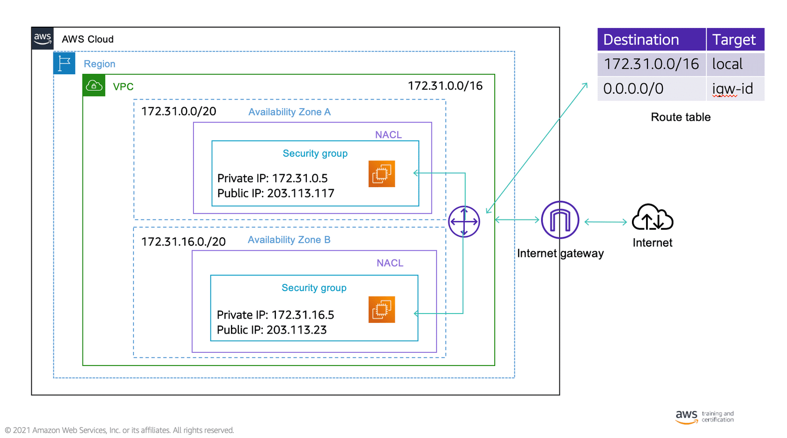
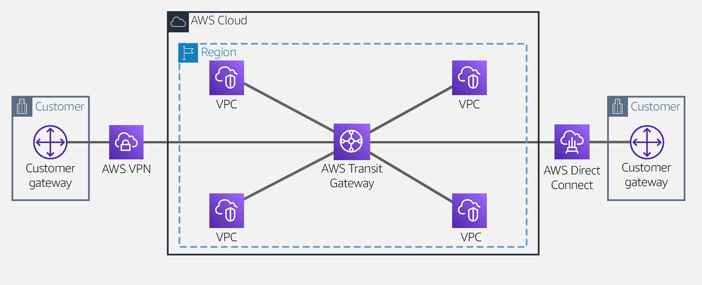
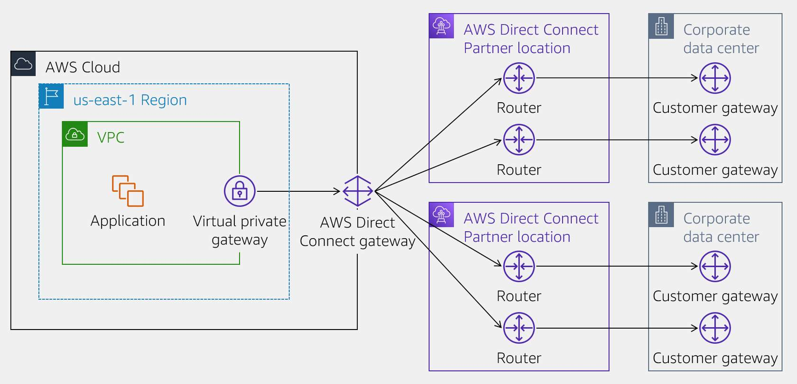

# AWS Certified Solutions Architect Professional

## Security

### IAM

- Managers users, groups (of users) and roles (can be assumed by someone of something) where you attach policies (permissions to resources).
- Groups cannot belong to groups.
- Users can belong to many groups.
- IdP can assume roles too.
- Access keys allows the user to use the cli.
- Most IAM policies are stored in AWS as JSON documents. They have several policy elements, including a Version, Effect, Action, and Resource (also Condition).
- IAM policies have a 2 kb size limit for users, 5 kb for groups, and a 10 kb for roles.
- IAM lets you create roles, and doing so allows you to define a set of permissions and then let authenticated users assume them. This feature increases your security posture by granting temporary access to the resources you define.
- You can use IAM to grant your employees and applications access to the AWS Management Console and to AWS service APIs using your existing identity systems. 

#### Limits on policy size

- User policy size cannot exceed 2,048 characters.
- Role policy size cannot exceed 10,240 characters.
- Group policy size cannot exceed 5,120 characters.

#### Policy elements

- Effect: Allow or Deny (required)
- Action (required)
- NotAction: explicitly matches everything except the specified list of actions
- Principal: you cannot use the Principal element in an IAM identity-based policy because, in that case, you are already attaching the policy directly to a principal (optional)
- NotPrincipal
- Resource: ARN of the resource (can have wildcards) (required)
- NotResource
- Condition: define complex conditions, multiple are interpreted as an AND operation (optional)

#### Identity-based policies

- AWS Managed: They can be attached to multiple users, groups, and roles.
- Customer managed: Provides more precise control than AWS managed policies and can also be attached to multiple users, groups, and roles.
- Inline: Embedded directly into a single user, group, or role. not recommended to use.

#### Policy types

##### Identity-based (Grant)

- Also known as IAM policies, identity-based policies are managed and inline policies attached to IAM identities (users, groups to which users belong, or roles). Impacts IAM principal permissions.

##### Resource-based (Grant)

- These are inline policies that are attached to AWS resources. The most common examples of resource-based policies are Amazon S3 bucket policies and IAM role trust policies.
- Resource-based policies grant permissions to the principal that is specified in the policy; hence, the principal policy element is required.

##### Permissions boundaries (Guardrails)

- A permissions boundary sets the maximum permissions that an identity-based policy can grant to an IAM entity. The entity can perform only the actions that are allowed by both its identity-based policies and its permissions boundaries. Resource-based policies that specify the user or role as the principal are not limited by the permissions boundary.
- Restricts permissions for the IAM entity attached to it.

##### AWS Organizations SCP (Guardrails)

- AWS Organizations is a service for grouping and centrally managing AWS accounts.
- If you enable all features in an organization, then you can apply SCPs to any or all of your accounts.
- SCPs specify the maximum permissions for an account, or a group of accounts, called an organizational unit (OU).
- Restricts permissions for entities in an AWS account, including AWS account root users.

##### ACLs (Grant)

- ACLs are supported by Amazon S3 buckets and objects.
- They are similar to resource-based policies although they are the only policy type that does not use the JSON policy document structure.
- ACLs are cross-account permissions policies that grant permissions to the specified principal.
- ACLs cannot grant permissions to entities within the same account.

##### Sessions policies (Guardrails)

- A session policy is an inline permissions policy that users pass in the session when they assume the role.
- The permissions for a session are the intersection of the identity-based policies for the IAM entity (user or role) used to create the session and the session policies.
- Restricts permissions for assumed roles and federated users.

#### Evaluation logic

- When an IAM entity (user or role) requests access to a resource in the same account, AWS evaluates all the permissions granted by the identity-based and resource-based policies. The resulting permission set is the total accumulated permissions from the two policy types. AWS evaluates all policies associated with a resource and builds a compilation of access rights into a key-value file called the request context.
- If an action is allowed by an identity-based policy, a resource-based policy, or both, AWS allows the action.
- An explicit deny in either of these policies overrides the allow.

#### Attributes and Tagging

- Attribute-based access control (ABAC) is an authorization strategy that defines permissions based on attributes.
- In AWS, these attributes are called tags.
- Tags can be attached to IAM principals (users or roles) and to AWS resources.
- Using both RBAC and ABAC is the way to go. For example, if multiple users share the same job function but different cost centers, and you want to grant access only to resources belonging to each individual’s cost center. With ABAC, only one role is required instead of multiple roles when using only RBAC.
- ABAC offers scalability, is more manageable and defines granular permissions.

#### IAM Condition Keys

- iam:AWSServiceName : control access for a specific service role. Use case: roles need to be attached to only specific services.
- iam:OrganizationsPolicyId : provides the IAM entity access to specific SCPs. Use case: users are also required to be authenticated via a service control policy.
- iam:PermissionsBoundary : checks that the specified policy is attached as a permissions boundary on the IAM principal resource. Use case: guardrails need to be configured for a policy attached to an IAM group.
- iam:PolicyARN : control how users can apply AWS managed and customer managed policies. Use case: users can attach specific customer managed policies to only certain IAM groups and roles.
- iam:ResourceTag : checks that the tag attached to the identity resource, either a user or role, matches the specified key name and value provided. Use case: permissions should be assigned to only a certain IAM role.

##### Condition keys for passing roles (iam:passRole)

- iam:PassedToService : specifies the service principal of the service to which a role can be passed. Use case: service roles should be created and passed to only specific AWS services.
- iam:AssociatedResourceArn : specifies the ARN of the resource to which this role will be associated at the destination service. Use case: users can pass a role that is associated with only a certain resource.

#### Global Condition Key

- TODO

### AWS Macie

- Macie automates the discovery of sensitive data, such as personally identifiable information (PII), personal health information (PHI) and financial data, to provide you with a better understanding of the types of data in Amazon S3.
- You can configure a job to run only once, for on-demand analysis and assessment, or on a recurring basis for periodic analysis, assessment, and monitoring. You can also choose various options to control the breadth and depth of a job's analysis, such as the S3 buckets that you want to analyze, the sampling depth, and custom include and exclude criteria that derive from properties of S3 objects.
- You can also customize what Macie looks for to reflect your unique scenarios, intellectual property, or proprietary data, such as customer account numbers or internal data classifications.
- If you require an inventory of your S3 buckets, Macie automatically evaluates and monitors those buckets for security and access control. Within minutes, Macie can identify and report overly permissive or unencrypted buckets within your organization.

### Amazon GuardDuty

- Amazon GuardDuty is a security monitoring service that analyzes and processes certain types of AWS logs, such as AWS CloudTrail data event logs for Amazon S3 and CloudTrail management event logs.
- It uses threat intelligence feeds, such as lists of malicious IP addresses and domains, and machine learning to identify unexpected and potentially unauthorized and malicious activity within your AWS environment.

## Networking

### IPv4

#### Public

- Class A: 0.0.0.0 to 127.255.255.255 (2.1 billion)
- Class B: 128.0.0.0 to 191.255.255.255 (1 billion)
- Class C: 192.0.0.0 to 223.255.255.255 (2 million)
- Class D
- Class E

#### Private

- Class A: 10.0.0.0 to 10.255.255.255
- Class B: 172.16.0.0 to 172.31.255.255 (16 ranges)
- Class C: 192.168.0.0 to 192.168.255.255 (256 ranges)

- The default VPC is configured using a Class B range.

### OSI model

- 1 - Physical: Cables.
- 2 - Data link: Frames and MACs.
- 3 - Network: IP.
- 4 - Transport: Ports, segments, retransmission and flow control.
- 5 - Session: Communication session between nodes.
- 6 - Presentation: Data representation and encryption.
- 7 - Application: Level 7 protocols (HTTP, SMTP, FTP, web-browsing, REST).

### VPC

- Every region have a default vpc (is open to internet).
- You choose your network size by using CIDR notation. In AWS, the smallest IP range you can have is /28, which provides 16 IP addresses. The largest IP range you can have is a /16, which provides 65,536 IP addresses.
- You define subnets inside a vpc in an AZ and in a IP range.
- A VPC can have connection to internet by internet gateway.
- When an internet gateway is attached to a subnet, it creates a public subnet by performing a type of Network Address Translation (NAT) called static NAT. The internet gateway will allocate a resource with a public IPv4 IP address. 
- A VPC can connect to a on-premise data center using a vpn using a Virtual Private Gateway (Add in the private routing table the IP range from your datacenter to access the VGW).
- To maintain redundancy and fault tolerance, create at least two subnets configured in two Availability Zones.
- AWS reserves five IP addresses in each subnet. (0 - Network address, 1 - VPC local router, 2 - DNS server, 3 - for future use, 255 - broadcast)
- The default Amazon VPC IPv4 CIDR,172.31.0.0/16, is always the same, and is designed and configured the same too.
- The Amazon VPC IPv6 CIDR for your subnet range is /64, and the Amazon VPC CIDR range is /56.
- Tenancy: if dedicated forces all instances to be physically isolated.
- Design your Amazon VPC implementation based on your expansion requirements, looking ahead at least two years.
- Recommend to use a separate Amazon VPCs for development, production, and staging environments.
- Depending on your solution, your data-tier subnets are likely to need more IP addresses than your public subnets, but fewer than your application-tier subnets.

#### Routing

- When creating a VPC a main route table is created (you can not delete it).
- You can create a custom route table and associate to the desired subnets.
- A subnet can only be in one Availability Zone.
- A subnet can only have one route table associated with it at a time, but you can use one route table for many different subnets in your Amazon VPC.
- The only architectural difference between a public and private subnet is that a public subnet has a route to an internet gateway.
- By default, DNS is handled by Amazon VPC. It is possible, however, to use Amazon Route 53 to create your own DNS inside an Amazon VPC with private hosted zones.
- All traffic is unicast and Amazon VPCs do not require the Address Resolution Protocol (ARP).
- By default, all subnets in an Amazon VPC can access each other. You can use network network ACLs to restrict traffic into and out of your subnets.
- All traffic between two points in the same Amazon VPC is forwarded directly.
- You attach the IGW to the VPC, is an one to one relation.
- In the public routing table add a record from 0.0.0.0/0 to the IGW.
- In the private routing table add a record from 0.0.0.0/0 to the NAT-ID.
- You can't resize a CIDR block after it's been created, so any IP addresses you reserve in that CIDR block are potentially stuck there until you delete that subnet.
- The CIDR blocks can overlap. When the CIDR blocks for route table entries overlap, the more specific (smaller range) CIDR block takes priority.

##### Internet gateway: Ingress routing

- Associates a route table with an internet gateway (instead of a subnet).
- Redirects incoming and outgoing VPC traffic through virtual appliances (for example a firewall for incoming traffic).
- Segments VPC traffic (for outgoing traffic).

#### Virtual private gateway

##### Site-to-site VPN

- One virtual private gateway per VPC.
- BGP or static routes.
- Redundant IPsec tunnels.
- Redundant routes across two AZ.
- In VPC route table the destination is the CIDR of the on-premises subnet and the target the virtual private gateway VGW.
- Up to 10 VPN connections (different on-premises networks) can terminate to the same virtual private gateway (each adds an entry to the route table).

##### Direct Connect

- One BGP per VPC.
- Restricted to one region.
- Maximum 50 VIFs (virtual interfaces) per Direct connection.
- If you want to communicate with a public aws services (like S3 or DynamoDB) you create a public VIF
- if you want to communicate with a resource inside a VPC you create a private VIF that terminates at the virtual private gateway of the VPC.

##### Ingress routing

- Associates a route table with a virtual private gateway (instead of a subnet).
- Redirects incoming and outgoing VPC traffic through virtual appliances (for example a firewall for incoming traffic).
- Segments VPC traffic (for outgoing traffic).

#### Customer gateway: Site-to-site VPN

- Located in on-premises data center.
- Physical or software appliance that the customers must configure.
- The same customer gateways can be reused for multiple site-to-site VPN connections, but you must consider high availability.
- Redundant IPSec tunnels (on the other end of the connections is the virtual private gateway).
- Each tunnel contains an Internet Key Exchange (IKE) security association, an IPSec security association, and a BGP peering.

#### Direct connect gateway

- Connect (associate) up to 10 virtual private gateways globally and cross account.
- It is a global resource, not a regional one.
- Has one BGP peering per Direct connect gateway per Direct connect connection.
- Can be associates with a virtual private gateway or a transit gateway.

#### Local Gateways

- One local gateway per Outpost.
- To allow the VPC in the Outpost on-premise to communicate to other networks on-premise outside the Outpost.
- Performs NAT for instances that have been assigned addresses from your customer-owner IP pool.

##### Components

- Route tables: AWS creates a local gateway for your Outpost and local gateway route table as part of the installation process. You can only associate the local gateway route table with subnets that reside in the Outpost.
- Virtual interfaces: AWS crates one VIF for each Link Aggregation Group (LAG), and then associates the VIF with the default local gateway route table. The local gateway route table has a default route to the two VIFs for local network connectivity.

#### NAT gateway

- To allow access to internet from private subnets but prevents the internet from initiation a connection with those instances, it is deployed in a public subnet.
- Performs NAT for instances with private IPs.
- Is highly available (redundancy inside an AZ).
- Is regional resource, IPv4 only.
- You cannot route traffic to a NAT gateway through a VPC peering connection, site-to-site VPN connection or Direct Connect.

#### Bastion

- To allow access private subnets from public subnets, it is an EC2 deployed in a public subnet.

#### Security

##### Network ACLs

- Attached at the subnet level.
- A network ACL is created for a default Amazon VPC and is associated with all subnets in your default Amazon VPC.
- Network ACLs manage traffic entering or leaving a subnet because network ACLs are associated with the subnet, not with resources inside the subnet. Network ACLs only manage traffic that is crossing the subnet boundary.
- Sateless resources, you have to configure in and out rules, for each port and ip ranges.
- The default network ACL allows all traffic in and out by default.
- Network ACLs are a great way to limit broad ranges of IP addresses from getting access to or from a subnet.

##### Security groups

- Attached to AWS resources, specifically the elastic network interfaces (ENIs), not Amazon VPC subnets.
- Security groups offer a few advantages compared to network ACLs in that they can recognize AWS resources and filter based on them.
- Security groups can reference other security groups and also reference themselves.  
- Stateful resources.
- Out traffic not checked.
- By default only allows outbound traffic.
- Security groups are not capable of explicitly blocking traffic. Security group rules only specify what traffic is allowed, while all other traffic is blocked.

##### Best practices

- Use multiple AZ deployments so you have high availability.
- Use CloudWatch to monitor your VPC components.
- Use VPC flow logs to capture traffic information. It does not affect network throughput or latency because it's collected outside of the path of your network traffic. You store them in S3. VPC flow logs do not capture packet payload.
- Chaining security groups together. Instead of IP ranges, define access to specific ports by other security groups (example: database servers sg would only allow traffic from application server sg).

#### AWS Networking Gateways

- Internet gateway is an Amazon VPC component that allows communication between your computer and the internet. Applications include, Elastic Load Balancers, Amazon EC2 instances, Amazon S3, AWS Lambda and so on.
- Customer Gateway is a physical or software appliance that you own or manage in your on premises network. Applications include manages routing to and from your environment.
- VPN Gateway is the gateway on the AWS side of site-to-site VPN connection. Applications include Amazon EC2 instances, Amazon S3, Amazon RDS< Amazon Lambda, and so on.
- Direct Connect Gateway establishes connectivity that spans Amazon VPCs spread across multiple AWS Regions. Applications include Amazon EC2 instances, Amazon RDS, AWS Lambda, and so on.
- NAT Gateway is a network address translation service that enables instances in a private subnet to connect to services outside your VPC. Applications include Amazon EC2 instances, Amazon RDS, AWS Lambda, and so on.
- AWS Transit Gateway connects Amazon VPCs, AWS accounts, and on premises networks to a single gateway. Applications include Amazon VPC connections, AWS VPN connection, AWS Direct Connect.
- Virtual gateway allows resources that are outside of your mesh network to communicate to resources that are inside. Applications include Amazon EC2, Amazon ECS, and Amazon EKS.

#### VPC peering

- VPC peering is a way to link multiple Amazon VPCs together and allows direct communications between two isolated Amazon VPCs using their private IP addresses.
- Adds entries in the route tables of each subnet with the destination of the other CIDR range and the peering connection VPX as target.
- VPC peers can span AWS accounts and also Regions (inter-region vpc peering).
- A VPC peering connection is highly available.
- This design is not scalable. As your environment grows and more Amazon VPCs are added, you will need to consider other options for connecting VPCs. VPC peering is a one-to-one connection, no more. You have a VPC peering connection between VPC A and VPC B, and between VPC A and VPC C. There is no VPC peering connection between VPC B and VPC C.
- The data shared is encrypted using the AWS global infrastructure.
- All data transfer over a VPC peering connection that stays within an Availability Zone is free of charge. All data transfer over a VPC peering connection that crosses Availability Zones will continue to be charged at the standard in-Region data transfer rates.
- Is great for shared services running in a single VPC to be accessible to other VPCs, vendor or partner systems that need to access your VPC or in reverse, security audits, requirements to split an application into multiple isolated VPCs to limit the impact of a potential outrage or application failure.
- You cannot create a VPC peering connection between VPCs with matching or overlapping IPv4 CIDR blocks. This limitation also applies to VPCs that have nonoverlapping IPv6 CIDR blocks. You cannot create a VPC peering connection if the VPCs have matching or overlapping IPv4 CIDR blocks. This applies even if you intend to use the VPC peering connection for IPv6 communication only.
- If either VPC in a peering relationship has one of the following connections, you cannot extend the peering relationship to that connection: A VPN connection or a Direct Connect connection to a corporate network, An internet connection through an internet gateway, An internet connection in a private subnet through a NAT device, A gateway VPC endpoint to an AWS service, for example, an endpoint to Amazon S3.
- There is no charge for setting up or running a VPC peering connection. Data transferred across peering connections is charged per gigabyte for send and receive, regardless of the Availability Zones involved.

### ELB (Elastic Load Balancer)

- High availability by design.

#### Application Load Balancer

- Configured at layer 7 form http/https traffic.
- The listener is configured to listen to a port and send traffic to a target group if the rule match.
- Rules can be defined based on path, host, headers, methods and source IPs.
- Understands HTTPS traffic.
- Can authenticate users (uses OpenID Connect (OIDC) protocol and integrates with other AWS services like SAML, LDAP, Microsoft Active Directory, etc)
- Each target group needs a health check.
- A target type can be instances, IPs or lambda functions.
- Can be internet-facing or internal-facing.
- You configure security groups and the vpc.
- Can configure redirects and fixed responses.
- Supports sticky sessions (for stateful applications). Uses an HTTP cookie to remember to which server has to send the traffic.
- Automatically provides a static IP address per AZ.
- Lets users assign a custom, fixed IP address per AZ.
- Billed at an hourly rate and an additional rate based on the load placed on your load balancer.

#### Network Load Balancer

- Configured at layer 4 for TCP/UDP/TLS.
- Low latency.
- Able to handle high-end workloads and scale to millions of requests per second. 
- Supports sticky sessions.
- A target type can be instances, IPs or ALB.
- Source IP preservation.
- Automatically provides a static IP address per AZ.
- Lets users assign a custom, fixed IP address per AZ.
- Uses Route 53 to direct traffic to load balancer nodes in other zones.
- It maintains stickiness of flows to a specific target appliance using 5-tuple (for TCP/UDP flows) or 3-tuple (for non-TCP/UDP flows). 
- The Gateway Load Balancer and its registered virtual appliance instances exchange application traffic using the GENEVE protocol on port 6081. It supports a maximum transmission unit (MTU) size of 8,500 bytes.

#### Gateway Load Balancer

- Configured alt layer 3 gateway and layer 4 load balancing.
- A target type can be instances or IPs.
- Helps you to deploy, scale, and manage your third-party appliances, such as firewalls, intrusion detection and prevention systems, and deep packet inspection systems.
- Provides a gateway for distributing traffic across multiple virtual appliances while scaling them up and down based on demand.
- Streamlined deployments: Can deploy a new virtual appliance by selecting it in the AWS Marketplace.
- Connects internet gateways, virtual private clouds (VPCs), and other network resources over a private network.
- Automatically provides a static IP address per AZ.
- Lets users assign a custom, fixed IP address per AZ.

### AWS Transit Gateway

- A service to manage and simplify the connections and peering for your VPCs.
- A regional resource that resides outside of a VPC.
- Creates a one-to-many peering connection through a central hub.
- Within a Region, AWS Transit Gateway provides a method for consolidating and centrally managing routing between VPCs with a hub-and-spoke network architecture.
- Inter-Region peering connects AWS Transit Gateways together using the AWS global network. This adds automatic encryption for your data, and your data never travels over the public internet.
- Transit gateways can also be used to connect your AWS environment to your on premises infrastructure creating a hybrid network of AWS and physical networks.
- Transit gateway offers AWS Transit Gateway Network Manager(opens in a new tab), which adds a unique view over your entire network, even connecting to Software-Defined Wide Area Network (opens in a new tab)(SD-WAN) devices.
- In AWS Transit Gateway, you are charged for the number of connections that you make to the Transit Gateway per hour and the amount of traffic (GB of data processed) that flows through AWS Transit Gateway. For AWS VPN attachments, the Transit Gateway owner is billed hourly. For AWS Direct Connect attachments, the Direct Connect Gateway owner is billed hourly. For Transit Gateway Connect attachments (SD-WAN appliances), the Transit Gateway owner is billed hourly. For peering attachments, each Transit Gateway owner is billed hourly for the peering attachment with the other Transit Gateway.
- You can have up to 20 different route tables per transit gateway.

#### Concepts

- Attachments: one or more VPCs, a compatible SD-WAN appliance, a Direct Connect gateway, a peering connection with another transit gateway, a VPN connection to a transit gateway.
- AWS Transit Gateway MTU: 8500 bytes for VPC connections, Direct Connect connections, connections to other transit gateway and peering connection. 1500 bytes for VPN connections.
- AWS Transit Gateway route table: A transit gateway has a default route table and can optionally have additional route tables. A route table includes dynamic and static routes that decide the next hop based on the destination IP address of the packet. The target of these routes can be any transit gateway attachment.
- Associations: Each attachment is associated with exactly one route table. Each route table can be associated with zero to many attachments.
- Route propagation: A VPC, VPN connection, or Direct Connect gateway can dynamically propagate routes to a transit gateway route table. With a Direct Connect attachment, the routes are propagated to a transit gateway route table by default. With a VPC, you must create static routes to send traffic to the transit gateway. With a VPN connection or a Direct Connect gateway, routes are propagated from the transit gateway to your on-premises router using BGP. With a peering attachment, you must create a static route in the transit gateway route table to point to the peering attachment.

#### Path selection behavior

- 1. Most specific route (longest prefix match)
- 2. Static route entries, including site-to-site VPN routes
- 3. BGP-propagated routes from Direct Connect gateway
- 4. BGP-propagated routes from AWS Site-to-Site VPN

### AWS PrivateLink

- Helps to establish secure and private connectivity between VPCs, AWS services and your on premises network.
- Makes it easy to connect services across different accounts and Amazon VPCs to significantly simplify your network architecture.
- Network traffic that uses PrivateLink doesn't traverse the public internet.
- You can also associate security groups and attach an endpoint policy to interface endpoints, which allow you to control precisely who has access to a specified service.
- There is no need to configure an internet gateway, VPC peering connection, or manage VPC CIDRs. It provides a more secure connection for services across different accounts and Amazon VPCs, with no need for firewall rules, path definitions, or route tables.
- Gateway VPC endpoints targets specific IP routes ina a VPC route table in the form of a prefix lists. Used for DynamoDB or S3.
- Interface VPC endpoints, powered by AWS PrivateLink, connect you to services hosted by AWS Partners and supported solutions available in AWS Marketplace. It is and elastic network interface with a private IP address from the IP address range of your subnet. It servers as an entry point for traffic.
- Gateway Load Balancer endpoints, powered by AWS PrivateLink, brings the same level of security and performance to your virtual network appliances or custom traffic inspection logic. This type of endpoint serves as an entry point to intercept traffic and route it to a service that you've configured using Gateway Load Balancers, for example, for security inspection.
- You will be billed for each hour that your VPC endpoint remains provisioned in each Availability Zone, irrespective of the state of its association with the service.
- With AWS PrivateLink, services establish a Transmission Control Protocol (TCP) connection between the service provider's VPC and the service consumer's VPC. This provides a secure and scalable solution.
- A transit VPC connects multiple VPCs that might be geographically disparate or running in separate AWS accounts to a common VPC that serves as a global network transit center. This network topology simplifies network management and minimizes the number of connections that you need to set up and manage. It is implemented virtually and does not require any physical network equipment or a physical presence in a co-location transit hub.
- AWS PrivateLink gives on-premises networks private access to AWS services through Direct Connect. You can also make services available to other accounts and VPCs that are accessed securely as private endpoints. If you use AWS PrivateLink with a Network Load Balancer to route traffic to your service or application, clients can connect to any service you host. Services configured to support AWS PrivateLink can be offered as a subscription service through the AWS Marketplace.
- AWS PrivateLink does not support IPv6.
- Traffic will be sourced from the Network Load Balancer inside the service provider VPC. From the perspective of the service provider application, all IP traffic will originate from the Network Load Balancer. All IP addresses logged by the application will be the private IP addresses of the Network Load Balancer. The service provider application will never see the IP addresses of the customer or service consumer.
- You can activate Proxy Protocol v2 to gain insight into the network traffic. Network Load Balancers use Proxy Protocol v2 to send additional connection information such as the source and destination. This might require changes to the application.
- Endpoint services cannot be tagged.
- The private Domain Name System (DNS) of the endpoint does not resolve outside of the VPC. Private DNS hostnames can be configured to point directly to endpoint network interface IP addresses. Endpoint services are available in the AWS Region in which they are created and can be accessed in remote AWS Regions using inter-Region VPC peering.
- Availability Zone names in a customer account might not map to the same locations as Availability Zone names in another account. For example, the Availability Zone US-East-1A might not be the same Availability Zone as US-East-1A for another account. An endpoint service is configured in Availability Zones according to their mapping in a customer’s account.
- When an interface endpoint is created, endpoint-specific DNS hostnames are generated that can be used to communicate with the service.
- An endpoint-specific DNS hostname is automatically generated and includes all zonal DNS hostnames generated for the interface endpoint. The hostname includes a unique endpoint identifier, service identifier, Region, and vpce.amazonaws.com in its name.
- You can generate a zonal-specific DNS hostname for each Availability Zone in which the endpoint is available. The hostname includes the Availability Zone in its name. 
- You can use a private DNS hostname to alias the automatically created zonal-specific or regional-specific DNS hostnames into a friendly hostname.
- Interface endpoints and Gateway Load Balancer endpoints are charged for each hour the VPC endpoint remains provisioned in each Availability Zone and for each gigabyte processed through the VPC endpoint.
- There is no additional charge for using gateway endpoints. Standard charges for data transfer and resource usage apply. You might be able to reduce costs by selecting gateway endpoints for traffic destined to DynamoDB or Amazon S3.

| Feature                     | Gateway Endpoints                                      | Interface Endpoints                                                    |
| --------------------------- | ------------------------------------------------------ | ---------------------------------------------------------------------- |
| Security                    | Uses endpoint policies for security                    | Uses endpoint policies and security groups                             |
| Amazon network connectivity | Uses Amazon network to connect to S3 and DynamoDB      | Uses Amazon Network through AWS PrivateLink to connect to AWS services |
| Access outside of the VPC   | Not accessible from outside the VPC                    | Can be accessed from on-premises and across Regions                    |
| IP connectivity             | Uses the public IPs of S3 and modifies the route table | Uses private IPs and can use public or endpoint-specific DNS names     |
| Cost                        | No additional charge for using gateway endpoints       | Charges a fee                                                          |

### AWS Direct Connect

- Your internal network is linked to an AWS Direct Connect location over a standard Ethernet fiber-optic cable. 
- This connection allows you to create virtual interfaces directly to public AWS services or to your VPC.
- When choosing to implement a Direct Connect connection, you should first consider bandwidth, connection type, protocol configurations, and other network configuration specifications.
- Only supports 802.1Q encapsulation. All equipment that will be part of the physical connection linking your location with AWS must support 802.1Q encapsulation.
- You pay only for what you use and there is no minimum fee. Direct Connect has two billing elements. Port hours and outbound data transfer. There might be additional external billing elements to consider.

#### Decision 1: Form of connection

##### Dedicated connection collocated at a Direct Connection location

- AWS has partnered with companies around the world to offer physical uplinks to AWS through the Direct Connect service.
- You deploy a router and supporting equipment to that location.
- The equipment you deploy will be the physical connection between your on-premises location and the AWS router at the Direct Connect location.
- You are responsible for the deployed equipment, the circuit that connects your op-premises location to the deployed equipment, and the connection from the deployed equipment to the AWS router.

##### Contracting with a Direct Connect Partner

- The Direct Connect Partner will provide you with the necessary equipment at the Direct Connect location that will connect to the AWS router.
- You will need to provide the physical connection between your on-premises location and the Direct Connect Partner equipment.
- The Direct Connect Partner will configure and maintain the physical equipment at the Direct Connect location.

##### Connecting directly to a Direct Connect node

- You are responsible for all the equipment from the node to your location.

#### Decision 2: Choose the bandwidth

- One gigabit per second, require a 1,310-nanometer 1000BASE-LX transceiver.
- 10 gigabits per second, require a 1,310-nanometer 10-gigabit BASE-LR transceiver.
- 100 gigabits per second, require a 100-gigabit BASE-LR4 transceiver.

- All types must all be single-mode fiber and you must disable auto-negotiation and configure your port speed and full duplex mode.
- Direct Connect supports the Link Aggregation Control Protocol (LACP), facilitating multiple dedicated physical connections to be grouped into link aggregation groups (LAGs). When you group connections into LAGs, you can stream the multiple connections as a single, managed connection.
- All connections in the LAG must use the same bandwidth.
- ou can have a maximum of two 100-Gbps connections in a LAG, or four connections with a port speed less than 100 Gbps. Each connection in the LAG counts toward your overall connection limit for the Region.
- All connections in the LAG must terminate at the same Direct Connect endpoint.
- When you create a LAG, you can download the Letter of Authorization and Connecting Facility Assignment (LOA-CFA) for each new physical connection individually from the Direct Connect console.

#### Decision 3: BGP (+ BFD) and public or private ASN

- The router that will connect to the AWS router must support Border Gateway Protocol, or BGP, and Border Gateway Protocol MD5 authentication.
- Direct Connect also supports asynchronous Bidirectional Forwarding Detection, or BFD. BFD can be configured with BGP, but is optional.
- BGP requires an Autonomous System Number, or ASN.
- ASNs can be public or private.
- Private ASNs can be self-determined.
- Public ASNs must be purchased and registered.
- Your choice of private or public ASN will determine which type of virtual interface you can use later. Private virtual interfaces require a private ASN and public virtual interfaces require a public ASN.

#### Decision 4: IP

- IPv4
- IPv6
- Both

- Public virtual interface will advertise your IP prefixes over BGP.
- AWS has implemented BGP community tags for private virtual interfaces to achieve load balancing and route preferences for traffic inbound to AWS.

#### Decision 5: Ethernet frame size

- Direct Connect virtual interfaces support a default Ethernet frame size of 1522 bytes and a jumbo Ethernet frame size of 9023 bytes.
- Ensure that all the equipment you will use to connect your on-premises location to your AWS environment supports the Ethernet frame size you want to implement.

#### Step 6: Configure Direct Connect connection in the dashboard.

- When you have configured your connection, AWS will provide you with a Letter of Authorization and Connecting Facility Assignment, or LOA-CFA. You will share your LOA-CFA with your Direct Connect Partner, showing them that AWS has authorized the completion of the last physical step for your Direct Connect connection.
- After they receive the LOA-CFA, your Direct Connect Partner will physically complete the connection between your router and the AWS router with a cross connect.

#### Decision 7: Configure the virtual interface

- Private: Choosing a private virtual interface lets you connect to all virtual private cloud, or VPC, resources within the private IP space in your AWS environment. Connect a single private virtual interface to multiple VPCs through private gateways within an AWS Region by associating it with your Direct Connect gateway.
- Public: Choosing a public virtual interface lets you route traffic to all VPC resources with a public IP address or that are connected to an AWS public endpoint. If you connect a public virtual interface to a Direct Connect location, you can connect to all public global AWS IP addresses and access AWS global IP route tables.
- Transit: Choosing a transit virtual interface lets you connect your Direct Connect connection to AWS Transit Gateway. Then you can use the power of the AWS Transit Gateway and the AWS Transit Gateway Network Manager to manage the traffic moving between your AWS environment and your physical location. A transit virtual interface supports connecting three transit gateways to your Direct Connect gateway. Each connected transit gateway can connect to multiple VPCs within the same Region, even if they belong to different accounts.

### AWS Site-to-Site VPN

- Create a secure and encrypted connections quickly if you need to connect remote offices to AWS.
- Based on IPsec technology, AWS Site-to-Site VPN uses a VPN tunnel to pass data from the customer network to or from AWS.
- One AWS Site-to-Site VPN connection consists of two tunnels. Each tunnel terminates in a different Availability Zone on the AWS side, but it must terminate on the same customer gateway on the customer side.

#### Components

- Customer gateway: A resource you create and configure in AWS that represents your on-premise gateway device. The resource contains information about the type of routing used by the Site-to-Site VPN, BGP, ASN and other optional configuration information.
- Customer gateway device: A customer gateway device is a physical device or software application on your side of the AWS Site-to-Site VPN connection.
- Virtual private gateway: A virtual private gateway is the VPN concentrator on the Amazon side of the AWS Site-to-Site VPN connection. You use a virtual private gateway or a transit gateway as the gateway for the Amazon side of the AWS Site-to-Site VPN connection.
- Transit gateway: A transit gateway is a transit hub that can be used to interconnect your VPCs and on-premises networks. You use a transit gateway or virtual private gateway as the gateway for the Amazon side of the AWS Site-to-Site VPN connection.

#### Limitations

- IPv6 traffic is partially supported. AWS Site-to-Site VPN supports IPv4/IPv6-Dualstack through separate tunnels for inner traffic. IPv6 for outer tunnel connection not supported.
- AWS Site-to-Site VPN does not support Path MTU Discovery. The greatest Maximum Transmission Unit (MTU) available on the inside tunnel interface is 1,399 bytes.
- Throughput of AWS Site-to-Site VPN connections is limited. When terminating on a virtual private gateway, only one tunnel out of the pair can be active and carry a maximum of 1.25 Gbps. However, real-life throughput will be about 1 Gbps. When terminating on AWS Transit Gateway, both tunnels in the pair can be active and carry an aggregate maximum of 2.5 Gbps. However, real-life throughput will be 2 Gbps. Each flow (for example, TCP stream) will still be limited to a maximum of 1.25 Gbps, with a real-life value of about 1 Gbps.
- Maximum packets per second (PPS) per VPN tunnel is 140,000.
- AWS Site-to-Site VPN terminating on AWS Transit Gateway supports equal-cost multi-path routing (ECMP) and multi-exit discriminator (MED) across tunnels in the same and different connection. ECMP is only supported for Site-to-Site VPN connections activated on an AWS Transit Gateway. MED is used to identify the primary tunnel for Site-to-Site VPN connections that use BGP. Note, BFD is not yet supported on AWS Site-to-Site VPN, though it is supported on Direct Connect.
- AWS Site-to-Site VPN endpoints use public IPv4 addresses and therefore require a public virtual interface to transport traffic over Direct Connect. Support for AWS Site-to-Site VPN over private Direct Connect is not yet available.
- For globally distributed applications, the accelerated Site-to-Site VPN option provides a connection to the global AWS backbone through AWS Global Accelerator. Because the Global Accelerator IP space is not announced over a Direct Connect public virtual interface, you cannot use accelerated Site-to-Site VPN with a Direct Connect public virtual interface.

#### Monitoring

- You can monitor VPN tunnels using Amazon CloudWatch, which collects and processes raw data from the VPN service into readable, near real-time metrics.
- These statistics are recorded for a period of 15 months.
- You can access historical information and gain a better perspective on how your web application or service is performing.
- VPN metric data is automatically sent to CloudWatch as it becomes available.

#### Pricing

- AWS Site-to-Site VPN: connection per hour and data transfer out charges.
- Accelerated Site-to-Site VPN: connection per hour, data transfer out charges, hourly charges for two AWS Global Accelerators per VPN connection and data transfer out premium (DT-Premium) fees.

### AWS Client VPN

- If you need to connect remote team access to AWS and your on premises resources.
- Based on OpenVPN technology.

#### Components

- Client VPN endpoint: Your Client VPN administrator creates and configures a Client VPN endpoint in AWS. Your administrator controls which networks and resources you can access when you establish a VPN connection.
- VPN client application: This is the software application that you use to connect to the Client VPN endpoint and establish a secure VPN connection.
- Client VPN endpoint configuration file: This is a configuration file that is provided to you by your Client VPN administrator. The file includes information about the Client VPN endpoint and the certificates required to establish a VPN connection. You load this file into your chosen VPN client application.

#### Limitations

- Client VPN supports IPv4 traffic only. IPv6 is not supported.
- Security Assertion Markup Language (SAML) 2.0-based federated authentication only works with an AWS provided client v1.2.0 or later. 
- SAML integration with AWS Single Sign-On requires a workaround. Better integration is being worked on.
- Client CIDR ranges must have a block size of at least /22 and must not be greater than /12.
- A Client VPN endpoint does not support subnet associations in a dedicated tenancy VPC.
- Client VPN is not compliant with Federal Information Processing Standards (FIPS).
- Client CIDR ranges cannot overlap with the local CIDR of the VPC in which the associated subnet is located. It also cannot overlap any routes manually added to the Client VPN endpoint's route table.
- A portion of the addresses in the client CIDR range is used to support the availability model of the Client VPN endpoint and cannot be assigned to clients. Therefore, we recommend that you assign a CIDR block that contains twice the number of required IP addresses. This will ensure the maximum number of concurrent connections that you plan to support on the Client VPN endpoint.
- The client CIDR range cannot be changed after you create the Client VPN endpoint.
- The subnets associated with a Client VPN endpoint must be in the same VPC.
- You cannot associate multiple subnets from the same Availability Zone with a Client VPN endpoint.
- AWS Certificate Manager (ACM) certificates are not supported with mutual authentication because you cannot extract the private key. You can use an ACM server as the server-side certificate. But, to add a client certificate to your customer configuration, you cannot use a general ACM certificate because you can't extract the required private key details. So you must access the keys in one of two ways. Either generate your own certificate where you have the key or use AWS Certificate Manager Private Certificate Authority (ACM PCA), which gives the private keys. If the customer is authenticating based on Active Directory or SAML, they can use a general ACM-generated certificate because only the server certificate is required.

#### Monitoring

- End-user usage reporting is possible through Amazon CloudWatch Logs.
- You can use a client connect handler to do basic posture assessment with Lambda because Client VPN does not support native posture assessment.
- Client VPN publishes metrics to CloudWatch for your Client VPN endpoints. Metrics are published to CloudWatch every five minutes.

#### Pricing

- Charged for the number of active client connections per hour and the number of subnets associated to Client VPN per hour.
- Billing starts when the subnet association is made.
- Each partial hour consumed is prorated for the hour.
- Any client connection that is less than an hour is also prorated for the hour.

### Networking Design Patterns

#### Simplifying Multi-VPC Routing: Hub-and-spoke scenario

- Deploy a transit gateway and phase out the VPC peering connections. This will reduce the complexity of the network and move from a distributed to a centrally managed model, reducing operational overhead.
- All routing tables are centralized on the transit gateway, simplifying management.
- The VPN connections terminates on the transit gateway.
- The Direct Connect connection terminates on the transit gateway.

#### Resilient Hybrid Networks

- AWS guarantees Direct Connect service as highly available by providing the service with a four nines (99.99%) service-level agreement. However, that guarantee only extends from the AWS router that the company connects to, not the segments of the connection before that.

#### Regional High Availability

- Route 53: used to route traffic based on latency or region.
- ELB: Public load balancer that passes the traffic to EC2 instances.
- Database: Clustered with data synchronization between regions.
- VPC peering connection: This permits application resources to communicate using a cost-effective way to replicate data between Regions. Inter-Region traffic is automatically encrypted and never traverses the public internet, always staying on the global AWS backbone.

#### AWS Transit Gateway Peering

- For large, multiregional AWS environments, AWS Transit Gateway supports inter-Region peering.
- This connection type creates a nontransitive, bidirectional route from a transit gateway in one Region to a transit gateway in another Region. Traffic that crosses an inter-Region peering connection is automatically encrypted and never leaves the global AWS backbone.
- To make a highly available multiregional AWS environment using transit gateways, a mesh network design is required. A mesh design ensures that each transit gateway has a peered connection with every other transit gateway in the environment, so traffic moves across the environment as needed.

### AWS Cloud WAN

- If you need to connect cloud routing and software-defined wide area networks, you can use this to provide a central dashboard for making the connections between your offices, data centers and VPCs.

### AWS App Mesh

- Connects containers and microservices with application-level networking.

### Amazon API Gateway

- To manage APIs at any scale.
- You can import from OpenAPI.
- Integration with lambda function, http, mock or aws service proxying (like s3, dynamodb, etc).
- APIs are deployed to stages. Previous deployments are keep as snapshots that can be restores.
- Stage variables can be configured.
- You can generate a SDK to consume the stage.

### AWS Cloud Map

- Discovers access to the most recent resources and services.

### CloudFront

- Delivers data, videos, applications and APIs with lower latency and higher transfer speeds.

### Route 53

- The DNS for AWS.

TODO: Route 53

### Global Accelerator

- Optimizes your user traffic, from the user to your application.

### AWS Shield

- Adds a safeguard to your applications against DDoS attacks.

### AWS WAF

- Protects your web application from common web exploits.

### AWS Network Firewall

- Deploys network security access for your VPC.

### AWS Firewall Manager

- Helps to centrally configure and manage your firewall rules.

### Monitoring and troubleshooting 

#### Metrics

- Bandwidth capacity: the maximum data transmission rate possible on a network.
- Throughput: data transmission rate. A low throughput means there are a lot of failed or dropped packets that need to be sent again.
- Latency: delay that happens between a node or device requesting data and when the data is finished being delivered.
- Packet loss: how many data packets are dropped during data transmissions on your network.
- Retransmission: retransmission rate lets you know how often packets are being dropped. Retransmission delay measures the time it takes for a dropped packet to be retransmitted.
- Availability: measures whether the network is currently operational.
- Connectivity: jitter is a variation in delay or disruption that occurs while data packets travel across the network.
- Network and server response time: metric that measures how quickly the application is responding to requests.
- CloudWatch metrics: you can monitor AWS Network Manager for global network, devices, connections, links and sites.

#### Security kinds of controls

- Directive: controls establish the governance, risk, and compliance models within which the environment operates.
- Detective: controls are intended to identify and characterize an incident in progress and provide assistance during investigations and audits after the event has occurred.
- Preventive: controls are designed to prevent an incident from occurring.
- Responsive: controls are intended to limit the extent of any damage caused by the incident.

#### Tools

##### CloudWatch

- Can configure alarms to be triggered when certain metrics values reach a threshold.
- Can configure alarms to be triggered when certain messages appear in logs.
- Can configure alarms to be triggered when an event is triggered.
- CloudWatch data is recorded for a period of 15 months to access historical information and gain a better perspective on how your network, application, or service is performing.
- Some CloudWatch metrics are not collected by default. The full range of CloudWatch metrics requires extra configuration and authorization. In that case, CloudWatch metrics need a CloudWatch agent installed to collect metrics for your Amazon EC2 instances and your on-premises servers.
- Data points with a 1-minute period are available for 15 days.
- For a peering connection, namespace would be AWS/PCX.

###### Data points

- VPC Registered transited gateways (BytesIn, BytesOut, PacketsIn, PacketsOut)
- VPC Associated Site-to-Site VPN connections (TunnelDataIn, TunnelDataOut, TunnelState) 
- VPC peering connections (awsRegion, vpcPeeringConnectionId, accepterVPCInfo, requesterVPCInfo)
- VPC On-premises resources (BytesIn, BytesOut, VPCTunnelDown)
- VPC Flow Logs metrics

###### Dashboards

- A single view for selected metrics and alarms to help you assess the health of your network, resources, and applications across one or more Regions and from multiple AWS accounts.
- A track for the same metric across multiple graphs by selecting the color used for each metric on each graph or widget.
- An operational playbook that provides guidance for team members during operational events about how to respond to network-specific incidents.
- A common view of critical resources and application measurements that can be shared by team members for faster communication flow during network performance or operational events.
- Metrics explorer widgets to your dashboard helps you to troubleshoot your network more efficiently.
- Alarm widget to display the status a single alarm or multiple alarms.
- Animated dashboard that replays CloudWatch metric data that was captured over time.
- You can share your CloudWatch dashboards across teams, with stakeholders, and with people external to your organization.

###### Logs

- Monitor, store, and access your log files from Amazon VPC, AWS Transit Gateway, AWS VPN, AWS Network Load Balancer, and other sources.
- You can then easily view the logs, search the logs for specific error codes or patterns and filter the logs based on specific fields or archive them securely for future analysis.
- Log events are a record of some activity recorded by the application or resource being monitored. The log event record that CloudWatch Logs understands contains two properties: the timestamp of when the event occurred, and the raw event message. Event messages must be UTF-8 encoded.
- Log streams are a sequence of log events that share the same source. More specifically, a log stream is generally intended to represent the sequence of events coming from the application instance or resource being monitored.
- Log groups define groups of log streams that share the same retention, monitoring, and access control settings. Each log stream has to belong to one log group. There is no limit on the number of log streams that can belong to one log group.
- Metric filters can extract metric observations from ingested events and transform them to data points in a CloudWatch metric. Metric filters are assigned to log groups and all of the filters assigned to a log group are applied to their log streams. You can choose to assign dimensions and a unit to the metric, use any type of CloudWatch statistic, including percentile statistics, when viewing these metrics or setting alarms and use subscriptions to get access to real-time feed of log events and have it delivered as an Kinesis stream, Kinesis Data Firehose stream or Lambda for custom processing. When log event are sent to the receiving service, they are base64-encoded and compressed with the gzip format.
- Retention settings can be used to specify how long log events are kept in CloudWatch Logs. Expired log events get deleted automatically. Just like metric filters, retention settings are also assigned to log groups, and the retention assigned to a log group is applied to its log streams. By default, log data is stored in CloudWatch Logs indefinitely. You can also export log data from your log groups to an S3.

###### Logs insights

- Helps you efficiently identify patterns, interactively search, and analyze your log data with bar charts, line charts, and stacked area charts.
- You can save queries to run them again latter and structure them in folders. You are limited to save 1000 queries per region per account.
- You can add a query to a dashboard, they run every time you load the dashboard and every time the dashboard refreshes. These queries count toward your limit of 10 concurrent logs insights queries.
- Includes a purpose-build query language.
- To perform a query yo need to specify the log groups, time range to query and the query string to use.
- A single request can query up to 20 log groups. Queries time out after 15 minutes. Query results are available for 7 days.
- CloudWatch Logs Insights queries incur charges based on the amount of data that is queried.
- For every log sent, five system fields are automatically generated: @message, @timestamp, @ingestionTime, @logStream, @log (log group identifier).

###### Alarms

- CloudWatch alarms facilitate more complex workflows such as sending an email, running a lambda function, viewing metrics per transit gateway for a global network and remediating changes to network ACLs or security groups.
- Metrics are grouped first by namespace and then by the various dimension combinations within each namespace.
- A metric alarm watches a single CloudWatch metric or the result of a math expression based on CloudWatch metrics. The alarm performs one or more actions based on the value of the metric or expression relative to a threshold over a number of time periods.
- A composite alarm includes a rule expression that takes into account the alarm states of other alarms that you have created. The composite alarm goes into an ALARM state only if all conditions of the rule are met. Using composite alarms can reduce alarm noise.
- Add alarms to your CloudWatch dashboards and monitor them visually. When an alarm is on a dashboard, it turns red when it is in the ALARM state, making it easier for you to monitor its status proactively.
- An alarm invokes actions only when the alarm changes state. The exception is for alarms with Auto Scaling actions. For Auto Scaling actions, the alarm continues to invoke the action once per minute that the alarm remains in the new state.
- The alarm can be in one of three states: OK, ALARM and INSUFFICIENT_DATA.
- When you create an alarm, you specify three settings to evaluate when to change the alarm state: period is the length of time to evaluate the metric in seconds (if you specify 1 minute, the alarm evaluates the metric once per minute), evaluation periods is the number of the mos recent periods to evaluate when determining the alarm state and datapoints to alarm is the number of data points withing the evaluation period that must be breaching (don't have to be consecutive) to cause the alarm to go to the ALARM state.
- Is recommended to set alarms when a configuration change is made to: VPC internet gateway, VPC VPN customer gateway, ACLs, Security group, CloudTrail, Root account and VPC Flow Logs.
- You can also configure alarms to create OpsItems in Systems Manager Ops Center or create incidents in Systems Manager Incident Manager. These actions can be performed only when the alarm goes into ALARM state.
- For each alarm you create, you can specify how to treat missing data points as notBreaching, breaching, ignore (current alarm state is maintained) or missing (alarm transitions to INSUFFICIENT_DATA).
- CloudWatch sends events to Amazon EventBridge whenever a CloudWatch alarm changes alarm state. You can use EventBridge and these events to write rules that take actions, such as notifying you, when an alarm changes state. CloudWatch guarantees the delivery of alarm state change events to EventBridge.
- You can create an alarm for a custom metric before you've created that custom metric.
- You can disable and enable alarms.
- You can test an alarm by setting it to any state. This temporary state change lasts only until the next alarm comparison occurs.
- You can list any or all of the currently configured alarms, and list any alarms in a particular state.
- You can create up to 5000 alarms per region per account.
- You only can use ACII characters for alarm names.

###### Pricing

- When you exceed three dashboards with up to 50 metrics.
- By ingesting and storing logs, as well as the amount of ingested logs scanned for each CloudWatch Insights query.
- Based on the number of custom events.
- Charges are also incurred when you monitor more than 10 custom metrics. Custom metrics can be metrics you create and also metrics from tools such as the CloudWatch agent.
- You are charged for each metric associated with a CloudWatch alarm.

###### Amazon EC2 network maximums at the instance level to be monitored

- Bandwidth capability: Each EC2 instance has a maximum bandwidth for aggregate inbound and outbound traffic, based on instance type and size. Amazon EC2 also has maximum bandwidth for traffic to AWS Direct Connect and the internet.
- Packet-per-second (PPS) performance: Each EC2 instance has a maximum PPS performance, based on instance type and size. When the limit is reached, AWS queues the extra packets for delivery at a late time. If the queue reaches its capacity, packets might be dropped.
- Connections tracked: The security group tracks each connection established to ensure that return packets are delivered as expected. There is a maximum number of connections that can be tracked per instance.
- Link-local service access: Amazon EC2 provides a maximum PPS per network interface for traffic to services such as the Domain Name System (DNS) service, the instance metadata service (IMDS), and the Amazon Time Sync Service.

##### VPC Flow Logs

- VPC Flow Logs is a feature that lets you to capture information about the IP traffic going to and from network interfaces in your VPC.
- Flow logs can help you with a number of tasks, such as diagnosing overly restrictive security group rules, monitor the traffic that is reaching your instance and determining the direction of the traffic to and from the network interfaces.
- Levels of monitoring: VPC level, subnet level and network interface level.
- Logging parameter can be defined by choosing the traffic filter type (all, accept or rejected), log name, destination (S3 or CloudWatch) and necessary permissions (IAM role).
- Flows are collected, processed, and stored in capture windows that are approximately 10 minutes long. You can create up to two flow logs on one resource.
- When publishing to CloudWatch Logs, flow log data is published to a log group. Once the log group is created, the first flow records are visible in the console in about 15 minutes. Each network interface has a unique log stream in the log group.
- If the same network interface is present in one or more flow logs in the same log group, it has one combined log stream. If you've specified that one flow log should capture rejected traffic, and the other flow log should capture accepted traffic, then the combined log stream captures all traffic.
- When publishing to Amazon S3, flow log data is published to an existing Amazon S3 bucket that you specify using a folder structure that is determined by the flow log's ID, Region, and the date on which they are created.
- Flow log records for all of the monitored network interfaces are published to a series of log file objects that are stored in the bucket. If the flow log captures data for a VPC, the flow log publishes flow log records for all of the network interfaces in the selected VPC.
- Flow logs can quickly grow into the hundreds of gigabytes.

###### Use cases

- Performance: provides flow duration, latency, and bytes sent and can be used to identify latencies, establish performance baselines, and improve applications.
- Security: can be used to log all traffic from an Amazon VPC, an interface, or a subnet for root cause analysis to identify gaps in your security. Identifying suspicious traffic tightens security and points to malicious traffic traversing your network.
- Compliance: can be used to show that your organization is compliant with specific industry, federal, state, and local regulations that your organization must follow. By directing logs into Amazon S3 to build a data lake, you can ensure that data is available for audits.

###### Anatomy of a flow log

- Account number
- Network interface
- Source IP
- Target IP
- Source port
- Target port
- Protocol (6 is TCP)
- Packets
- Bytes
- Timestamp
- Timestamp
- Action (ACCEPT or REJECT)

###### Limitations

- Changes cannot be made to the configuration of a flow log or the format of a flow log record after they have been created. If the flow log you have created is not gathering the data you expected or if the nature of what you need to gather changes, you have to delete the existing flow log and create a new one.
- Flow logs can only be configured for VPC peering connections deployed by your account. VPC peering connections deployed by another account cannot be monitored using VPC flow logs even if they have been authorized to link to VPCs within your account.
- Network interfaces for EC2-Classic instances are not supported. This includes instances linked to your VPC through ClassicLink.
- Sent to an EC2 with multiple IP addresses is recorded under the primary private IP address, listed in the dstaddr field, for the EC2 network interface. To separate log traffic by destination IP, configure the flow log to use the pkt-dstddr log field.
- Sent through an intermediate device, such as a NAT gateway, will record the IP of the intermediate device in the srcaddr field. To ensure that the original source IP address of device that generated the packet is recorded, configure the flow log to use the pkt-srcaddr field.
- Received from an intermediate device, such as a NAT gateway, will record the IP of the intermediate device in the dstaddr field. To ensure that the original destination IP address is recorded, configure the flow log to use the pkt-dstaddr field.
- Flow logs do not capture IP traffic to and from Amazon reserved IPs. This includes but is not limited to Amazon Domain Name Service (DNS), Amazon Windows license activation service, instance metadata, and Amazon Time Sync. The five IPv4 addresses reserved by Amazon for each subnet are also excluded from VPC flow logs.

##### Traffic Mirroring

- You can use Traffic Mirroring to copy network traffic from an elastic network interface of an Amazon EC2 instance. In addition, you can send the traffic to out-of-band security and monitoring appliances for: Content inspection, Threat monitoring and Troubleshooting.
- You can choose to capture all traffic or you can use filters to capture the packets that are of particular interest to you, with an option to limit the number of bytes captured per packet.
- You can use VPC Traffic Mirroring in a multi-account AWS environment, capturing traffic from VPCs spread across many AWS accounts and then routing it to a central VPC for inspection.
- You can mirror traffic from any EC2 instance that is powered by the AWS Nitro system and 12 Xen-based instance types.
- You can use open-source tools such as Suricata and Zeek to monitor network traffic from an Amazon EC2 instance. These open-source tools support VXLAN decapsulation, and they can be used at scale to monitor Amazon VPC traffic.
- The following traffic types cannot be mirrored: ARP, DHCP, Instance metadata service, NTP and Windows activation.

###### Key concepts

- Traffic mirror source: is the network interface of an Amazon EC2 instance where AWS copies the network traffic from. VPC Traffic Mirroring supports the use of Elastic Network Interfaces (ENIs) as mirror sources.
- Traffic mirror target: is the destination for mirrored traffic. The traffic mirror target can be a network interface or a network load balancer and used in more than one traffic mirror session.
- Traffic mirror filter: by default, no traffic is mirrored. To mirror traffic, add traffic mirror rules to the filter. Traffic mirror filter rules define what traffic gets mirrored. Rules are numbered and processed in order. The filter can specify a protocol, ranges for source and destination ports and CIDR block for the source and destination.
- Traffic mirror session: establishes a relationship between a traffic mirror source and a traffic mirror target that makes use of a traffic mirror filter. Traffic mirror sessions are evaluated based on the ascending session number that you define when you create the session. The first match (accept or reject) is used to determine the fate of the packet.
- Connectivity: the mirrored traffic is sent to the traffic mirror target using the source Amazon VPC route table. Before you configure Traffic Mirroring, make sure that the traffic mirror source can route to the traffic mirror target.

###### Use cases

- Performance monitoring and network visibility to analyze specific traffic patterns to identify any vulnerable blind spots or choke points between application tiers or Amazon EC2 instances.
- Troubleshooting by extracting traffic of interest from any workload in an Amazon VPC and sending it to the right tools to detect and respond faster to attacks often missed by traditional log-centric tools. Analyzing the actual packets helps to perform a root-cause analysis on a performance issue and assist with diagnosis of network issues. This gives visibility beyond what is available through VPC Flow Logs.
- Security monitoring using packet inspection, signature analysis, anomaly detection, and machine learning based techniques provides further protection, threat prevention, and network forensics to your network traffic.
- Better response time using the right tools to detect, extract, and respond to traffic of interest from any workload in an Amazon VPC that is often missed by traditional log-centric tools.
- Replicate production traffic into develop environments.

##### VPC Reachability Analyzer

- The VPC Reachability Analyzer is a network diagnostics tool that troubleshoots reachability between two endpoints in an Amazon VPC, or within multiple Amazon VPCs.
- Specify the path of communication for the traffic from a source to a destination for any of the following endpoint types: VPN Gateways, Instances, Network Interfaces, Internet Gateways, VPC Endpoints, VPC Peering Connections, and Transit Gateways.
- The source and destination resources must be: owned b yhe same account, in the same region and in the same VPC or VPCs connected through VPC peering.
- You can choose to check for connectivity through either the TCP or UDP protocols. Optionally, you can also specify a port number, source, or destination IP address.
- Once the analysis completes, you can se if the destination is reachable or not reachable (provides one or mode explanation codes to help diagnose).
- To resolve automatically, you can configure VPC Reachability Analyzer with CloudWatch to alert on connectivity issues and possibly automatically remediate using AWS Lambda.
- With VPC Reachability Analyzer, you are charged per analysis run between a source and a destination. It is best practice to run analysis during networking configuration changes and to troubleshoot connectivity issues that arise. Optionally, you can tag your analysis to keep track of the cost.

###### Use cases

- Troubleshooting connectivity issues caused by network misconfiguration.
- Verifying that your network configuration matches your intended connectivity.
- Automating the verification of your connectivity intent as your network configuration changes.
- Determining whether a destination resource in your Amazon VPC is reachable from a source resource. 

##### AWS Transit gateway Network Manager

- The AWS Transit Gateway Network Manager lets you to centrally manage your networks that are built around transit gateways. You can visualize and monitor your global network across Regions and on-premises locations.
- There is no additional cost for using Network Manager.

###### Steps to configure

- Create a global network.
- Register your transit gateways (automatically includes transit gateway attachments like the VPCs, Site-to-Site VPN connections ,AWS Direct Connect gateways, Transit Gateway Connect and Transit gateway peering connections, but not its attachments)
- Define and add devices, links, and sites for your on-premises resources to your global network.
- Analyze your network wit the Route Analyzer.
- Monitor your networks through a dashboard on the Network Manager console. You can view network activity and health using CloudWatch metrics and CloudWatch Events.

###### Section pages

- Overview: you can view the inventory of your global network and a list of transit gateways that are registered.
- Details: you can view information about the global network resource.
- Geographic: you can view the locations of the resources that are registered in your global network on a map. Lines on the map represent connections between the resources, and the line colors represent the type of connection and their state. You can choose any of the location points to view information about the resources in that location.
- Topology: you can view the network tree for your global network.
- Events: you can view the system events that describe changes in your global network.
- Monitoring: you can view CloudWatch metrics for the transit gateways, VPN connections, and on-premises resources in your global network.
- Route Analyzer: you can perform an analysis of the routes in your transit gateway route tables.

##### CloudTrail

- AWS service that logs all API actions in your account. CloudTrail maintains the audit logs of changes to the AWS account.
- Management Events: By default, CloudTrail only logs management events such as creating an Amazon EC2 instance and an Amazon VPC. It provides information about management operations.
- Data Events: By default, CloudTrail only logs management events because data events occur more often. Data events are the resource operations in a resource such as AWS Lambda functions or objects uploaded to Amazon S3.
- CloudTrail does not log in real time. There is a delay, but you can create a CloudTrail and store that data in Amazon S3 or CloudWatch logs.

##### COTS Tools

- COTS network monitoring tools are available under license. The AWS Marketplace has third-party COTS network monitoring tools available for deployment within a customer's AWS environment.  Some have a licensing fee, some do not.

##### iPerf and iPerf3

- Tools for active measurements of the maximum achievable bandwidth on IP networks. It supports tuning of various parameters related to timing, buffers, and protocols (TCP, UDP, SCTP with IPv4 and IPv6). For each test, they report the bandwidth, loss, and other parameters. iPerf3 is a new implementation that shares no code with the original iPerf and also is not backwards compatible.

##### ExtraHop

- ExtraHop is a monitoring solution for security, network performance, and the cloud. It gives detailed metrics on average bandwidth utilization, average throughput, and more.

##### Netperf

- Netperf is a CLI tool similar to iPerf that measures throughput and benchmarking speeds.

## Compute

### Choose options

- Main focus is time to market.
- Scalability is important but not the main priority.
- For startups starting from scratch Serverless with SAM is the best option to focus only on code.
- For teams that already have containers ECS or EKS running on Fargate.
- For a team with an existing monolithic app the recommended solution is Elastic Beanstalk.

### AWS App Runner

TODO AWS App Runner

### EC2

- Allows to have a custom launch script.
- Provision and launch one or more EC2 instances in minutes.
- Stop or shut down EC2 instances when you finish running a workload.
- Pay by the hour or second (depending on the type of instance) for each instance type (minimum of 60 seconds).
- Hardware specifications: CPU, memory, network, and storage
- Logical configurations: Networking location, firewall rules, authentication, and the operating system of your choice
- When launching an EC2 instance, the first setting you configure is which operating system you want by selecting an Amazon Machine Image (AMI).
- An AMI includes the operating system, storage mapping, architecture type, launch permissions, and any additional preinstalled software applications.
- You can create an AMI from your running instance and use the AMI to start a new instance.
- AMI origins: Quick Start AMIs, AWS Marketplace AMIs, My AMIs, Community AMIs and Custom image.
- Each AMI in the AWS Management Console has an AMI ID, which is prefixed by ami-, followed by a random hash of numbers and letters. The IDs are unique to each AWS Region.
- The default VPC is suitable for getting started quickly and launching public EC2 instances without having to create and configure your own VPC.
- When architecting any application for high availability, consider using at least two EC2 instances in two separate Availability Zones.
- Anything you can run on a physical server can be run on Amazon EC2.  Amazon EC2 gives you access to the OS and to the underlying files and can scale out and in as necessary.

#### Instance types

EC2 instances are a combination of virtual processors (vCPUs), memory, network, and, in some cases, instance storage and graphics processing units (GPUs).

- The first position indicates the instance family.
- The second position indicates the generation of the instance.
- The remaining letters before the period indicates additional attributes.
- After the period indicates the instance size.

| Family                          | Description                                                                                                                                                                                                                                                                                                                | Use cases                                                                                                                                                                                                                                                                |
| ------------------------------- | -------------------------------------------------------------------------------------------------------------------------------------------------------------------------------------------------------------------------------------------------------------------------------------------------------------------------- | ------------------------------------------------------------------------------------------------------------------------------------------------------------------------------------------------------------------------------------------------------------------------ |
| General purpose (t/m)           | General purpose instances provide a balance of compute, memory, and networking resources, and can be used for a variety of workloads.                                                                                                                                                                                      | Ideal for applications that use these resources in equal proportions, such as web servers and code repositories                                                                                                                                                          |
| Compute optimized (c)           | Compute optimized instances are ideal for compute-bound applications that benefit from high-performance processors.                                                                                                                                                                                                        | Well-suited for batch processing workloads, media transcoding, high performance web servers, high performance computing (HPC), scientific modeling, dedicated gaming servers and ad server engines, machine learning inference, and other compute intensive applications |
| Memory optimized (r/u/x)        | Memory optimized instances are designed to deliver fast performance for workloads that process large datasets in memory.                                                                                                                                                                                                   | Memory-intensive applications, such as high-performance databases, distributed web-scale in-memory caches, mid-size in-memory databases, real-time big-data analytics, and other enterprise applications.                                                                |
| Accelerated computing (p/g/trn) | Accelerated computing instances use hardware accelerators or co-processors to perform functions such as floating-point number calculations, graphics processing, or data pattern matching more efficiently than is possible in software running on CPUs.                                                                   | Machine learning, HPC, computational fluid dynamics, computational finance, seismic analysis, speech recognition, autonomous vehicles, and drug discovery.                                                                                                               |
| Storage optimized (i/d)         | Storage optimized instances are designed for workloads that require high sequential read and write access to large datasets on local storage. They are optimized to deliver tens of thousands of low-latency random I/O operations per second (IOPS) to applications that replicate their data across different instances. | NoSQL databases (Cassandra, MongoDB and Redis), in-memory databases, scale-out transactional databases, data warehousing, Elasticsearch, and analytics.                                                                                                                  |
| HPC optimized (hpc)             | High performance computing (HPC) instances are purpose built to offer the best price performance for running HPC workloads at scale on AWS.                                                                                                                                                                                | Ideal for applications that benefit from high-performance processors, such as large, complex simulations and deep learning workloads                                                                                                                                     |

#### Lifecycle

- When an instance is pending, billing has not started.
- Rebooting keeps its public DNS name (IPv4) and private and public IPv4 addresses.
- When you stop and start an instance, your instance can be placed on a new underlying physical server.
- Termination of an instance means that you can no longer access the machine.
- As soon as the status of an instance changes to shutting down or terminated, you stop incurring charges for that instance.
- When you stop your instance, the data from the instance memory (RAM) is lost.
- When you stop-hibernate an instance, Amazon EC2 signals the operating system to perform hibernation (suspend-to-disk), which saves the contents from the instance memory (RAM) to the EBS root volume. 

#### Pricing

- On-demand: pay as you go, recommended for unpredicted load and test.
- Spot: for flexible start and end times, recommended for stateless workloads.
- Saving plan: flexible pricing model that offers low usage prices for a 1-year or 3-year term commitment to a consistent amount of usage.
- Reserved: for applications with steady state usage that might require reserved capacity, can be standard, convertible or scheduled.
- Dedicated host: physical Amazon EC2 server that is dedicated for your use, can be purchased hourly or as reservation.

#### Auto Scaling

- Vertical scaling: Increase the instance size in active-passive system.
- Horizontal scaling: Add additional instances in active-active system.
- Automatic scaling based on demand.
- Scheduled scaling based on user-defined schedules.
- Fleet management automatically replacing unhealthy EC2 instances.
- Predictive scaling using ML to help schedule optimum number of instances.
- ELB integrates seamlessly with EC2 Auto Scaling.

##### Configuring components

###### Launch template or configuration

- Recommended over launch configuration (you can not use previously created launch configurations as a template or can create one from an existing instance).
- Can create one from an existing instance, from an existing template or previous version, or define a template from scratch (AMI, instance type, key pair, security group, storage, resource tags)

###### Amazon EC2 Auto Scaling groups

- You specify the VPC and subnets where instances should be launched.
- You can specify the type of purchase (on-demand, spot or combination of the two).
- You configure the minimum, desired and maximum capacity.

###### Scaling policies

- Simple scaling policy: Use CloudWatch alarm to scale based on number or percentage. Has a cooldown before taking any other action.
- Step scaling policy: Respond to additional alarms even when scaling activity is in progress.
- Target tracking policy: You define the target value to track and it automatically creates the required CloudWatch alarms.

### EC2 Image builder

- Used to build custom EC2 images.

### ECS

- End-to-end container orchestration service that helps you spin up new containers.
- Your containers are defined in a task definition that you use to run an individual task or a task within a service.
- You have the option to run your tasks and services on a serverless infrastructure that's managed by another AWS service called AWS Fargate.
- For more control over your infrastructure, you can run your tasks and services on a cluster of EC2 instances that you manage.
- You need to install the Amazon ECS container agent on your EC2 instances.
- To prepare your application to run on Amazon ECS, you create a task definition.
- Recommended for large monolithic applications that you want to break into container or move directly without any change.

### EKS

- If you already use Kubernetes, you can use Amazon EKS to orchestrate the workloads in the AWS Cloud.
- The machine that runs the containers is called a worker node or Kubernetes node.
- An EKS container is called a pod.
- Recommended for large monolithic applications that you want to break into container or move directly without any change.

### Fargate

- AWS Fargate is a purpose-built serverless compute engine for containers.
- Supports both Amazon ECS and Amazon EKS architecture and provides workload isolation and improved security by design.

### Lambda

- Lambda runs your code on a high availability compute infrastructure and requires no administration from the user.
- You have the option of configuring your Lambda functions using the Lambda console, Lambda API, AWS CloudFormation, or AWS Serverless Application Model (AWS SAM).
- You can create a function from scratch, blueprint, select a container image or browse the AWS Serverless Application Repository.
- You can deploy by zip or by container.
- You define the execution parameters, such as memory, timeout and concurrency.
- The runtime provides a language-specific environment that runs in an application environment.
- The AWS Lambda function handler is the method in your function code that processes events.
- The handler method takes two objects: the event object and the context object. 
- Billing is rounded up to the nearest 1 millisecond (ms). It can be cost effective to run functions whose execution time is very low.
- Price depends on the amount of memory you allocate to your function, not the amount of memory your function uses.
- Is a suitable choice for any short-lived application that can finish running in under 15 minutes.
- Great option for even-driven applications.
- If is compute intensive consider using a container instead of lambda.
- Supported languages: Node, Python, Java, Go, C#, Ruby, PowerShell.
- AWS provided plugins for a number of popular IDEs.
- The AWS Lambda Free Tier includes 1 million free requests per month and 400,000 GB-seconds of compute time per month.

#### Invocation models

##### Synchronous invocation

- Runs the function and waits for a response.
- Synchronous events expect an immediate response from the function.
- There are no built-in retries. You must manage your retry strategy within your application code.
- Synchronous services: API Gateway, Cognito, CloudFormation, Alexa, Lex, CloudFront.

##### Asynchronous invocation

- Events are queued and the requestor doesn't wait for the function to complete.
- With the asynchronous model, you can make use of destinations. Use destinations to send records of asynchronous invocations to other services.
- There is a built in retries twice.
- A destination can send records of asynchronous invocations to other services.
- You can configure separate destinations for events that fail processing and for events that process successfully.
- You can configure destinations on a function, a version, or an alias, similarly to how you can configure error handling settings.
- Asynchronous services: SNS, S3, EventBridge.

##### Polling invocation

- Lambda will poll (or watch) these services, retrieve any matching events, and invoke your functions.
- With this model, the retry behavior varies depending on the event source and its configuration.
- The configuration of services as event triggers is known as event source mapping. This process occurs when you configure event sources to launch your Lambda functions and then grant theses sources IAM permissions to access the Lambda function.
- Polling services: Kinesis, SQS, Amazon MQ, Managed Streaming for Apache Kafka (MSK), self-managed Kafka, DynamoDB Streams.

#### Lambda execution environment

##### Init phase

- Lambda creates or unfreezes an execution environment with the configured resources, downloads the code for the function and all layers, initializes any extensions, initializes the runtime, and then runs the function’s initialization code (the code outside the main handler).
- The Init phase happens either during the first invocation, or before function invocations if you have enabled provisioned concurrency.
- Three sub-phases: extension init (starts all extensions), runtime init (bootstraps the runtime) and function init (runs the function static code)

##### Invoke phase

- Lambda invokes the function handler. After the function runs to completion, Lambda prepares to handle another function invocation.

##### Shutdown phase

- If the Lambda function does not receive any invocations for a period of time, this phase initiates.
- Lambda shuts down the runtime, alerts the extensions to let them stop cleanly, and then removes the environment.
- Lambda sends a shutdown event to each extension, which tells the extension that the environment is about to be shut down.

#### Design best practices

- Separate business logic: separate your core business logic from the handler event. This makes your code more portable and you can target unit-tests on your code without worrying about the configuration of the function.
- Write modular functions: module functions will reduce the amount of time that it takes for your deployment package to be downloaded and unpacked before invocation.
- Treat functions as stateless: if you need to store state data consider using DynamoDB, ElastiCache or S3.
- Only include what you need: minimize both your deployment package dependencies and its size. Choose the modules that you need instead of the full AWS SDK. In TypeScript bundle and tree shaking dependencies. In Java use simple DI like Dagger or Guice over Spring Framework and put your dependency .jar files in a separate /lib directory.

#### Best practices for writing code

- Include logging statements.
- Use return coding.
- Provide environment variables.
- Add secret and reference data. AWS Secrets Manager helps you organize and manage important configuration data such as credentials, passwords, and license keys. Parameter Store, a capability of AWS Systems Manager, is integrated with Secrets Manager so you can retrieve Secrets Manager secrets when using AWS Lambda. By using Parameter Store to reference Secrets Manager secrets, you create a consistent and secure process for calling and using secrets and reference data in your code and configuration scripts. Parameter Store also integrates with IAM, giving you fine-grained access control to individual parameters or branches of a hierarchical tree.
- Avoid recursive code. If you accidentally deploy recursive code, you can quickly set the concurrent execution limit to zero by using the console or command line to immediately throttle requests while you fix the code.
- Gather metric with CloudWatch.
- Reuse execution context (store dependencies locally, limit re-initialization of variable, reuse connections, use tmp space ad check that background process have completed).

#### Performance optimization

- A cold start occurs when a new execution environment is required to run a Lambda function.
- In a warm start, the Lambda service retains the environment instead of destroying it immediately. This allows the function to run again within the same execution environment. This saves time by not needing to initialize the environment.
- Billing starts after the runtime has been initialized.
- After optimizing your function, another way to minimize cold starts is to use provisioned concurrency. Provisioned concurrency is a Lambda feature that prepares concurrent execution environments before invocations.
- If you need predictable function start times for your workload, provisioned concurrency ensures the lowest possible latency. This feature keeps your functions initialized and warm, and ready to respond in double-digit milliseconds at the scale you provision.

##### Best practice: Write functions to take advantage of warm starts

- Store and reference dependencies locally.
- Limit re-initialization of variables.
- Add code to check for and reuse existing connections.
- Use tmp space as transient cache.
- Check that background processes have completed.

#### Permissions

- Permissions to invoke the function are controlled using an IAM resource-based policy. An IAM execution role defines the permissions that control what the function is allowed to do when interacting with other AWS services.

##### Resource-based policy

- A resource policy (also called a function policy) tells the Lambda service which principals have permission to invoke the Lambda function.
- An AWS principal may be a user, role, another AWS service, or another AWS account.
- A consideration with cross-account permissions is that a resource policy does have a size limit. If you have many different accounts that need to invoke the function and you have to add permissions for each account via the resource policy, you might reach the policy size limit. In that case, you would need to use IAM roles instead of resource policies.

##### Execution role

- The execution role gives your function permissions to interact with other services. You provide this role when you create a function, and Lambda assumes the role when your function is invoked.
- The role must include a trust policy that allows Lambda to “AssumeRole” so that it can take that action for another service.
- You can also use (opens in a new tab)IAM Access Analyzer to help identify the required permissions for the IAM execution role. IAM Access Analyzer reviews your AWS CloudTrail logs over the date range that you specify and generates a policy template with only the permissions that the function used during that time.

#### Accessing resources in a VPC

- Enabling your Lambda function to access resources inside your VPC requires additional VPC-specific configuration information, such as VPC subnet IDs and security group IDs.
- To establish a private connection between your VPC and Lambda, create an interface VPC endpoint via PrivateLink.

#### Building Lambda functions

##### Lambda console editor

- If your code does not require custom libraries (other than the AWS SDK), you can edit your code inline through the console.
- The Lambda console editor is based on the AWS Cloud9 IDE where you can author and test code directly.
- When working with Lambda via the console, note that when you save your Lambda function the Lambda service creates a deployment package that it can run.

##### Deployment packages

- Your Lambda function's code consists of scripts or compiled programs and their dependencies.
- Lambda supports two types of deployment packages: container images and .zip file archives.
- You can create and upload a .zip file to S3 or use a container image and push to Amazon Elastic Container Registry (Amazon ECR).

##### Automate using tools

- You can automate the deployment process of your applications by using AWS SAM and other AWS services, such as AWS CodeBuild, AWS CodeDeploy, and AWS CodePipeline.

#### AWS SAM

- Open-source framework for building serverless applications.
- AWS SAM transforms and expands the AWS SAM syntax into AWS CloudFormation syntax.
- A variety of serverless frameworks are available.
- AWS SAM provides a number of predefined, commonly used templates that you can use to build for least privilege security access.
- For a Lambda function, AWS SAM scopes the permissions of your Lambda functions to the resources used by your application.
- You can add IAM policies as part of the AWS SAM template. The policies property can be the name of AWS managed policies, inline IAM policy documents, or AWS SAM policy templates.
- AWS SAM CLI launches a Docker container that you can interact with to test and debug your Lambda functions. Note that even with a tool like AWS SAM CLI, local testing will only cover a subset of what must be tested before code should go into your production application.
- Testing: invoke functions and run automated tests locally, generate sample event source payloads, run api gateway locally, debug code, review logs and validate SAM templates.
- Commands: init, local, validate, deploy and build.

#### Configuring your Lambda functions

- Depending on the function, you might find that the higher memory level might actually cost less because the function can complete much more quickly than at a lower memory configuration.
- You can use an open-source tool called Lambda Power Tuning to find the best configuration for a function. Powered by AWS Step Functions, supports three optimization strategies: cost, speed, and balanced. It's language-agnostic.

##### Memory

- You can allocate up to 10 GB of memory.
- Lambda allocates CPU and other resources linearly in proportion to the amount of memory configured.
- Because Lambda charges are proportional to the memory configured and function duration (GB-seconds), the additional costs for using more memory may be offset by lower duration.

##### Timeout

- The maximum timeout for a Lambda function is 900 seconds.
- There are many cases when an application should fail fast and not wait for the full timeout value.
- It is important to analyze how long your function runs.
- Load testing your Lambda function is the best way to determine the optimum timeout value.
- Avoiding lengthy timeouts for functions can prevent you from being billed while a function is simply waiting to time out.

##### Concurrency and scaling

- Concurrency is the number of invocations your function runs at any given moment.
- Concurrency = request rate * average duration, example: 25 requests per second * 10 seconds of duration = 250, if limits are lower, then calls are throttled.
- Function concurrency of 0 halts all invocations (emergency stop).
- Default regional account level limit is 1000. You can increase the limit by requests.
- You limit concurrency to limit costs, regulate how long it takes to process batch events or match with a downstream resource that cannot scale as quickly as Lambda.
- You reserve concurrency to ensure that you can handle peak expected volume for a critical function or address invocation errors.
- The burst concurrency quota is not per function. It applies to all of your functions in the Region. Differ by region: 3000 for US West (Oregon), US East (N. Virginia), Europe (Ireland), 1000 for Asia Pacific (Tokyo), Europe (Frankfurt), US East (Ohio) and 500 for other regions.
- After the initial burst, your functions' concurrency can scale by an additional 500 instances each minute. This continues until there are enough instances to serve all requests, or until a concurrency limit is reached.
- CloudWatch includes two built-in metrics that help determine concurrency: ConcurrentExecutions and UnreservedConcurrentExecutions.

###### Unreserved concurrency

- The amount of concurrency that is not allocated to any specific set of functions.
- The minimum is 100 unreserved concurrency.

###### Reserved concurrency

- Guarantees the maximum number of concurrent instances for the function.
- When a function has reserved concurrency, no other function can use that concurrency.
- No charge is incurred for configuring reserved concurrency for a function.

###### Provisioned concurrency

- Initializes a requested number of runtime environments so that they are prepared to respond immediately to your function's invocations.
- This option is used when you need high performance and low latency.
- You pay for the amount of provisioned concurrency that you configure and for the period of time that you have it configured.
- For example, you might want to increase provisioned concurrency when you are expecting a significant increase in traffic.

#### Versions and aliases

- Versioning: You can use versions to manage the deployment of your functions. Lambda creates a new version of your function each time that you publish the function. When you create a Lambda function, only one version exists, which is identified by $LATEST at the end of the Amazon Resource Name (ARN).
- Publish: Publish makes a snapshot copy of $LATEST. Enable versioning to create immutable snapshots of your function every time you publish it. Publish as many versions as you need. Each version results in a new sequential version number. Add the version number to the function ARN to reference it. The snapshot becomes the new version and is immutable.
- Aliases: A Lambda alias is like a pointer to a specific function version. You can access the function version using the alias ARN. Each alias has a unique ARN. An alias can point only to a function version, not to another alias. You can update an alias to point to a new version of the function.
- You can also use routing configuration on an alias to send a portion of traffic to a second function version.
- You can point an alias to a maximum of two Lambda function versions. Both versions must have the same runtime role, same dead-letter queue configuration or no dead-letter queue configuration, be published and the alias cannot point to $LATEST.

#### Monitoring and Troubleshooting

- Lambda automatically tracks the following: Number of requests, Invocation duration per request and Number of requests that result in an error.
- Built in metrics: invocations, duration, errors, throttles (number of times that a process failed because of concurrency limits), iteratorAge (amount of time between when the stream receives the record and when the event source mapping sends the event to the function), deadLetterErrors, concurrentExecutions.
- The Lambda Insights dashboard has two views in the CloudWatch console: the multi-function overview and the single-function view.
- The multi-function overview aggregates the runtime metrics for the Lambda functions in the current AWS account and Region.
- The single-function view shows the available runtime metrics for a single Lambda function.
- You can use AWS X-Ray to visualize the components of your application, identify performance bottlenecks, and troubleshoot requests that resulted in an error. Your Lambda functions send trace data to X-Ray, and X-Ray processes the data to generate a service map and searchable trace summaries.
- Dead-letter queues help you capture application errors that must receive a response.

### Serverless architecture

#### Migration patterns

- Leapfrog: go straight from an on-premises legacy architecture to a serverless cloud architecture.
- Organic: you move on-premises applications to the cloud in more of a lift-and-shift model (EC2 or EKS). Then experiment with serverless, adopt and take strategic decisions.
- Strangler: incrementally and systematically decomposes monolithic applications by creating APIs and building event-driven components that gradually replace components of the legacy application. New feature branches can be serverless first, and legacy components can be decommissioned as they are replaced.

#### Migration considerations

- Establish what part of the total application each microservice will represent. Then pull the associated data into its own data store. Teams have to agree on the boundaries of each domain, what is shared, who owns, and who uses the data.
- Break up your data based on the command query responsibility segregation, or CQRS, pattern.
- Design the data stores that match how the data will be used and stop thinking in terms of a single, general purpose database.
- Tasks or code that uses cron jobs are good targets to replace with Lambda functions. You can use Amazon CloudWatch Events as triggers for Lambda functions, or create an EventBridge rule that runs a Lambda function on a schedule.
- Workers listening to a queue may be an easy place to introduce SQS queue without requiring a lot of untangling of the existing code.
- You can use both Application Load Balancer and API Gateway to direct traffic to different targets to easily incorporate new components without disrupting the existing system.
- You can use API Gateway stages to maintain multiple versions of an API.
- A steady stream of traffic may cost less with ALB, but if request patterns are very spiky, API Gateway may be more cost effective.

#### Fargate or Lambda

##### Fargate

- Lift and shift with minimal rework
- Long running processes
- Predictable and consistent workload
- Need more than 3GB of memory
- Application with a non-http/s listener
- Run side cars with your service
- Container image portability with Docker runtime

##### Lambda

- Task that run less than 15 minutes
- Spiky, unpredictable workloads
- Unknown demand
- Light-weight application focused in stateless computing
- Simplified IT automation
- Real-time data processing
- Reduced complexity form development and operations

#### Serverless IT automation

- A powerful IT automation pattern is to trigger a Lambda function that assesses whether a configuration change is allowed and deletes the change automatically if it is not allowed.

#### Serverless web applications and mobile apps

- A common event-driven pattern forms the basic backbone of a serverless web application architecture using Amazon API Gateway to handle HTTP requests, Lambda to provide the application layer, and Amazon DynamoDB to provide database functionality. Also add Cognito, S3 and SQS. The SPA can be published using S3. Use CloudFront as an entry point to serve static data. Use AWS AppSync for GraphQL for mobile apps. Also Amazon Pinpoint captures analytics data from clients and also sends targeted texts or emails based on user data.

### Amazon EventBridge

- EventBridge was formerly called Amazon CloudWatch Events. The default event bus and the rules you created in CloudWatch Events also display in the EventBridge console. EventBridge uses the same CloudWatch Events API, so your code that uses the CloudWatch Events API stays the same. New features added to EventBridge are not added to CloudWatch Events.

### AWS Step Functions

- You can use to coordinate the components of distributed applications and microservices using visual workflows.
- States are elements in your state machine. A state is referred to by its name, which can be any string but it must be unique within the scope of the entire state machine. Individual states can make decisions based on their input, perform actions, and pass output to other states.
- You pay for each transition from one state to the next. Billing is metered by state transition, and you do not pay for idle time, regardless of how long each state persists (up to one year).
- You can configure your Step Functions workflow to call other AWS services such as compute services (Lambda, ECS, EKS, Fargate), database services (DynamoDB), messaging services (SNS, SQS), data processing and analytics services (Athena, AWS Batch, AWS Glue, Amazon EMR, and AWS Glue DataBrew), machine learning services (Amazon SageMaker), 
APIs created by Amazon API Gateway and AWS SDK integrations to call over two hundred AWS services.
- Automatically handles errors and exceptions with built-in try/catch and retry, whether the task takes seconds or months to complete. You can automatically retry failed or timed-out tasks, respond differently to different types of errors, and recover gracefully by falling back to designated cleanup and recovery code.
- Support event rates greater than 100,000 per second.
- The Amazon States Language is a JSON-based, structured language used to define your state machine.
- Transitions link states together, defining the control flow for the state machine.
- Step Functions supports JSON path expressions.
- The fields that filter and control the flow from state to state are InputPath, ResultPath, OutputPath, Parameters and ResultSelector.
- The AWS Step Functions Workflow Studio is a low-code visual workflow designer.

#### States

- A Pass state passes its input to its output, without performing work. Pass states are useful when constructing and debugging state machines.
- A Task state represents a single unit of work performed by a state machine. Tasks perform all work in your state machine. A task performs work by using an activity or an AWS Lambda function, or by passing parameters to the API actions of other services.
- A Choice state adds branching logic to a state machine.
- A Wait state delays the state machine from continuing for a specified time. You can choose either a relative time, specified in seconds from when the state begins, or an absolute end time, specified as a timestamp.
- A Succeed state stops an activity successfully. The Succeed state is a useful target for Choice state branches that don't do anything except stop the activity.
- A Fail state stops the activity of the state machine and marks it as a failure, unless it is caught by a Catch block.
- The Parallel state can be used to create parallel branches of activity in your state machine.
- The Map state can be used to run a set of steps for each element of an input array.

#### Intrinsic functions

- States.Format: format a string with the parameters ("States.Format('Welcome to {} {}\\'s playlist.', $.firstName, $.lastName)")
- States.StringToJson
- States.JsonToString
- States.Array: the interpreter returns a JSON array containing the values of the arguments, in the order provided.

#### Security

- AWS Step Functions can invoke code and access AWS resources. In order for AWS Step Functions to invoke AWS resources, and maintain security, you need to grant Step Functions access to those resources by using an IAM role.

#### Standard and Express Workflows

- You cannot change the workflow type after you have created your state machine.
- Standard Workflows are ideal for long-running, durable, and auditable workflows.
- Express Workflows are ideal for high-volume, event-processing workloads such as IoT data ingestion, streaming data processing and transformation, and mobile application backends.
- There are two types of Express Workflows, asynchronous and synchronous.

| Feature                   | Standard Workflows                                                                                    | Express Workflows                                                                                |
| ------------------------- | ----------------------------------------------------------------------------------------------------- | ------------------------------------------------------------------------------------------------ |
| Maximum duration          | 1 year                                                                                                | 5 minutes                                                                                        |
| Workflow run start rate   | Over 2,000 per second                                                                                 | Over 100,000 per second                                                                          |
| Start transition rate     | Over 4,000 per second per account                                                                     | Nearly unlimited                                                                                 |
| Pricing                   | Priced per state transition. A state transition is counted each time a step in your run is completed. | Priced by the number of times you run, their duration, and memory consumption.                   |
| Workflow run history      | Runs can be listed/described via APIs, debugged in console, and logged in CloudWatch Logs.            | Not recorded in Step Functions. Can be logged to CloudWatch Logs if configured.                  |
| Workflow run semantics    | Exactly-once workflow run.                                                                            | Async: At-least-once. Sync: At-most-once.                                                        |
| Service integrations      | Supports all service integrations and patterns.                                                       | Supports all integrations, but not `.sync` (Job-run) or `.waitForTaskToken` (Callback) patterns. |
| Step Functions activities | Supports Step Functions activities.                                                                   | Does not support Step Functions activities.                                                      |

| Feature            | Asynchronous Express Workflows                                                                       | Synchronous Express Workflows                                                                        |
| ------------------ | ---------------------------------------------------------------------------------------------------- | ---------------------------------------------------------------------------------------------------- |
| Response behavior  | Return confirmation that the workflow has started, but do not wait for the workflow to complete.     | Start a workflow, wait until it completes, and then return the result.                               |
| Use case           | Use when immediate response is not required, e.g., messaging services or background data processing. | Use to orchestrate microservices, simplifying error handling, retries, and parallel task management. |
| Invocation sources | Can be started by a nested workflow in Step Functions or via the `StartExecution` API call.          | Can be invoked from Amazon API Gateway, AWS Lambda, or via the `StartSyncExecution` API call.        |

#### Use cases

- Data processing
- IT Automation
- E-commerce
- Web applications with human approval

### AWS Batch

- Batch dynamically provisions the optimal quantity and type of compute resources, such as CPU- or memory-optimized compute resources, based on the volume and specific resource requirements of the batch jobs submitted.
- Runs your batch computing workloads using Amazon EC2 and AWS compute resources with Fargate or Fargate Spot. 

### Elastic Beanstalk

- Automatically handles the deployment details of capacity provisioning, load balancing, auto-scaling, and application health monitoring. 
- Automatically scales your application up and down based on your application's specific need using adjustable Auto Scaling settings.
- No cost for the service, only the cost of the underlying infrastructure.

### Lightsail

- VPS provider and is a useful way to get started with AWS for users who need a solution to build and host their applications on AWS Cloud.
- Provides low-cost, pre-configured cloud resources for simple workloads just starting on AWS.
- Cheap prices.

### Serverless Application Repository

TODO Serverless Application Repository

### AWS SimSpace Weaver

TODO AWS SimSpace Weaver

### Scaling Serverless Architecture

#### API Gateway

- If backend services starts to fail because of the load, then configure throttling on the API method.
- Consider limits in size of the payload (10MB).
- Consider the authorizer function for lambda concurrency calculations. You can mitigate this by enabling caching.
- Consider limits of the full system, for example API gateway is limited to 10MB but the SQS related queue only 256KB.

#### SQS

- Lambda defaults to using five parallel processes to get messages off the queue, make sure that the reserved concurrency on the function is at least five.
- If the Lambda service detects an increase in queue size, it will automatically increase the number of concurrent Lambda functions it invokes each minute until maximum concurrency is reached or the queue has slowed down.
- If your Lambda function returns errors when processing messages, the Lambda service will decrease the number of processes polling the queue, assuming that the errors indicate too much pressure on downstream targets.
- SQS will continue to try a failed message up to the maximum receive count specified in the receive policy, at which point, if a dead-letter queue is configured, the failed message will be put into the dead-letter queue and deleted from your SQS queue.
- If the choice you made for batch size is too large, your Lambda function may time out, and that’s going to result in an error back to the Lambda service.
- If the visibility timeout expires, before your Lambda function has processed the messages in that batch, any message in that batch that hasn’t been deleted by your function will become visible again.
- The best practice, is to set your visibility timeout to six times the function timeout.
- In terms of the receive policy that determines when to send failed records to your dead-letter queue, you need to choose a max receive count that balances keeping things moving in the queue, vs. sending too many messages to the dead-letter queue, when the concurrency is high and functions are getting throttled.

| Parameter                                                     | Value or Limit                                      | How the Parameter is Set or Changed                                  |
| ------------------------------------------------------------- | --------------------------------------------------- | -------------------------------------------------------------------- |
| Number of messages that can be in a batch                     | 1 to 10                                             | Configured with the event source on the Lambda function              |
| Number of default pollers (batches returned at one time)      | 5                                                   | Managed by the Lambda service                                        |
| Rate at which Lambda increases the number of parallel pollers | Up to 60 per minute                                 | Managed by the Lambda service                                        |
| Number of batches that Lambda manages simultaneously          | Up to 1,000                                         | Managed by the Lambda service                                        |
| Number of Lambda functions that can be running simultaneously | The lesser of 1,000 functions and the account limit | Configured by setting a limit (reserved concurrency) on the function |
| Messages per queue                                            | No limit                                            | N/A                                                                  |
| Visibility timeout                                            | 0 seconds to 12 hours                               | Configured on the queue                                              |
| Number of retries                                             | 1 to 1,000                                          | Configured on the queue (maxReceiveCount)                            |
| Function timeout                                              | 0 seconds to 15 minutes                             | Configured on the function                                           |

#### Lambda

- Consider a multi-account strategy to avoid functions of different apps competing for concurrency.
- Take advantage of warm-starts storing parameters locally when data is retrieved and use /tmp space as transient cache.

#### DynamoDB

- The on-demand option scales to instantly double the previous peak, then you can configure throttling to only scale if new peak is more than double previous within 30 min.
- Use DAX (in memory cache installed in VPC) to increase the read and write speed. DAX is definitely worth a look if you have read-heavy workloads with the need for speed.

#### Traditional relational databases

- Initialize one connection outside the handler and check for connection.
- Use database TTL to clean up connections because you can no close them.
- Use Lambda concurrency limits to limit the number of potential connections.
- The best practice is to implement an external mechanism for managing the connections.
- You could also use a method called Dynamic Content Management. This method uses an Amazon DynamoDB table to track connections allowed and connections in use and manipulates the count with a helper function packaged as a Lambda layer.

#### Step Functions

- Use wait states and callbacks.
- Use timeouts (by default is not enabled).
- Be aware of payload limits between steps (use S3 to store heavy data).
- Know the API limits.

#### SNS

- Use to execute tasks in parallel.
- Use AWS Event Fork Pipeline applications to deploy pre-built applications that use Amazon SNS to run common tasks in parallel.

#### Kinesis Data Streams

- Stream processing is dependent of the number of shards, one lambda per shard.
- One shard can take up to 1000RPS or 1MB/s.
- Retention period from 24h to 1 week.
- If one message fails, the full batch fails.
- GetRecords requests can only be made at five transactions per second, per shard. Each request can return a maximum of 2MB of data. You can have up to five standard consumers on a stream, but all of them have to share the polling capacity and the data capacity.
- Enhanced Fan-Out subscribe to the stream, so they have the full 2MB capacity.
- If you have three consumers or less, and latency isn’t critical, you probably want to use a standard stream to minimize the cost.
- More shards increase throughput and lower the impact of error but increases costs.
- An increasing IteratorAge metric may mean you need to re-shard.
- Any data record before the re-shard, they remain in the original shard, only new records are split.

## Storage

### Choose options

- Understand characteristics like shareable, file size, cache size, access patterns, latency, throughput and persistence of data.
- Conduct a performance analysis to measure IOPS and throughput.
- Determine the expected growth rate for your workload and choose a storage solution that will meet those rates.

#### Questions

- Is it a new or existing workflow?
- What are the know workflow requirements?
- What is the type of use case?
- Wat are the requirements for storage location?
- Wat are the requirements for storage type?
- Wat are the requirements for storage performance?
- Wat are the requirements for access protocol?
- Wat are the requirements for data transfer?
- Wat are the requirements for data protection?
- What is the best combination of storage services?
- How often and how quickly do you need to access your data?
- Does your data store require high IOPS or throughput?
- What storage access protocols are required?
- How critical (durable) is your data?
- How sensitive is your data?
- How large is your dataset?
- How transient is your data?
- How much are you prepared to pay to store the data?

### Amazon EFS

- File storage.
- Operates as a Regional service.
- Automatically grows and shrinks as you add and remove files.
- Can grow to petabyte scale.
- You can connect tens, hundreds, and even thousands of compute instances to an Amazon EFS file system at the same time.
- You pay only for the storage used.
- EFS Standard and EFS Standard-Infrequent Access (Standard-IA) offer Multi-AZ resilience and the highest levels of durability and availability.
- EFS One Zone and EFS One Zone-Infrequent Access (EFS One Zone-IA) provide additional savings by saving your data in a single availability zone.
- For Linux.
- Supports the Network File System version 4 (NFSv4.1 and NFSv4.0) protocol.
- You can use Amazon EFS to control access to your file systems through Portable Operating System Interface (POSIX) permissions.
- Supports authentication, authorization, and encryption capabilities to help you meet your security and compliance requirements.
- The default General Purpose performance mode is ideal for latency-sensitive use cases, such as web serving environments, content management systems, home directories, and general file serving. 
- File systems in the Max I/O mode can scale to higher levels of aggregate throughput and IOPS. The tradeoff is slightly higher latencies for file metadata operations.
- Max I/O performance mode is available only on Amazon EFS file systems using Standard storage classes.
- Using the default Bursting Throughput mode, throughput scales as your file system grows. Using Provisioned Throughput mode, you can specify the throughput of your file system independent of the amount of data stored.
- You can start saving on your storage costs by enabling EFS lifecycle management for your file system and choosing an age-off policy of 7,14, 30, 60, or 90 days. With EFS lifecycle management policies enabled, files automatically move from Amazon EFS Standard storage to EFS Standard-IA storage, or from Amazon EFS One Zone storage to EFS One Zone-IA storage.
- Amazon EFS transparently serves files from both frequently accessed and infrequent access storage classes from a common file system namespace.
- You can control network access to your file systems by using Amazon Virtual Private Cloud (Amazon VPC) security group rules.
- You can also control application access to your file systems by using AWS Identity and Access Management (IAM) policies and Amazon EFS access points.
- Amazon EFS can support performance over 10 GB/sec and over 500.000 IOPS.
- Amazon EC2 instances can access your file system across Availability Zones and Regions. By contrast, on-premises servers can access file systems using AWS Direct Connect or AWS Virtual Private Network (AWS VPN).
- Offers encryption for data at rest and in transit.
- Data at rest is transparently encrypted by using encryption keys managed by the AWS Key Management Service (AWS KMS).
- Encryption of data in transit uses open-standard Transport Layer Security (TLS) to secure network traffic without having to modify your applications. 
- Amazon EFS provides applications running on Amazon ECS, Amazon EKS, AWS Fargate, and AWS Lambda, access to shared file systems for stateful workloads.

### Amazon FSx

- File storage.

#### FSx for Lustre

- Parallel file system built on Lustre for high performance computing (HPC) workloads. FSx for Lustre supports the Lustre POSIX-compliant protocol.
- Operates in a single AZ.
- Delivers the highest levels of throughput (up to 1+ TB/s) and IOPS (millions). Customers can seamlessly integrate, access, and process their Amazon S3 datasets using the Lustre high-performance file system.
- You can link FSx for Lustre file systems to data repositories on Amazon Simple Storage Service (Amazon S3) or to on-premises data stores.
- FSx for Lustre integrates with Amazon CloudWatch metrics.
- FSx for Lustre appears as a native drive for Amazon Elastic Compute Cloud (Amazon EC2) Linux-based instances and Amazon Elastic Kubernetes Service (Amazon EKS) containers.
- Support for cloud bursting from your on-premises data repositories.
- FSx for Lustre maintains read-after-write close consistency for file sharing for your high-performance computing workloads.
- SSD storage is optimized for latency-sensitive workloads or workloads requiring the highest levels of IOPS and throughput.
- HDD storage is optimized for throughput-focused workloads that aren't latency-sensitive.
- For HDD-based file systems, the optional SSD cache improves performance by placing your most frequently read data on SSD automatically.
- The number of Amazon S3 PUT and GET requests to load and save your data are minimized retaining data used in FSx, which helps optimize costs.
- You can launch and delete FSx for Lustre file systems in minutes.
- Data imported into FSx for Lustre is encrypted. 
- FSx for Lustre is compliant eligible with PCI from DSS, ISO and HIPAA.
- You control access to your application using Amazon Virtual Private Cloud (Amazon VPC) security groups.
- You control access using AWS Identity and Access Management (IAM) to set up users, groups, and roles and assign access permissions. IAM access permissions are applied for management and application programming interface (API) access to the FSx for Lustre file system.
- You can monitor and audit API calls using AWS CloudTrail.
- If you use AWS Batch to manage your HPC compute resource deployment, you can also use it to manage the FSx for Lustre persistent and scratch file systems.
- FSx for Lustre integrates with SageMaker as a direct data source.
- You can use AWS ParallelCluster to create a new Amazon FSx for Lustre file system automatically.
- Horizontal use cases: machine learning and HPC.
- Vertical use cases: genomics, media processing, autonomous vehicles and SAS Grid computing.
- For scratch FSx for Lustre file systems, you pay for your use of a file system based on the configured storage capacity measured in gigabyte-months (GB-months).
- For persistent FSx for Lustre file systems, you pay for your use of a file system based on the configured storage capacity measured in gigabyte-months (GB-months). In addition, you have three tiers of SSD-based performance and four tiers of HDD-based performance to choose from.
- You can create automatic daily backups and manual backups of persistent file systems that are not linked to an Amazon S3 durable data repository.
- Backups are available with only persistent file systems that are not linked to Amazon S3 data repositories.
- Backup pricing is based on the actual backed up data capacity.

#### FSx for NetApp ONTAP

- Provides rich data management features and flexible shared file storage that are broadly accessible from Linux, Windows, and macOS compute instances running in AWS or on premises.
- Sub-millisecond latencies.
- These block services use NetApp's application programming interface (API) calls and management interface.
- FSx for ONTAP provides highly available and durable storage with fully managed backups and support for cross-region disaster recovery, and supports popular data security and anti-virus applications that make it even easier to protect and secure your data.
- Provides rich integration with other AWS services, such as AWS Identity and Access Management (IAM), Amazon WorkSpaces, AWS Key Management Service (AWS KMS), and AWS CloudTrail.
- You can create snapshots, clones, and replication, with the click of a button.

##### Administration and Management

- Administration: With FSx for ONTAP, you can use both AWS-native and NetApp management tools to set up, manage, and monitor your file systems.
- Data migration: FSx for ONTAP fully supports NetApp SnapMirror replication. You can configure SnapMirror to replicate your files, file metadata, and file system configuration, in a matter of minutes.
- Point-in-time, instantaneous cloning: FSx for ONTAP supports NetApp's FlexClone feature, enabling you to create a clone of the volumes in your file system instantaneously.

##### Accessibility

- Multi-protocol: NFS, SMB, and iSCSI. Support iSCSI for block storage, NFS protocol for POSIX-compliant access, and SMB protocol for Windows-compatible access.
- Offers block storage services over an iSCSI access protocol.
- Access from AWS compute services. Offers a multiple availability (AZ) deployment option. The multi-AZ option is designed to provide continuous availability to data, even in the event that an AZ is unavailable. Multi-AZ file systems include an active and standby file server in separate AZs. Any changes written to disk in your file system are synchronously replicated across AZs to the standby.
- Network connectivity: FSx for ONTAP provides shared storage for up to thousands of simultaneous clients running in Amazon EC2, Amazon ECS, Amazon EKS, VMware Cloud on AWS, Amazon WorkSpaces, and Amazon AppStream 2.0 instances.

##### Performance and Scale

- Performance: FSx for ONTAP is designed to deliver fast, predictable, and consistent performance. It provides multiple GB/s of throughput per file system, and hundreds of thousands of IOPS per file system. You can also create read replicas of your data to scale the performance of read-heavy workloads to tens of GB/s of throughput.
- Low-latency access: FSx for ONTAP is built to deliver consistent sub-millisecond latencies when accessing data on SSD storage, and tens of milliseconds of latency when accessing data in capacity pool storage.
- Support for high performance database workloads: It supports common database features such as application-consistent snapshots using NetApp SnapCenter, data cloning using FlexClone, Continuously Available (CA) SMB shares, and Instant File Initialization.
- Storage scalability – Each FSx for ONTAP file system can scale to petabytes in size.

##### Cost Optimization

- Elastic capacity pool tiering: Primary storage is provisioned and capacity pool storage is fully elastic. Automatically tiers data.
- Compression and deduplication: Includes all of ONTAP storage efficiency and cost-savings features, including compression and deduplication (in normal workloads 65% of savings).
- Flexible storage management: Thin provisioned (only consumes storage capacity from your file system for the data stored in the volume). You define the volume limit and can also apply quotas to users and groups. 
- Flexible throughput and IOPS selection: Offers multiple throughput capacity levels that you can choose from. You can also optionally provision higher levels of IOPS as needed (independent from the storage and throughput capacity).

##### Availability and Data Protection

- Snapshots and file restore: Supports restoring individual files and folders to previous versions using NetApp Snapshots.
- Cross-region replication: NetApp SnapMirror replication technology. You can use to replicate data between two ONTAP file systems. You can configure replication with a Recovery Point Objective (RPO) of as low as 5 minutes, and a Recovery Time Objective (RTO) in single-digit minutes. You can configure SnapMirror using the ONTAP CLI or REST API.
- Automated backups: FSx for ONTAP automatically takes highly durable daily backups of every volume in your file system. Backups are incremental relative to one another and crash-consistent. You can take additional backups of your volumes at any point.

##### Hybrid Workflow Support

- On-premises caching: Supports NetApp Global File Cache and FlexCache that are deployed on premises.
- Backup and disaster recovery to AWS: You can back up, archive, or replicate data from your on-premises file servers to FSx for ONTAP.
- Cloud bursting: You can configure FSx for ONTAP as an in-cloud cache for your on-premises data by using NetApp FlexCache.

##### Security and Compliance

- Network isolation: You access your FSx for ONTAP file system from the Amazon VPC that it's associated with, or from any network that you peer with your VPC. You can also optionally use ONTAP export policies to configure which clients can read and write to the volumes.
- Resource-level permissions: FSx for ONTAP is integrated with IAM. You can also tag your Amazon FSx for NetApp ONTAP resources and control the actions that your IAM users and groups can take based on those tags.
- Identity-based authentication: FSx for ONTAP supports identity-based authentication over NFS or SMB if you join your file system to an Active Directory (AD). Your users can then use their existing AD-based user identities to authenticate themselves. Once authenticated, users can access the file system and control access to individual files and folders.
- Encryption: All data is automatically encrypted using KMS. Also supports Kerberos-based encryption in transit if you join your file system to Active Directory.
- Logging and auditing: Integrates with CloudTrail to monitor and log administrative actions made in the NetApp ONTAP console, API and CLI.
- Compliance: PCI DSS, ISO 9001, 27001, 27017, and 27018, and SOC 1, 2, and 3, in addition to being HIPAA eligible.
- File access auditing: Supports auditing end-user access to your files and folders using ONTAP native audit logging. Also supports ONTAP FPolicy feature with AWS Partner solutions to monitor for file access events.
- Antivirus: Supports ONTAP vscan feature. You can use vscan with AWS Partner antivirus applications to automatically scan new files as they are written to your file system.

##### Use Cases

- Migrate workloads to AWS seamlessly: Move workloads running on NetApp or other NFS/SMB/iSCSI servers.
- Build modern applications.
- Modernize your data management.
- Simplify business continuity.

##### Pricing

- SSD storage capacity.
- SSD IOPS.
- Capacity Pool usage.
- Throughput Capacity.
- Backups.
- Data transfer in and out of FSx for ONTAP across Availability Zones and VPC peering connections.
- Capacity pool read and write requests.

#### FSx for OpenZFS

- Implementation of the Open Zettabyte File System (ZFS).
- Supports NFS and SMB protocols for a wide range of application implementations. 
- Delivers leading performance for latency-sensitive and small-file workloads with popular NAS data management capabilities (snapshots, and cloning), at a lower price than commercially licensed alternatives.

##### Performance and scale

- High-speed, low-latency file storage in the cloud: Lowest file storage latencies available in the cloud.
- Throughput and IOPS performance: Supporting up to 12,5 GB/s of throughput and up to 1 million IOPS for frequently accessed cached data. For data accessed from persistent disk storage deliver up to 4 GB/s and up to 160.000 IOPS. You can also enable data compression to increase your effective throughput.
- Scalable performance for up to thousands of clients: Supports simultaneous access from up to thousands of clients. With support for multiple parallel connections per client.

##### Cost optimization

- Flexible storage and performance capacity: Independent storage and performance capacity.
- ZFS-powered storage efficiency capabilities: Supports the latest Z-Standard compression technologies. Z-standard compression.

##### Accessibility

- Support for the latest versions of NFS: Full support for NFS v3, v4.0, v4.1, and v4.2
- Accessible from AWS compute instances and containers: Supports EC2, ECS, EKS, VMware Cloud, Amazon WorkSpaces and Amazon AppStream 2.0
- Accessible in AWS and on premises: You can access file systems from another VPC (including a VPC in another region) using AWS Transit Gateway or VPC Peering, and you can access file systems from on premises using AWS Direct Connect or VPN.

##### Administration and management

- Rich ZFS capabilities for working with data: Provides rich ZFS capabilities for working with data, like point-in-time snapshots and in-place data cloning, natively via the FSx API. Clones are created almost instantly, they consume no additional capacity upon creation, and any data modifications are isolated from your original dataset.
- Simple, flexible administration: You can manage your file systems using the AWS Management Console, AWS Command Line Interface (AWS CLI), and AWS SDK.
- Integrated with AWS services: Integrated with IAM, CloudWatch, CloudTrail and CloudFormation.

##### Availability and data protection

- Automatic file system backups for disaster recovery: Daily backups to S3. You can take additional backups or restore one to a new file system.
- Easy file-level restore with snapshots: Supports near instant point-in-time volume snapshots that are stored directly within your file system. End users can easily restore volumes to past snapshots, or even undo changes and compare versions of individual files or directories.

##### Security and compliance

- Encryption: All data is automatically encrypted using KMS. Data is automatically encrypted in transit with 256-bit encryption when accessed from supported Amazon EC2 instance types.
- Network isolation and resource-level permissions and tagging: Integrated with IAM.
- API activity monitoring: You can monitor and secure API calls using AWS CloudTrail and IAM and detect and flag suspicious API usage patterns using Amazon GuardDuty.
- File and directory-level access control: Supports POSIX permissions and POSIX ACLs.
- Compliance: Complying with PCI DSS, ISO 9001, 27001, 27017, and 27018; SOC 1, 2, and 3; in addition to being HIPAA eligible.

##### Use Cases

- Migrate workloads to AWS seamlessly: Move workloads running on ZFS or other Linux-based file servers.
- Deliver insights faster for data analytics workloads: Data intensive applications with high-IOPS storage
- Accelerate content management.
- Increase dev/test velocity: Fast storage for repositories and DevOps solutions, such as Git, Bitbucket, and Jenkins.

##### Pricing

- SSD storage capacity.
- SSD IOPS.
- Throughput Capacity.
- Backups.
- Data transfer in and out of FSx for OpenZFS across Availability Zones and VPC peering connections.
- Data transfer out of FSx for OpenZFS to other AWS Regions.

#### FSx for Windows File Server

- Provides file storage that is accessible over the Service Message Block (SMB) protocol and has the ability to serve as a drop-in replacement for existing Windows file server deployments.
- Built on Windows Server.
- To control user access, Amazon FSx integrates with your on-premises Microsoft Active Directory and with AWS Microsoft Managed AD.
- Accessible from EC2, ECS, VMWare Cloud, Workspaces and Amazon AppStream 2.0.
- FSx for Windows File Server supports all Windows versions, starting from Windows Server 2008 and Windows 7, and current versions of Linux and macOS.
- Sx for Windows File Server also supports on-premises access through AWS Direct Connect or AWS VPN. It also supports access from multiple virtual private clouds (VPCs), AWS accounts, and AWS Regions by using VPC Peering or AWS Transit Gateway.
- For frequently accessed file data, Amazon FSx File Gateway provides efficient, low-latency on-premises access with a local cache.
- FSx for Windows File Server provides storage of up to 64 TB per file system.
- You can use Distributed File System (DFS) namespaces to create shared common namespaces spanning multiple FSx for Windows File Server file systems.
- Encryption of data at rest uses keys managed with AWS Key Management Service (AWS KMS).
- Data is encrypted automatically before being written to the file system and decrypted automatically as it is read.
- Amazon FSx automatically encrypts data in transit using SMB Kerberos session keys, when accessed from compute instances that support SMB protocol 3.0 or newer.
- Compliance with PCI from DSS, ISO 9001, 27001, 27017 and 27018 and SOC 1, 2 and 3 and HIPAA.
- FSx for Windows File Server supports Windows access control lists (ACLs) for fine-grained file and folder access control.
- For network-level access control, you can use Amazon Virtual Private Cloud (Amazon VPC) security groups to control access to your FSx for Windows File Server resources.
- Use IAM to control the actions that your IAM users and groups can take on specific FSx for Windows File Server resources.
- FSx for Windows File Server integrates with AWS CloudTrail to monitor and log administration actions.
- Amazon FSx also offers user storage quotas to monitor and control user-level storage consumption.
- FSx for Windows File Server supports auditing user access to your files, folders, and file shares by using Windows Event Logs. Logs are published to Amazon CloudWatch Logs or streamed to Amazon Kinesis Data Firehose.
- FSx for Windows File Server offers Single-AZ (by default) and multi-AZ deployment options for your Windows file-based workloads.
- Any changes written to disk in your file system are synchronously replicated across Availability Zones to the standby.
- During planned maintenance, or in the event of a failure of the active file server or its Availability Zone, FSx for Windows File Server automatically fails over to the standby.
- Support for High Availability Microsoft SQL Server deployments.
- Automated daily backups to S3. Uses the Volume Shadow Copy Service (VSS) to make your backups file system-consistent. You can take additional backups of your file system at any point.
- Supports restoring individual files and folders to previous versions using Windows shadow copies.
- Cross-Region and cross-account backup compliance.
- Storage options of HDD and SSD.
- Dada deduplication to reduces costs associated with redundant data. 50%-60% for general purpose file shares, 30%-50% for user documents and 70%-80% for software development datasets.
- Microsoft SQL Server database workloads without the need for Enterprise licenses.
- Use cases: business applications (lift-and-shift), home directories, High Availability Microsoft SQL Server deployments, media workflows, web serving and content management, data analytics.
- You pay data transfer in and out of FSx for Windows File Server across Availability Zones and VPC peering connections.
- You pay data transfer out of FSx for Windows File Server to other AWS Regions.

### Amazon EC2 Instance Store

- Block storage.
- Close to the physical server. Provides submillisecond latencies.
- Tied to the instance.
- Only specific Amazon EC2 instance types support instance stores.
- Ideal if you host applications that replicate data to other EC2 instances, such as Hadoop clusters. For these cluster-based workloads, having the speed of locally attached volumes and the resiliency of replicated data helps you achieve data distribution at high performance.
- It's also ideal for temporary storage of information that changes frequently, such as buffers, caches, scratch data, and other temporary content.
- As ephemeral storage, instance stores are not replicated or spread across multiple devices to improve durability and availability.
- If an instance reboots (intentionally or unintentionally), data in the instance store persists. However, data in the instance store is lost if disc drive fails, instance stops, hibernates or terminates.

### Amazon EBS

- Block storage.
- Can attach multiple volumes to one instance.
- We can de-attach from one instance and attach to another.
- Depending on the instance type and EBS volume, you can have the same volume attached to multiple instances (EBS Multi-Attach).
- Multi-attach feature that permits Provisioned IOPS SSD (io1 or io2) volumes to be attached to multiple EC2 instances at one time. This feature is not available for all instance types, and all instances must be in the same Availability Zone.
- Multi-attach allows a single EBS volume to be concurrently attached to up to 16 Nitro-based EC2 instances within the same Availability Zone.
- Backups are incremental snapshots.
- Amazon EBS does not manage data consistency for multiple writers. Your application or operating system environment must manage data consistency operations.
- Increase the volume size only if it doesn't increase above the maximum size limit. Depending on the volume selected, Amazon EBS currently supports a maximum volume size of 64 tebibytes (TiB).
- Attach multiple volumes to a single EC2 instance. Amazon EC2 has a one-to-many relationship with EBS volumes. You can add these additional volumes during or after EC2 instance creation to provide more storage capacity for your hosts.
- Boot and root volumes can be used to store an operating system.
- Can be used as a storage layer for databases running on Amazon EC2 that will scale with your performance needs and provide consistent and low-latency performance.
- Provides high availability and high durability block storage to run business-critical applications.
- Offers data persistence, dynamic performance adjustments, and the ability to detach and reattach volumes, so you can resize clusters for big data analytics.
- When you create an EBS volume, it is automatically replicated in its Availability Zone to prevent data loss from single points of failure.
- Storage persists even when your instance doesn't.
- When activated by the user, all EBS volumes support encryption on creation. Snapshots are also encrypted.
- EBS volumes support on-the-fly changes. Modify volume type, volume size, and input/output operations per second (IOPS) capacity without stopping your instance.
- Amazon EBS provides the ability to create backups of any EBS volume.
- EBS snapshots can be used to create multiple new volumes, whether they're in the same Availability Zone or a different one.
- When you delete a snapshot, only the data unique to that snapshot is removed.
- Multi-volume snapshots let you take exact point-in-time, data-coordinated, and crash-consistent snapshots across multiple EBS volumes attached to an EC2 instance.
- Pay only for the storage and resources that you provision.
- Root EBS volumes created with an EC2 instance are terminated with the instance by default. However, you can modify the volume to be persistent.
- The Elastic Volumes feature makes it easier to adapt your resources to changing application demands. You can make modifications in the future as your business needs change.
- With Elastic Volumes, volume sizes can only be increased within the same volumes. To decrease a volume size, you must copy the EBS volume data to a new smaller EBS volume.
- Amazon EBS volumes are designed to provide 99.8–99.9 percent durability with an annual failure rate (AFR) of 0.1–0.2 percent.
- Amazon EBS offers a higher durability io2 volume that is designed to provide 99.999 percent durability with an AFR of 0.001 percent.
- Performance metrics, such as bandwidth, throughput, latency, and average queue length, are available through the AWS Management Console.
- The maximum amount of data that a volume type counts as a single I/O is 256 KiB for SSD and 1024 KiB for HDD. When small IO operations are physically contiguous, EBS attempts to merge them.
- Throughput is the measurement the volume of data transferred.
- For some SSD-backed and the HDD-backed EBS volume types, you are able to burst your performance above your provisioned baseline limits. They accumulate and you use them when needed.
- Latency is the true round trip time of an I/O operation or the elapsed time, between sending an I/O to Amazon EBS and receiving an acknowledgement from Amazon EBS that the I/O read or write operation is complete.
- Volume queue length can affect latency. The volume queue length is the number of pending I/O requests for a device. Queue length must be correctly calibrated with I/O size and latency to avoid creating bottlenecks, either on the guest operating system or on the network link to Amazon EBS.
- Your account has a limit on the number of EBS volumes that you can use and the total storage available to you. You can request an increase in your limits if required.
- For gp3 and io2 volumes types, you can dynamically change the provisioned IOPS or provisioned throughput performance settings for your volume.
- io1, io2 and gp3 support provisioning IOPS performance separately from the volume size.
- Once your EBS volumes are in operation, you can monitor them and verify that your volumes are providing optimal performance and cost effectiveness using AWS Compute Optimizer.
- EBS Snapshot events are tracked through CloudWatch events.
- You can copy any accessible snapshot that has a completed status.
- Pricing is based on provisioned volume size, IOPS and throughput billed per second (prices in months are 30 days based). When calculated you need to take into account the default IOPS and throughput (gp3 3000 and 125).
- Striped volumes: The striped configuration uses a RAID 0 style process to increase the volume size and increase performance for the combined EBS volumes.
- You can encrypt both the EBS boot and data volumes of an EC2 instance.
- To determine the minimum provisioned capacity to support your desired sustained IOPS, you divide the sustained IOPS by the IOPS-to-volume capacity ratio.

#### Snapshot encryption

- Snapshots of encrypted volumes are automatically encrypted.
- Volumes created from encrypted snapshots are automatically encrypted.
- Volumes created from an unencrypted snapshot can be encrypted during the creation process.
- When you copy an unencrypted snapshot, you can encrypt it during the copy process.
- When you copy an encrypted snapshot, you can re-encrypt it with a different encryption key during the copy process.
- The first snapshot taken of an encrypted volume that was created from an unencrypted snapshot is always a full snapshot.
- The first snapshot taken of a re-encrypted volume that has a different encryption key from the source snapshot is always a full snapshot.
- 

#### Workload characteristics questions

- Is your workload more IOPS-intensive or throughput-intensive? If IOPS then SSD else then HDD.
- Do the workload requirements exceed the maximum performance characteristics for a selected EBS volume type? If yes eliminate the volume type from consideration.
- What is the application's latency sensitivity? If low up to 1 digit then io2 Provisioned IOPS. If single or two digits then gp3. if no latency requirements then HDD could be most cost effective choice.
- Do you prefer to optimize for price or performance? When multiple types could satisfy the requirements.

#### Volume types

| Category | Type              | Description                                                                                                                                                        | Size             | Max IOPS per volume | Max throughput per volume | EBS Multi-attach |
| -------- | ----------------- | ------------------------------------------------------------------------------------------------------------------------------------------------------------------ | ---------------- | ------------------- | ------------------------- | ---------------- |
| SSD      | gp3               | Balance of price and performance for transactional workloads. Use cases like virtual desktops, test and development environments, interactive gaming applications. | 1 GiB - 16 TiB   | 16.000 (3.000 min)  | 1.000 MiB/s               | No               |
| SSD      | gp2               | Balance of price and performance for transactional workloads. Use cases like virtual desktops, test and development environments, interactive gaming applications. | 1 GiB - 16 TiB   | 16.000 (100 min)    | 250 MiB/s                 | No               |
| SSD      | io2 Block Express | High performance designed for latency-sensitive transactional workloads. Use cases like SAP HANA, Microsoft SQL Server, and IBM DB2.                               | 4 GiB - 64 TiB   | 256.000             | 4.000 MiB/s               | Yes              |
| SSD      | io2               | High performance designed for latency-sensitive transactional workloads. Use cases like SAP HANA, Microsoft SQL Server, and IBM DB2.                               | 4 GiB - 16 TiB   | 64.000              | 1.000 MiB/s               | Yes              |
| SSD      | io1               | High performance designed for latency-sensitive transactional workloads. Use cases like SAP HANA, Microsoft SQL Server, and IBM DB2.                               | 4 GiB - 16 TiB   | 64.000              | 1.000 MiB/s               | Yes              |
| HHD      | st1               | Low cost designed for frequently accessed, throughput intensive workloads                                                                                          | 125 GiB - 16 TiB | 500                 | 500 MiB/s                 | No               |
| HHD      | sc1               | Lowest cost designed for less frequently accessed workloads                                                                                                        | 125 GiB - 16 TiB | 250                 | 250 MiB/s                 | No               |

##### gp2 General Purpose SSD volumes

- These volumes deliver single-digit millisecond latencies and the ability for smaller volumes to burst to 3,000 IOPS for extended periods of time.
- Baseline performance scales linearly at 3 IOPS per GiB of volume size.
- Performance ranges from a minimum of 100 IOPS at 33.33 GiB and below to a maximum of 16,000 IOPS at 5,334 GiB and above.
- A flat-rate pricing model is based on the provisioned volume size.

##### gp2 I/O burst credits and burst performance

- I/O credits represent the available bandwidth that your gp2 volume can use to burst large amounts of I/O when more than the baseline performance is needed. 
- Larger volumes have higher baseline performance levels and accumulate I/O credits faster.
- Each volume receives an initial I/O credit balance of 5.4 million I/O credits, which is enough to sustain the maximum burst performance of 3,000 IOPS for at least 30 minutes.
- gp2 volumes earn I/O credits at the baseline performance rate of 3 IOPS per GiB of provisioned volume size.
- When your volume uses fewer I/O credits than it earns in a second, unused I/O credits are added to the I/O credit balance. 
- When your volume requires more than the baseline performance I/O level, it draws on I/O credits in the credit balance to burst to the required performance level up to a maximum of 3.000 IOPS.
- When the baseline performance of a volume is higher than maximum burst performance, I/O credits are never spent.  

##### gp3 General Purpose SSD volumes

- gp3 consistent baseline performance of 3.000 IOPS and 125 MB/s throughput is included with the price of storage.
- The maximum ratio of provisioned IOPS to provisioned volume size is 500 IOPS per GiB up to 32 GiB.
- The maximum ratio of provisioned throughput to provisioned IOPS is 0.25 MB/s per provisioned IOPS (with 8 GiB you reach the limit of 1000 MB/s).

##### io1 and io2 Provisioned IOPS SSD volume comparison

- Provisioned IOPS SSD volumes can range in size from 4 GiB to 16 TiB. You can provision 100–64.000 IOPS per volume on instances built on the Nitro System and up to 32.000 on other instances.
- Provisioned IOPS SSD volumes provisioned with up to 32.000 IOPS support a maximum I/O size of 256 KiB and yield as much as 500 MiB/s of throughput. With the I/O size at the maximum, peak throughput is reached at 2.000 IOPS.
- A volume provisioned with more than 32.000 IOPS (up to the cap of 64.000 IOPS) supports a maximum I/O size of 16 KiB and yields as much as 1.000 MiB/s of throughput.

##### io1 and io2 Provisioned IOPS SSD volume differences

- io2 durability is better than io1 (99.999 vs 99.8-99.9)
- io1 are available to all EC2 instance types, io2 not for R5b.
- The maximum ratio of provisioned IOPS to requested volume size (in GiB) is 50:1 for io1 volumes and 500:1 for io2 volumes.

##### Throughput Optimized HDD (st1)

- This volume type is a good fit for large, sequential workloads such as Amazon EMR, data warehouses, log processing, and extract, transform, and load (ETL) workloads.
- Maximum IOPS is based on 1MB I/O size, with a baseline throughput of 40MB/s per TB of volume size for st1 volumes. 
- Sustained throughput performance ranges from 5 MB/s at 125 GiB to a maximum of 500 MB/s at 12,775 GiB and above.
- Baseline burst performance scales from 40 MB/s per TiB to 500 MB/s.
- st1 volumes are designed to deliver their provisioned performance 90 percent of the time.
- st1 volume size can range from 125 GiB to 16 TiB.
- For a 1-TiB st1 volume, burst throughput is limited to 250 MB/s. Larger volumes scale these limits linearly with throughput capped at a maximum of 500 MB/s.
- The bucket fills with credits at 40 MB/s, and it can hold up to 1 TiB of credits.
- When the baseline performance of a volume is higher than maximum burst performance, I/O credits are never spent.

##### Cold HDD (sc1)

- Maximum IOPS is based on 1MB I/O size, with a baseline throughput of 12 MB/s per TB of volume size for sc1 volumes.
- Sustained throughput performance ranges from 1.5 MB/s at 125 GiB to a maximum of 192 MB/s at 16,384 GiB.
- Baseline burst performance scales from 12 MB/s per TiB to 250 MB/s.
- sc1 volumes are designed to deliver their provisioned performance 90 percent of the time.
- sc1 volume size can range from 125 GiB to 16 TiB.
- For a 1-TiB st1 volume, burst throughput is limited to 80 MB/s. Larger volumes scale these limits linearly, with throughput capped at a maximum of 250 MB/s.
- The bucket fills with credits at 12 MB/s, and it can hold up to 1 TiB of credits.

##### Magnetic volumes

- Magnetic is a previous-generation EBS volume type that is still in use in some customer production environments and available on AWS Management Console.
- AWS recommends General Purpose SSD gp3 volumes for new workloads. gp3 volumes deliver higher performance and better consistency than Magnetic volumes.

#### Amazon EBS metrics

- All EBS volume types automatically send 1-minute metrics to CloudWatch.

| Metric                     | Description                                                                                                                                                                                                                                                                                                                                                        |
| -------------------------- | ------------------------------------------------------------------------------------------------------------------------------------------------------------------------------------------------------------------------------------------------------------------------------------------------------------------------------------------------------------------ |
| VolumeReadBytes            | Provides information on the read operations in a specified period of time                                                                                                                                                                                                                                                                                          |
| VolumeWriteBytes           | Provides information on the write operations in a specified period of time                                                                                                                                                                                                                                                                                         |
| VolumeReadOps              | The total number of read operations in a specified period of time                                                                                                                                                                                                                                                                                                  |
| VolumeWriteOps             | The total number of write operations in a specified period of time                                                                                                                                                                                                                                                                                                 |
| VolumeTotalReadTime        | The total number of seconds spent by all read operations that completed in a specified period of time. If multiple requests are submitted at the same time, this total could be greater than the length of the period. (Not supported with multi-attach enabled volumes)                                                                                           |
| VolumeTotalWriteTime       | The total number of seconds spent by all write operations that completed in a specified period of time. If multiple requests are submitted at the same time, this total could be greater than the length of the period. (Not supported with multi-attach enabled volumes)                                                                                          |
| VolumeIdleTime             | The total number of seconds in a specified period of time when no read or write operations were submitted. (Not supported with multi-attach enabled volumes)                                                                                                                                                                                                       |
| VolumeQueueLength          | The number of read and write operation requests waiting to be completed in a specified period of time.                                                                                                                                                                                                                                                             |
| VolumeThroughputPercentage | Used with Provisioned IOPS SSD volumes only. The percentage of I/O operations per second (IOPS) delivered of the total IOPS provisioned for an Amazon EBS volume. (Not supported with multi-attach enabled volumes)                                                                                                                                                |
| VolumeConsumedReadWriteOps | Used with Provisioned IOPS SSD volumes only. The total amount of read and write operations (normalized to 256K capacity units) consumed in a specified period of time.                                                                                                                                                                                             |
| BurstBalance               | Used with General Purpose SSD (gp2), Throughput Optimized HDD (st1), and Cold HDD (sc1) volumes only. Provides information about the percentage of I/O credits (for gp2) or throughput credits (for st1 and sc1) remaining in the burst bucket. Data is reported to CloudWatch only when the volume is active. If the volume is not attached, no data is reported. |

#### Amazon CloudWatch events for Amazon EBS

- createVolume, deleteVolume, attachVolume, reattachVolume and modifyVolume
- createSnapshot, createSnapshots, copySnapshot and shareSnapshot

### S3

- Object storage.
- Regional service.
- Stores objects in buckets.
- A bucket name cannot be used by another AWS account in the same partition until the bucket is deleted.
- You can create between 1 and 100 buckets in each AWS account. You can increase the bucket limit to a maximum of 1.000 buckets by submitting a service limit increase.
- Everything in Amazon S3 is private by default.
- A single object can be up to 5 terabytes in size.
- When uploading data via the AWS Management Console, the maximum file that you can upload is 160GB.
- You can upload or copy objects of up to 5 GB in a single PUT operation. For objects, up to 5 TB you must use the multipart upload API. In general, when your object size reaches 100 MB, you should consider using multipart uploads instead of uploading the object in a single operation.
- It is recommended to enable and use lifecycle rules to clean up incomplete multipart uploads automatically (AbortIncompleteMultipartUpload action).
- Performance scales per prefix.
- If you need to retrieve the object in parts, use the Range HTTP header in a GET request (bytes range).
- You can permanently delete individual versions of an object by invoking a DELETE request with the object's key and version ID. To completely remove the object from your bucket, you must delete each individual version.
- Amazon S3 buckets are owned by the account that creates them and cannot be transferred to other accounts.
- Bucket names are globally unique, you can not change a bucket name and need to be DNS-compliant (3-63 characters, lower letters, numbers, dots and hyphens, start with letter or number, not begin with xn--, not be an ip address, only use . in the name if is for static website).
- Buckets are permanent storage entities and only removable when they are empty. After deleting a bucket, the name becomes available for reuse by any account after 24 hours if not taken by another account.
- An object consists of the following: Key, version ID, value, metadata, and access control information.
- Each S3 bucket has a tag set. A tag set contains all of the tags that are assigned to that bucket and can contain as many as 50 tags, or it can be empty.
- You can associate up to 10 tags with an object they must have unique tag keys. They need to be up to 128 characters in length in key and 255 in value, and are case sensitive.
- With object tags you can enable fine-grained access with IAM, fine grained lifecycle management, S3 analytics and CloudWatch metrics.
- If you want to add or replace a tag in a tag set (all the tags associated with an object or bucket), you must download all the tags, modify the tags, and then replace all the tags at once.
- Calls to the api could temporarily response redirection to other facilities (DNS redirection to different ips).
- Amazon S3 performance supports at least 3,500 requests per second to add data and 5,500 requests per second to retrieve data.
- Amazon S3 provides strong read-after-write (new or override) consistency for GET, LIST, PUT, HEAD and DELETE actions.
- For bucket operation such as reading a bucket policy or metadata, the consistency model is eventually consistent.
- When IAM policies are attached to your resources (buckets and objects) or IAM users, groups, and roles, the policies define which actions they can perform.
- S3 bucket policies can only be attached to S3 buckets. Use this instead of IAM if you need a simple way to do cross-account or the policies bump up against the defined IAM size limit.
- Amazon S3 reinforces encryption in transit (as it travels to and from Amazon S3) and at rest.
- Amazon S3 automatically encrypts all objects on upload and applies server-side encryption with S3-managed keys as the base level of encryption for every bucket in Amazon S3 at no additional cost.
- Versioning keep multiple versions of a single object.
- Version states: unversioned (default), versioning-enabled, versioning-suspended.
- Lifecycle: transition actions define when objects should transition to another storage class and expiration actions define when objects expire and should be permanently deleted.
- You can use S3 Storage Class Analysis to monitor access patterns across objects to discover data that should be moved to lower-cost storage classes.
- You can also use S3 Batch Operations to run AWS Lambda functions across your objects to run custom business logic.
- To prevent accidental deletions, enable multi-factor authentication (MFA) Delete on an S3 bucket.
- With S3 Replication, you can replicate objects and their respective metadata and object tags to one or more destination buckets into the same or different AWS Regions.
- Cross-Region Replication (CRR) helps you store data in multiple regions. You can replicate all bucket or use tags to only replicate desired objects.
- Same-Region Replication (SRR) allows you to automatically aggregate logs from different S3 buckets for in-region processing, or configure live replication between test and development environments.
- You can use Amazon S3 to host a static website. you can configure index and error documents, and also redirection.
- If you include dots in a bucket name that is not a static website, you can't use virtual-host-style addressing over HTTPS.
- You can enforce write-once-read-many (WORM) policies with S3 Object Lock. In Governance mode can remove objects if correct IAM permissions, in Compliance mode none can.
- You can configure S3 Event Notifications to trigger workflows, alerts, and invoke AWS Lambda when a specific change is made to your S3 resources.
- You can use Amazon Macie to discover and protect sensitive data stored in Amazon S3.
- Amazon S3 supports a bucket policy size limit of up 20 kb.
- Because bucket policies grant access to another AWS account or IAM user, you must specify the principal, or the user to whom you are granting access, as a "Principal" in the bucket policy.
- Use bucket policy if you need to grant cross-account permissions without IAM roles, or IAM policies reach size limits or you prefer to keep access control in the S3 environment.
- Use IAM user policies if you want centralized management or have numerous S3 buckets with different permissions requirements or prefer to only use IAM environment.
- Access Analyzer for Amazon S3 alerts you to buckets configured to allow access to anyone on the internet or other AWS accounts, including AWS accounts outside of your organization. For each public or shared bucket, you receive findings that report the source and level of public or shared access.

#### Storage classes

| Class                         | Description                                                                                                                                                                             |
| ----------------------------- | --------------------------------------------------------------------------------------------------------------------------------------------------------------------------------------- |
| S3 Standard                   | General purpose                                                                                                                                                                         |
| S3 Intelligent-Tiering        | For unknown or changing access patterns.                                                                                                                                                |
| S3 Standard-IA                | For data that is accessed less frequently but required rapid access when need. Ideal for long-term backups, disaster recovery files, etc.                                               |
| S3 One Zone-IA                | Ideal to store data that is recreatable and needs fast access but infrequent                                                                                                            |
| S3 Glacier Instant Retrieval  | Lower-cost archival storage that may require retrieval at any time.                                                                                                                     |
| S3 Glacier Flexible Retrieval | Has default retrieval time of 1-5 minutes using expedited retrieval. Free bulk is up to 5-12 hours. Ideal for data accessed 1 or 2 times per year. Minimum storage duration of 90 days. |
| S3 Glacier Deep Archive       | Has default retrieval time of 12h. Designed to meet regulatory compliance requirements and store data sets for 7-10 years. Minimum storages duration of 180 days.                       |
| S3 on Outpost                 | Delivers object storage to your on-premise                                                                                                                                              |

#### Cost optimization

- Amazon S3 Storage Class Analysis observes data access patterns over a period of time. Can be for an entire bucket or filter by prefix and/or tags (up to 1000 filters per bucket). It allows daily exports of analysis data. It takes 24h to generate the first report.
- Amazon S3 Intelligent-Tiering optimizes costs by automatically moving data between three access tiers with the option to activate a fourth and fifth archive and deep archival tiers. The first tier is optimized for frequent Access, the next lower-cost tier is optimized for infrequent Access, and the Archive Instant Access tier is a very low-cost tier optimized for rarely accessed data.
- The archive access tier that must be activated before using. Once activated, S3 Intelligent Tiering moves data that has not been accessed for 90+ consecutive day to the this archival tier. This tier has the same performance as the S3 Glacier Flexible Retrieval storage class. The last, optional tier, is the Deep Archive Access tier. Once activated, objects that have not been access for 180 days automatically move to this lowest cost tier. This tier has the same performance as the S3 Glacier Deep Archive storage class.
- Amazon S3 inventory is one of the tools Amazon S3 provides to help manage your storage. You can use it to audit and report on the replication and encryption status of your objects for business, compliance, and regulatory needs.
- Amazon S3 Server access logging provides detailed records for the requests that are made to a bucket.
- S3 Storage Lens delivers organization-wide visibility into object storage usage, activity trends, and makes actionable recommendations to improve cost-efficiency and apply data protection best practices.
- AWS Budgets allows you to set custom budgets to track your cost and usage.
- AWS Cost and Usage Reports provides both a billing and usage report.
- Use Amazon QuickSight to visualize S3 usage reports.
- Object data in a lifecycle policy can transition between storage classes in a downward, waterfall model.
- Amazon S3 does not transition objects between storage classes if they are smaller than 128 KB because it's not cost effective to do so.
- Objects must remain for a minimum of 30 days in S3 Standard before they can transition to S3 Standard-IA, and S3 One Zone-IA.
- Objects in S3 Intelligent-Tiering, S3 Standard-IA, and S3 One Zone-IA storage are charged for a minimum storage duration of 30 days, and objects deleted before 30 days incur a pro-rated charge equal to the storage charge for the remaining days.
- You can define separate lifecycle rules for current and noncurrent object versions.
- When an object reaches the end of its lifetime, Amazon S3 queues it for removal and removes it asynchronously. You are not charged for storage time associated with an object that has expired.
- If the current object version is not a delete marker,  the lifecycle expiration action causes Amazon S3 to add a delete marker with a unique version ID.
- In a versioning-suspended bucket, the expiration action causes Amazon S3 to create a delete marker with null as the version ID. This delete marker replaces any object version with a null version ID in the version hierarchy, which effectively deletes the object.
- For non-version-enabled buckets, when an object expires, the object is permanently deleted.
- Lifecycle configuration on multi-factor authentication (MFA)-enabled buckets is not supported.
- Lifecycle actions are not captured by AWS CloudTrail object level logging. If logging is required, you can use Amazon S3 Server access logs to capture S3 lifecycle-related actions.
- You should consider using multipart uploads if your object size is over 100 MB or uploading files over a network with inconsistent or erratic uptime.
- If you initiate a multipart upload but the upload does not complete, the in-progress upload occupies storage space and incurs storage charges. After you initiate a multipart upload, Amazon S3 retains all the parts until you either complete or stop the upload. Throughout its lifetime, you are billed for all storage, bandwidth, and requests for this multipart upload and its associated parts. A Lifecycle rule can be configured to automatically remove incomplete uploads (AbortIncompleteMultipartUpload).
- Each unit of provisioned capacity allows at least three expedited retrievals (Glacier Flexible Retrieval) to be performed every five minutes and provides up to 150 MB/s of retrieval throughput.
- The S3 Glacier storage classes must complete a restore request job before you can view the output. After completion, a job will not expire for at least 24 hours (you can configure number of days to be kept), allowing you to download the output within the 24-hour period after the job is completed. if you want to keep it permanently yo need to do a copy of it.
- You can specify an Amazon SNS topic to which S3 Glacier Flexible Retrieval can post a notification after the job is completed. S3 Glacier Flexible Retrieval sends a notification only after it completes the job (Configure in event notification). It also can send to SQS and Lambda function.
- Amazon S3 Storage Lens provides organization-wide visibility into object storage usage and activity trends.
- Amazon S3 Storage Lens requires specific permissions in IAM to authorize access to S3 Storage Lens actions. To do this, you attach the IAM policy to IAM users, groups, or roles to grant them permissions to enable or disable S3 Storage Lens, or to access any S3 Storage Lens dashboard or configuration. You cannot use your account's root user credentials to view Amazon S3 Storage Lens dashboards. To access S3 Storage Lens dashboards, you must grant the requisite IAM permissions to a new or existing IAM user and then log in with those user credentials to access S3 Storage Lens dashboards. 

#### Encryption

##### Server-side

- Server-Side Encryption with Amazon S3-Managed Keys (SSE-S3): each object encrypts with a unique key. As an additional safeguard, it encrypts the key itself with a master key that it regularly rotates. Uses AES-256.
- Server-Side Encryption with Customer Master Keys (CMKs) Stored in AWS Key Management Service (SSE-KMS): similar to SSE-S3, but with some additional benefits and charges for using this service. There are separate permissions for the use of a CMK that provides added protection against unauthorized access of your objects in Amazon S3. SSE-KMS also provides you with an audit trail showing when and who used the CMK. Additionally, you can choose to create and manage customer managed CMKs, or use AWS managed CMKs that are unique to you, your service, and your Region. AWS KMS generates a bucket-level key that is used to create unique data keys for new objects that you add to the bucket. This S3 Bucket Key is used for a time-limited period within Amazon S3, reducing the need for Amazon S3 to make requests to AWS KMS to complete encryption operations.
- Server-Side Encryption with Customer-Provided Keys (SSE-C): you manage the encryption keys and Amazon S3 manages the encryption, as it writes to disks, and decryption, when you access your objects. With this option, the customer is responsible for managing and rotating the keys, and without access to these keys the Amazon S3 data can not be decrypted.

- If you have existing objects in your bucket and you set the default encryption, the setting does not retroactively encrypt existing objects. To encrypt existing objects, use Amazon S3 Batch Operations.
- If you are using a custom AWS KMS key, you must grant users access to use the key. Otherwise, they will not be able to decrypt the objects.
- The default encryption on the bucket is used on all objects unless the object PUT request header contains a different encryption method.

##### Client-side encryption

- You encrypt the data before sending it to S3 and decrypt it when received. It's implemented in the SDKs.

##### Encrypted connections

- To protect data in transit, use an S3 bucket policy to force the use of HTTPS requests. (Deny actions with condition of SecureTransport false)
- You can use AWS Config rules to implement ongoing detective controls using the s3-bucket-ssl-requests-only AWS Config managed rule.

#### Service Integration

##### As a data lake

- Decoupling storage from compute
- Centralize data architecture
- Integration with clusterless and serverless AWS services (Amazon Athena, Amazon Redshift Spectrum, Amazon Rekognition, and AWS Glue)
- Standardized APIs
- You can use AWS Glue Data Catalog or create a data catalog with Lambda, Dynamodb and Elasticsearch Service.
- Amazon Athena: interactive query serverless service that makes it easy for you to analyze data directly in Amazon S3, using standard SQL. Can process unstructured, semi-structured, and structured data sets. It integrates with Amazon QuickSight for easy visualization. It can also be used with third-party reporting and business intelligence tools by connecting these tools to Athena with a JDBC driver. Typically used for ad hoc data discovery and SQL querying.
- Amazon Redshift Spectrum: enables you to run Amazon Redshift SQL queries directly against data stored in an Amazon S3-based data lake. You can directly query a wide variety of data assets stored in the data lake, including CSV, TSV, Parquet, Sequence, and RCFile. Typically used for more complex queries and scenarios where a large number of data lake users want to run concurrent BI and reporting workloads.
- Amazon FSx for Lustre file systems can link to Amazon S3 buckets, allowing you to access and process data concurrently from a high-performance file system.

#### Analytics

- S3 Storage Lens: Delivers organization-wide visibility into object storage usage and activity trends. Usage metrics describe the size, quantity, and characteristics of your storage. Provides recommendations. Includes drill-down options to generate insights at the organization, account, Region, bucket, or even prefix level.
- S3 Storage Class Analysis: Analyzes storage access patterns to help you determine when to transition less frequently accessed storage to a lower-cost storage class. You can configure by bucket, prefix and or tags.

#### Amazon S3 Block Public Access settings

- Block all public access
- Block public access granted through new ACLs (any existing ACLs or policies granting public access permissions will not be affected and public access to those resources will remain intact)
- Block public access granted through any ACLs (you are not prevented from creating new ACLs that would normally grant public access but they are ignored)
- Block public access granted through new public bucket policies (recommended at account level)
- Block public and cross-account access granted through any public bucket policies (If you have any ACLs granting public access to buckets and objects will remain publicly accessible)

#### Amazon S3 Object Ownership

- With Amazon S3 Object Ownership, the bucket owner, now has full control of the objects, and may own any new objects written by other accounts automatically.
- Object writer – The account that is writing the object owns the object.
- Bucket owner preferred – The bucket owner will own the object if uploaded with the bucket-owner-full-control canned ACL. Without this setting and canned ACL, the object is uploaded to the bucket but remains owned by the uploading account (add a bucket policy to require all Amazon S3 PUT operations to include the bucket-owner-full-control canned ACL).
- After you set the S3 Object Ownership to Bucket owner preferred, you can add a bucket policy to require all Amazon S3 PUT operations to include the bucket-owner-full-control canned ACL. If the uploader fails to meet the ACL requirement in their upload, the request fails. This setting enables bucket owners to enforce uniform object ownership across all newly uploaded objects in their buckets. 

#### Access policies

- Bucket policy size limit of up 20 KB.
- Each bucket and object has an ACL attached to it as a subresource. The ACL defines which AWS accounts or groups are granted access and the type of access.
- For cross-account access, use ACLs to control which principals in another account can access a resource. You cannot use ACLs to control access for a principal in the same account.
- Amazon S3 also evaluates the corresponding resource policies (bucket policy, bucket ACL, and object ACL) at the same time.
- You can use a bucket policy to control access to the bucket from only specified VPC endpoints or specific VPCs.

#### Access Points

- Access points are named network endpoints that attach to S3 buckets. They enforce distinct permissions and network controls for any request made through the access point.
- Name must be unique by account and regions, dns compliant, between 3 and 50 characters, not have upper, periods or underscores.
- Can only be associated with one bucket.
- Can create up to 1000 per account and region.
- Policies limited to 20 KB.
- Only used to perform operations on objects.
- Don't work with all AWS services (can't be used as destination for S3 cross-region replication).
- You can find logging for Amazon S3 requests in CloudTrail logs. These include requests made through access points and requests made to the APIs that manage access points.
- Access point ARNs use the format:  arn:partition:service:region:account-id:accesspoint/resource
- Objects accessed through an access point use the ARN format: arn:partition:service:region:account-id:accesspoint/access-point-name/object/resource
- To configure a bucket in which all access is through access control policies, configure the bucket policy to allow full access. Then, create access point policies to restrict access based on your user or application needs.
- During access point creation, you can choose requests to originate from a specific VPC. Alternatively, you can choose to make the access point accessible from the internet. An access point that's accessible only from a specified VPC has a network origin of VPC. Amazon S3 rejects any request made to the access point that doesn't originate from that VPC. An access point that's accessible from the internet is said to have a network origin of Internet.
- Adding an S3 access point to a bucket doesn't change the bucket's behavior when accessed through the existing bucket name or ARN. All existing operations against the bucket continue to work as before. Restrictions that you include in an access point policy apply only to requests made through that access point.
- Amazon S3 Access Points support independent Block Public Access settings for each access point.
- For any request made through an access point, Amazon S3 evaluates the Block Public Access settings for that access point, the underlying bucket, and the bucket owner's account.

#### Presigned URLs

- Someone who has permission to perform the operation must create the presigned URL.
- Presigned url generated from IAM user have a maximum expiration time of 7 days (12 hours if in web console).
- If you created a presigned URL using a temporary token (Security Token Service), then the URL expires when the token expires (up to 36 hours), even if you created the URL with a later expiration time.
- If you create a presigned URL using an IAM instance profile, it is valid up to 6 hours, even if you specify a later expiration date.
- You can define a policy with the `s3:signatureAge` condition to deny any presigned url with signature more than X seconds old.

#### Online data transfer services

- AWS DataSync: To move large amounts of data online between on-premises storage and Amazon S3.
- AWS Transfer Family: Provides fully managed support for file transfers directly into and out of Amazon S3.
- Amazon S3 Transfer Acceleration: Secure transfers of files over long distances. Takes advantage of Amazon CloudFFront.
- Amazon Kinesis Data Firehose: To stream data into Amazon S3, a fully managed streaming service. Because it captures and automatically loads streaming data in Amazon S3 and Amazon Redshift, you get near-real-time analytics with the business intelligence tools that you already use.
- Amazon Kinesis Data Streams (KDS): Enables you to build custom applications that process or analyze streaming data for specialized needs. You can also emit data to other AWS services, such as Amazon S3, Amazon Redshift, Amazon EMR, and AWS Lambda.
- Amazon Partner Network: Con can use third-party connectors.

#### Offline data transfer services

- AWS Snowcone
- AWS Snowball
- AWS Snowmobile

#### Hybrid cloud storage services

- AWS Direct Connect: Dedicated network connection from your on-premise data center to AWS.
- AWS Storage Gateway: AWS Storage Gateway configured as a File Gateway enables you to connect your Amazon S3 bucket using either the Network File System (NFS) or Server Message Block (SMB) protocol with local caching.

#### Unmanaged cloud data migration tools

- rsync and 3rd party tools
- Amazon S3 and the AWS CLI

### AWS Snowcone

- The smallest component.
- AWS DataSync comes pre-installed (you also can send data offline by shipping).
- Purpose-build for use outside of a traditional datacenter.
- Can run edge computing workloads that use AWS IoT Greengrass or Amazon Elastic Compute Cloud (Amazon EC2) instances.
- Formatted in NFS when import to S3 job type and in EBS with compute and storage job type.
- AWS Snowcone devices are not available in a cluster configuration.

#### Jobs

- Local compute and storage job
- Import to Amazon S3 job
- Export from Amazon S3 job

### AWS Snowball

- Edge computing, data migration, and edge storage device.
- You can it for data collection, ML processing and storage in environments with intermittent connectivity or in remote disconnected locations.
- Comes in three options, storage optimized (with and without compute) and compute optimized.
- Storage Optimized devices provide 24 vCPUs of compute capacity (if is with compute), coupled with 80 terabytes (TB) of usable block or Amazon S3-compatible object storage.
- Compute Optimized devices provide 52 vCPUs, 42 TB of usable block or object storage and an optional GPU.

#### Jobs

- Local compute and storage job
- Import to Amazon S3 job
- Export from Amazon S3 job

### AWS Snowmobile

- Exabyte-scale data transfer service.
- You can transfer up to 100 PB per Snowmobile.

##### Features

- Fast transfer even at massive scale
- Strong encryption: you provide the keys (can manage in KMS)
- Rugged, durable and more secure
- Customized for your needs
- Massively scalable
- Easy data retrieval

#### Use cases

- Cloud data migration

### AWS Outpost

- On-premises cloud storage that includes EBS and S3 services.
- Offers the same functionality but on-premise.
- Ideal for workloads that require low latency to on-premise systems, local data processing and data residency or migration of applications with local system interdependencies.
- AWS compute, storage, database, and other services run locally on Outposts. You can access the full range of AWS services available in the Region to build, manage, and scale your on-premises applications using familiar AWS services and tools.
- You can create subnets.
- You can create resources like EC2, EBS, ECS, EKS, ElastiCache, EMR, S3, ALB, App Mesh Envoy proxy and RDS.
- Requires connectivity to an AWS Region. A service link is a network route that enables communication between your Outpost and its associated AWS Region. Each Outpost is an extension of an Availability Zone and its associated Region.

#### Compute capabilities

- General purpose (M5/M5d)
- Compute optimized (C5/C5d)
- Memory-optimized (R5/R5d)
- Graphics optimized (G4dn)
- I/O optimized (I3en)
- Support for EC2 instances powered by Graviton processors, such as C6g, M6g, and R6g

#### Amazon EBS

- EBS gp2
- Offered in tiers of 11 TB, 33 TB, and 55 TB

#### Amazon S3

- S3 on Outposts provides an Amazon S3 storage class named S3 Outposts, which uses the S3 APIs.
- You can add 26 TB, 48 TB, or 96 TB of Amazon S3 storage capacity to your Outposts.
- You can create up to 100 buckets on each Outpost.

#### Amazon EBS snapshots

- Snapshots of EBS volumes on your Outpost are stored on Amazon S3 in the same AWS Region.
- Local snapshots on Outposts require that you provision your Outpost with S3.
- You can use local snapshots on Outposts for disaster recovery and backup.
- You can migrate workloads from any source directly onto Outposts, or from one Outpost to another. You can perform the migration without requiring the snapshot data to go through the Region.

#### CloudEndure

- AWS offers CloudEndure Migration to migrate workloads onto AWS Outposts from physical, virtual, or cloud-based sources.
- CloudEndure Disaster Recovery offers scalable, cost-effective business continuity for physical, virtual, and cloud-based workloads onto AWS Outposts.
- CloudEndure Disaster Recovery improves resilience, enabling recovery point objectives (RPOs) of seconds and recovery time objectives (RTOs) of minutes.

#### Networking

- VPC extension: Extend an existing VPC to your Outpost in your on-premises location. You can create a subnet in your Regional VPC. You can associate it with an Outpost. Instances in Outpost subnets communicate with other instances in the AWS Region using private IP addresses, all within the same VPC.
- Local gateway: Each Outpost provides a new local gateway that you can use to connect your Outpost resources with your on-premises networks.
- Load balancer: You can provision an ALB to automatically distribute incoming HTTP and HTTPS traffic across multiple targets on your Outposts. Scales automatically.
- Private Connectivity: Establish a service link VPN connection from your Outposts to the AWS Region over AWS Direct Connect.

#### Security and compliance

- Enhanced security with AWS Nitro: Continuously monitors, protects, and verifies your Outpost instance hardware and firmware. 
- Security model: AWS is responsible for protecting Outposts infrastructure similar to how it secures infrastructure in the cloud. You are responsible for securing your applications and physical security.
- Securing data: Data at rest is encrypted, data in transit is encrypted through the Service Link and data is deleted when instances are terminated.

#### Access Regional services

- Is an extension of a Region.
- You can access all Regional AWS services in your private VPC environment through interface endpoints, gateway endpoints, or their Regional public endpoints.

#### Use cases

- Low latency compute
- Local data processing
- Data residency
- Migration and modernization

#### Pricing

- Pricing depends on the EC2 instance types and EBS volumes.
- Includes delivery, installation and maintenance of the equipment.
- You can add S3 for an additional fee.
- Purchase is for a 3-year term and you can pay all upfront, partial upfront and no upfront. If not all upfront, monthly charges apply.
- Any upfront charges apply 24 hours after your Outpost is installed and the compute and storage capacity is available for use.

### AWS Storage Gateway

- Connects on-premises users and applications using a software appliance with cloud-based storage.

#### Types

##### Amazon S3 File Gateway

- Amazon S3 File Gateway provides a seamless way to connect to the cloud to store application data files and backup images as durable objects in Amazon S3.
- Amazon S3 File Gateway offers SMB or NFS-based access to data in Amazon S3 with local caching.
- POSIX-style metadata, including ownership, permissions, and timestamps, are durably stored in Amazon S3 in the user-metadata of the object associated with the file.
- When objects are transferred to S3, you can manage them as native S3 objects.
- You can use S3 File Gateway to back up on-premises file data as objects in Amazon S3.
- Integrate with SAP, SQL Server, Oracle, Hadoop Distributed File System (HDFS), and other applications.
- The S3 File Gateway appliance is configured with a file share. Each file share is paired with a single S3 bucket and uses the appliance's local cache. A specific S3 File Gateway appliance can have multiple NFS and SMB file shares.
- Files written to the file share become objects in the S3 bucket, with a one-to-one mapping between files and objects. Metadata, such as ownership and timestamps, are stored with the object. File paths become part of the object's key, and thus maintain consistent name space. Objects in Amazon S3 appear as files to the on-premises clients.
- You can access your data directly in Amazon S3.
- You can implement storage management capabilities, such as versioning, lifecycle management, and cross-Region replication.
- S3 File Gateway also publishes audit logs for SMB file share user operations to CloudWatch.
- A cache refresh will find objects in the S3 bucket that were added, removed, or replaced since the gateway last listed the bucket's contents and cached the results. It will then refresh the metadata and cached inventory in the gateway appliance.
- You can configure Storage Gateway for automated cache refresh based on a timer value between 5 minutes and 30 days.
- The Storage Gateway can also be refreshed using the RefreshCache API operation.
- You can refresh a cache at the bucket or prefix level.
- Each file share needs to be connected to an S3 bucket and given access to the bucket through an IAM role with a trust policy.
- When you create a new file share, there are some settings that you will not be able to change, such as the bucket or access point or the VPC endpoint settings.
- You can change other settings of the file share configuration after the file share has been created. For example, you can edit the storage class for your S3 bucket, edit the file share name, export as read-write or read-only, automatically refresh cache settings, and more. What you can change is specific to SMB and NFS.
- You can configure your gateway to notify you when a file has been fully uploaded to Amazon S3 by the file gateway. Storage Gateway can invoke Amazon EventBridge when your file operations are completed. This in turn, can send an event to a target such as SNS.

###### Planning and designing the deployment

- 1. Deploy the gateway appliance. In on-premises choose from virtual or physical appliance. In AWS you can deploy as an AMI in EC2.
- 2. Connectivity using public endpoint, VPC endpoint over Direct Connect of VPN or FIPS compliant endpoints.
- 3. Configure local disks as cache. It is recommended to allocate at least 20 percent or 150 GiB. You can increase adding new disks. The maximum supported size of the local cache for a gateway running on a VM is 64 TiB. To optimize gateway performance, consider adding high-performance disks such as solid state drives (SSDs) or an NVMe controller, or attach a virtual disk to your VM directly. A high-performance disk generally results in better throughput and more input/output operations per second (IOPS).
- 4. Add file shares to the gateway appliance. Each file share is associated with a unique S3 bucket or unique prefix on the same bucket. Currently file metadata, such as ownership, stored as S3 object metadata cannot be mapped across different protocols. A file gateway, however, can host one or more file shares of different types.
- 5. Select the S3 storage class for the file share. It is recommended to use standard and use lifecycle policies.

###### Reads, Writes and Updates

- On premises, the file share uses a local cache that provides low-latency access to recently accessed data and reduces outgoing data charges.
- The S3 File Gateway also stores a local inventory of the objects in the S3 bucket and the metadata. The inventory is used to provide low-latency access for file system operations; for example, listing an inventory.
- For read requests from the client, first check to see if the data is in the cache. If the data is not in the cache, it's fetched from the S3 bucket using byte-range gets to better use available bandwidth.
- The gateway performs several optimizations. For example, if you read the file in parts, the whole file is not necessarily pulled into the cache. The gateway tries to predict patterns and do some pre-fetching and read-aheads. If you are reading a video file, for example, and you are reading it serially front to back, the gateway will recognize the pattern and try to pre-fetch ahead of your operations. This is useful for avoiding buffering and avoids the latency of demand caching.
- When the client writes data to the gateway appliance, using either the NFS or SMB protocols, the gateway stores the data locally. The data is compressed asynchronously, and changed data is uploaded securely. Changes to the files asynchronously update the objects in the S3 bucket using optimized data transfers (such as multipart parallel uploads).
- To reduce data transfer overhead, the gateway uses multipart uploads and copy put, so only changed data in your files is uploaded to Amazon S3. Then, data that is already in the cloud is used to create a new version of the object (UploadPartCopy).

###### File share health

| Status         | Meaning                                                                                   |
| -------------- | ----------------------------------------------------------------------------------------- |
| AVAILABLE      | The file share is configured properly and is available to use. The normal running status. |
| CREATING       | The file share is being created and is not ready for use.                                 |
| UPDATING       | The file share configuration is being updated.                                            |
| DELETING       | The file share is being deleted. Not deleted until all data is uploaded to AWS.           |
| FORCE_DELETING | The file share is being deleted forcibly. Deleted immediately, uploading ceases.          |
| UNAVAILABLE    | The file share is in an unhealthy state.                                                  |

###### Multi-writer best practices

- When multiple gateways or file shares write to the same S3 bucket, unpredictable results might occur.
- Configure your S3 bucket so that only one file share can write to it. You can create an S3 bucket policy that denies all roles, except the role used for the specific file share, to put or delete objects in the bucket and attach this policy to the S3 bucket. The best practice for secondary gateways is to either use an IAM role that is prevented from writing to the bucket or permit the export of file shares as read-only. These measures can prevent accidental writes to the bucket from the secondary clients at the Amazon S3 level and at Storage Gateway level.
- If you want to write to the same Amazon S3 bucket from multiple file shares, you must prevent the file shares from trying to write to the same objects simultaneously. To do this, you configure a separate, unique object prefix for each file share. This means that each file share will only write to objects with its corresponding prefix. It will not write to objects associated with the other file shares in your deployment. You configure the object prefix in the S3 prefix name field when you create a new file share.

###### Access to the file share

- NFS: can limit access to specific NFS clients or networks by IP, permit read-only or read-write and activate user permission squashing.
- SMB: can limit access for AD users only or providing authenticated guests access to users, permit read-only or read-write, controlling file or directory access by POSIX or ACLs.

###### CloudWatch Metrics

| Metric                    | Description                                                                                         |
| ------------------------- | --------------------------------------------------------------------------------------------------- |
| AvailabilityNotifications | Number of availability-related health notifications generated by the gateway                        |
| CacheHitPercent           | Percentage of application read operations from the file shares that are served from cache           |
| CachePercentDirty         | The file share's contribution to the overall percentage of the gateway's cache not persisted to AWS |
| CachePercentUsed          | The file share's contribution to the overall percentage use of the gateway's cache storage          |
| CloudBytesUploaded        | Total number of bytes that the gateway uploaded to AWS during the reporting period                  |
| CloudBytesDownloaded      | Total number of bytes that the gateway downloaded from AWS during the reporting period              |
| HealthNotifications       | Number of health notifications generated by this gateway in the reporting period                    |
| IoWaitPercent             | Percentage of time that the gateway is waiting on a response from the local disk                    |
| ReadBytes                 | Total number of bytes read from your on-premises applications in the reporting period               |
| WriteBytes                | Total number of bytes written from your on-premises applications in the reporting period            |
| WriteTime                 | Total number of milliseconds spent on write operations from your on-premises application            |

- Analyze the CloudBytesDownloaded and CloudBytesUploaded metrics to understand throughput between your S3 File Gateway and the AWS Cloud. 
- Calculate the percentage of read requests that are served from the cache by using the CacheHitPercent metric with the Average statistic. 
- Use the WriteTime metric with the Average statistic to measure latency.
- Monitor performance of your Storage Gateway by monitoring metrics such as CachePercentDirty. The higher the percentage of dirty cache (data that has not been written to Amazon S3), the lower the space available for low-latency data.
- For each activated gateway, we recommend that you create the following CloudWatch alarms:
  - High IO wait: IoWaitpercent >= 20 for 3 datapoints in 15 minutes
  - Cache percent dirty: CachePercentDirty > 80 for 4 datapoints within 20 minutes
  - Availability notifications: AvailabilityNotifications >= 1 for 1 datapoints within 5 minutes
  - Health notifications: HealthNotifications >= 1 for 1 datapoints within 5 minutes
- Storage Gateway generates events that EventBridge uses.

##### Amazon FSx File Gateway

- Amazon FSx File Gateway optimizes on-premises access to fully managed, highly reliable file shares in Amazon FSx for Windows File Server.
- A local cache of frequently used data that you can access is stored, providing faster performance and reduced data transfer traffic.
- FSx File Gateway stores your data natively as files rather than as objects.
- Customers with unstructured or file data, whether from SMB-based group shares or business applications, might require on-premises access to meet low-latency requirements.
- FSx File Gateway is a solution for replacing on-premises NAS.
- It facilitates user or team file shares and file-based application migration shares in Amazon FSx for Windows File Server, using the SMB protocol.
- Files written through FSx File Gateway can be directly accessed in FSx for Windows File Server.

##### Tape Gateway

- Tape Gateway is used to replace physical tapes on premises with virtual tapes in AWS without changing existing backup workflows.
- Tape Gateway supports all leading backup applications and caches virtual tapes on premises for low-latency data access.
- Tape Gateway presents a virtual tape library (VTL) to your backup application using storage open standard iSCSI protocol.
- Stores your virtual tapes in service-managed S3 buckets.
- Move the data to an archive tier to further reduce storage costs (Amazon S3 Glacier or Amazon S3 Glacier Deep Archive).

##### Volume gateway

- Volume Gateway presents cloud-backed iSCSI block storage volumes to your on-premises applications. 
- Volume Gateway stores and manages on-premises data in Amazon S3 on your behalf and operates in cache mode or stored mode.
- In the cached mode, your primary data is written to Amazon S3, while retaining your frequently accessed data locally in a cache for low-latency access.
- In the stored mode, your primary data is stored locally and your entire dataset is available for low-latency access while asynchronously backed up to AWS.
- In either mode, you can take point-in-time copies of your volumes, which are stored as Amazon EBS snapshots in AWS. With this feature, you can make space-efficient versioned copies of your volumes for data protection, recovery, migration, and various other copy data needs.
- Because Volume Gateway integrates with AWS Backup, you can use the AWS Backup service to protect on-premises applications that use Storage Gateway volumes.
- The Volume Gateway cached mode is deployed into your on-premises or AWS Cloud environment as a VM running on VMware ESXi, KVM, Microsoft Hyper-V hypervisor, Amazon EC2, or a physical gateway hardware appliance. Stored mode is only available with on-premises host platform options.
- To prepare data for upload to Amazon S3, your gateway also stores incoming data in a staging area, referred to as an upload buffer. You can use on-premises DAS or SAN disks for working storage.
- To recover a backup of your data, you can restore an Amazon EBS snapshot to an on-premises gateway storage volume. You can also use the snapshot as a starting point for a new Amazon EBS volume, which you can then attach to an Amazon EC2 instance for processing in the cloud.
- Volume resizing for the gateway is not supported. To decrease the storage capacity, you will need to create a new gateway and migrate your data to the new gateway. To increase storage capacity, you add new disks to the gateway instead of expanding disks previously allocated.
- If you ofter use processes that require reading all of the data on the entire volume, use stored mode instead of cached mode.
- EBS snapshots are stored in an S3 service bucket instead of a customer bucket.
- The gateway software running as a virtual machine (VM) or on the hardware appliance is stateless, so you can easily create and manage new instances of your gateway as your storage needs evolve.
- The host platform can be a VMware ESXi, Microsoft Hyper-V, Linux KVM, Amazon EC2 and hardware appliance.
- AWS Storage Gateway provides public, VPC, and Federal Information Processing Standards (FIPS) service endpoints.
- You can connect a gateway to the service either using public internet or through Direct Connect.
- Storage Gateway supports authentication between your gateway and iSCSI initiators by using Challenge-Handshake Authentication Protocol (CHAP). Data is transferred over the internet, secured by Secure Sockets Layer (SSL)/Transport Layer Security (TLS), from the gateway appliance to AWS.
- CHAP provides protection against man-in-the-middle and playback attacks by periodically verifying the identity of an iSCSI initiator as authenticated to access a storage volume target. For each volume target, you can define one or more CHAP credentials.
- Assure your Storage Gateway and the gateway appliance are supported in your desired Regions.
- When deploying to VMware, Microsoft Hyper-V, and Linux KVM, you must synchronize the virtual machine's time with the host time before you can successfully activate your gateway. Make sure that your host clock is set to the correct time and synchronize it with an NTP server.
- You should choose a CloudWatch log group option for monitoring the health of your gateway.
- By default, stored volumes are assigned a snapshot schedule of once a day. This schedule can be edited by specifying either the time the snapshot occurs each day or the frequency (every 1, 2, 4, 8, 12, or 24 hours), or both.
- Storage Gateway doesn't create a default snapshot schedule for cached volumes. A default schedule is not needed because your data is durably stored in Amazon S3. You can create a snapshot schedule for a cached volume at any time if you want.
- You can't remove the default snapshot schedule for stored volumes, as they require at least one snapshot schedule.
- By default, an activated gateway has no rate limits on upload or download. You can limit (or throttle) the upload throughput from the gateway to AWS or the download throughput from AWS to your gateway. The minimum rate for download is 100 Kilobits (Kib) per second and the minimum rate for upload is 50 Kib per second. You can also assign bandwidth rate limits on a schedule.
- You can optimize iSCSI settings on your iSCSI initiator to achieve higher I/O performance. We recommend choosing 256 KiB for MaxReceiveDataSegmentLength and FirstBurstLength, and 1 MiB for MaxBurstLength.
- When you provision gateway disks, it is strongly recommended that you don't provision local disks for the upload buffer and cache storage that use the same underlying physical storage disk.
- If you find that adding more volumes to a gateway reduces the throughput to the gateway, consider adding the volumes to a separate gateway. In particular, if a volume is used for a high-throughput application, consider creating a separate gateway for the high-throughput application. However, as a general rule, you should not use one gateway for all of your high-throughput applications and another gateway for all of your low-throughput applications. To measure your volume throughput, use the ReadBytes and WriteBytes metrics.

###### Planning and designing the deployment

- 1. Choose the right configuration. Cached for custom file shares, migrating application data. Stored for block storage backups, migrations, cloud-based disaster recovery.
- 2. Deploy the gateway appliance. In on-premises choose from virtual or physical appliance. In AWS you can deploy as an AMI in EC2 (only for cached volume) and minimum recommended size of m5.xlarge, the main use cases for this scenario are proof of concept, disaster recovery and data mirroring.
- 3. Gateway appliance sizing. Determine the number of total volumes and capacity, cached mode supports up to 32 volumes of 32 TiB and stored mode supports up to 32 volumes of 16 TiB. Estimate the application and workload volume, minimum of 150 GiB for cache storage (only for cached mode) and upload buffer storage, best practice for performance is to allocate multiple local disc for cache storage. Also deploy additional appliances to increase overall throughput if required. In VM if you have more than one data store, is recommended to use one for the cache storage and another for the upload buffer.
- 4. Connectivity using public endpoint, VPC endpoint over Direct Connect of VPN or FIPS compliant endpoints.
- 5. Adding volumes. After creation and activation, for a cached volume provision storage volumes backed by S3 and then mount these volumes to your on-premises application servers as iSCSI devices. For a stored volume, map them to on-premises direct-attached storage (DAS) or storage area network (SAN) disk, you can start with new disck or already holding data, then mount these storage volumes to your on-premises application as iSCSI devices.

| From               | To                 | Protocol | Port         | Usage                                                                                            |
| ------------------ | ------------------ | -------- | ------------ | ------------------------------------------------------------------------------------------------ |
| Storage Gateway VM | AWS                | TCP      | 443 (HTTPS)  | Communicate from a Storage Gateway outbound VM to an AWS service endpoint.                       |
| Web Browser        | Storage Gateway VM | TCP      | 80 (HTTP)    | Used by local systems to obtain the Storage Gateway activation key. Only used during activation. |
|                    |                    |          |              | A Storage Gateway VM doesn't require port 80 to be publicly accessible.                          |
| Storage Gateway VM | DNS server         | UDP      | 53 (DNS)     | For communication between a Storage Gateway VM and the DNS server.                               |
| Storage Gateway VM | AWS                | TCP      | 22 (Support) | Allows AWS Support to access your gateway for troubleshooting. Not needed for normal operation.  |
| Storage Gateway VM | NTP server         | UDP      | 123 (NTP)    | Local systems use this protocol to synchronize VM time to the host time.                         |
| iSCSI initiators   | Storage Gateway VM | TCP      | 3260 (iSCSI) | Used by local systems to connect to iSCSI targets exposed by a gateway.                          |

###### Reads, Writes and Updates

- In cached volume the reads check first the cache, if not available then retrieves the data compressed from the S3, decompresses it, stores it in the local cache and returns it. This is know as read-through cache.
- In stored volume the reads are locally.
- In cached volume the writes are stored in the cache volume first and then compresses and encrypts the data ais ot moves the data from the cache into the upload buffer. This is known as write-back.
- In stored volume the writes happen directly to the local disk. When you create a snapshot of one of your volumes, the data will then be moved to AWS. Data is compressed and encrypted as it is moved to the upload buffer. From there, data is securely transferred to Amazon S3 in AWS.
- iSCSI The initiator is the client component of an iSCSI network. The initiator sends requests to the iSCSI target. Initiators can be implemented in software or hardware. Storage Gateway only supports software initiators.
- The iSCSI target is the server component of the iSCSI network that receives and responds to requests from initiators. Each of your volumes is exposed as an iSCSI target. Connect only one iSCSI initiator to each iSCSI target.

###### Recovery options

- Volume clone: Instant clones offer rapid recovery of data to a gateway on premises. Cloning from an existing volume is faster and more cost effective than creating an Amazon EBS snapshot. Cloning does a byte-to-byte copy of your data from the source volume to the new volume, using the most recent recovery point from the source volume. You can create a new volume from any existing cached volume in the same AWS Region. The new volume is created from the most recent recovery point of the selected volume.
- EBS snapshot: Snapshots represent a point-in-time copy of the volume at the time the snapshot is requested. Data written to the volume by your application prior to taking the snapshot, but not yet uploaded to AWS, will be included in the snapshot.

###### Volume status

| Status                           | Meaning                                                                                                                                                                                                                                                   |
| -------------------------------- | --------------------------------------------------------------------------------------------------------------------------------------------------------------------------------------------------------------------------------------------------------- |
| **AVAILABLE**                    | The volume is available for use. The Available status is the normal running status for a volume.                                                                                                                                                          |
| **BOOTSTRAPPING**                | The gateway is synchronizing data locally with a copy of the data stored in AWS. You typically don't need to take action for this status, because the storage volume automatically sees the Available status in most cases.                               |
| **CREATING**                     | The volume is currently being created and is not ready for use. The Creating status is transitional. No action is required.                                                                                                                               |
| **DELETING**                     | The volume is currently being deleted. The Deleting status is transitional. No action is required.                                                                                                                                                        |
| **IRRECOVERABLE**                | An error occurred from which the volume cannot recover.                                                                                                                                                                                                   |
| **PASS THROUGH**                 | Local data is out of sync with data stored in AWS. Data written to a volume while the volume is in Pass Through status remains in the cache until the volume status is Bootstrapping. This data starts to upload to AWS when Bootstrapping status begins. |
| **RESTORING**                    | The volume is being restored from an existing snapshot. This status applies only for stored volumes.                                                                                                                                                      |
| **RESTORING PASS THROUGH**       | The volume is being restored from an existing snapshot and has encountered an upload buffer issue. This status applies only for stored volumes.                                                                                                           |
| **UPLOAD BUFFER NOT CONFIGURED** | The volume cannot be created or used. No upload buffer is configured.                                                                                                                                                                                     |
###### Attachment status

| Status        | Meaning                                                                                                                                             |
| ------------- | --------------------------------------------------------------------------------------------------------------------------------------------------- |
| **ATTACHED**  | The volume is attached to a gateway.                                                                                                                |
| **DETACHED**  | The volume is detached from a gateway.                                                                                                              |
| **DETACHING** | The volume is being detached from a gateway. When you are detaching a volume and the volume doesn't have data on it, you might not see this status. |

###### CloudWatch Metrics

| Metric                    | Description                                                                                             |
| ------------------------- | ------------------------------------------------------------------------------------------------------- |
| AvailabilityNotifications | Number of availability-related notifications sent by the volume.                                        |
| CacheHitPercent           | Percent of application read operations from the volume that are served from cache.                      |
| CachePercentDirty         | The volume's contribution to the overall percentage of the gateway's cache that isn't persisted to AWS. |
| CachePercentUsed          | The volume's contribution to the overall percent use of the gateway's cache storage.                    |
| CloudBytesUploaded        | The total number of bytes that the gateway uploaded to AWS during the reporting period.                 |
| CloudBytesDownloaded      | The total number of bytes that the gateway downloaded from AWS during the reporting period.             |
| HealthNotifications       | The number of health notifications sent by the volume.                                                  |
| IoWaitPercent             | Percent of time that the gateway is waiting on a response from the local disk.                          |
| ReadBytes                 | The total number of bytes read from your on-premises applications in the reporting period.              |
| WriteBytes                | The total number of bytes written to your on-premises applications in the reporting period.             |

- Analyze the CloudBytesDownloaded and CloudBytesUploaded metrics to understand throughput between your gateway and the AWS Cloud.
- Calculate the percent of read requests that are served from the cache by using the CacheHitPercent metric with the Average statistic. The Average statistic of CloudWatch will sum all the metric values over a period of time and divide them by the number of samples. 
- Use the ReadTime and WriteTime metrics with the Average statistic to measure latency.
- Monitor performance of your Storage Gateway by monitoring metrics like CachePercentDirty. The higher the percentage of dirty cache (overall percentage of the gateway's cache that has not persisted to AWS), the lower the space available for low-latency data.
- Use the ReadBytes and WriteBytes metrics with the Sum statistic to measure throughput from your on-premises applications coming into the gateway.
- For each activated gateway, it is recommended to create the following CloudWatch alarms:
    - High IO wait: IoWaitPercent >= 20 for 3 datapoints in 15 minutes
    - Cache percent dirty: CachePercentDirty > 80 for 4 datapoints within 20 minutes
    - Availability notifications: AvailabilityNotifications >= 1 for 1 datapoints within 5 minutes
    - Health notifications: HealthNotifications >= 1 for 1 datapoints within 5 minutes

#### Features

- Standard storage protocols
- Fully managed cache
- Optimized and secure data transfer
- Native AWS integrated service
- High availability on VMware

#### Use cases

- Low-latency access for on-premises applications to the cloud
- Use on-premise file shares backed by cloud storage
- Moving backups to the cloud
- Data protection and disaster recovery

#### Pricing

- Charged based on the type and amount of storage you use, requests and data transferred out of AWS.

### AWS Transfer

- Provides fully managed support for file transfers directly into and out of Amazon S3 or Amazon EFS.
- Support for Secure File Transfer Protocol (SFTP), File Transfer Protocol over SSL (FTPS), and File Transfer Protocol (FTP).
- Integrates with the specified authentication system and provides DNS routing with Route 53.
- You can use Microsoft AD and LDAP for authentication or store amd manager users directly in the service.
- You can use IAM for security and identity management, CloudWatch for monitoring, KMS, S3 server-side encryption or customer managed keys to control encryption at rest. CloudTrail help meet compliance requirements.

### AWS DataSync

- Online data transfer service that simplifies, automates, and accelerates moving data between on-premises storage systems and AWS Storage services and between AWS Storage services.
- Used to migrate active datasets, archive data, replicate data or transfer data for analysis and processing.
- Can copy data between NFS, SMB, self-managed object storage, Snowcone, S3, EFS and FSx for Windows File Server file systems.
- Automatically recovers from network connectivity failures.
- A single DataSync task can fully use 10 Gbps over a network link between your on-premises environment and AWS.
- AWS DataSync supports asynchronous or one-direction at a time transfers between on-premises file systems to supported AWS Storage services in the AWS Cloud.
- DataSync also supports asynchronous data transfers between supported AWS Storage resources within the AWS Cloud.
- AWS DataSync can be scheduled or run on demand.

#### Features

- Automatic infrastructure management.
- Data encryption and validation.
- Data transfer scheduling.
- File system integration and metadata preservation.
- Integration with WS infrastructure and management services: Supports VPC endpoints powered by AWS PrivateLink.
- Monitoring and auditing with Amazon CloudWatch and AWS CloudTrail.

#### Use cases

- Data migration.
- Data protection.
- Archiving cold data.
- Data processing for edge and hybrid workloads.

#### Pricing

- You pay for only the amount of data that you copy.

### Application Migration Service (AWS MGN)

- Includes CloudEndure Migration, is a highly automated lift-and-shift (rehost) solution.
- You can use AWS MGN or CloudEndure Migration by itself to quickly lift-and-shift physical, virtual, or cloud servers without compatibility issues, performance impact, or long cutover windows.
- Continuously replicates your source servers to your AWS account. When you're ready to migrate, it automatically converts and launches your servers on AWS.
- AWS MGN provides similar capabilities as CloudEndure Migration, but it is available on the AWS Management Console.
- Replication Agent on your source servers continuously replicates the data to staging EBS. When you launch test or cutover instances, converts your source servers to run natively on AWS.
- For each source server you have a free period of 2.160 hours (90 days). Then your are charged per hour.

### AWS Backup

- Global service.
- You can centralize and automate data protection across AWS services.
- When you combine AWS Organizations with AWS Backup, you can deploy data protection policies centrally.
- Automate backup scheduling.
- Automate retention management.
- Lifecycle management policies.
- Incremental backups (except DynamoDB or Aurora).
- Cross-Region backup.
- AWS Backup can seamlessly integrate with AWS Organizations so the administrative team can manage and monitor all of their backups from a single management account.
- AWS Backup provides unified IAM policy control over which accounts and roles can access backup resources. Using unified IAM policy control decreases the number of individual per-service roles and service-specific, individualized permissions to be maintained.
- AWS Backup is in scope of the many AWS compliance programs, including FedRAMP High, General Data Protection Regulation (GDPR), SOC 1, SOC 2, SOC 3, payment card industry (PCI), Health Insurance Portability and Accountability Act of 1996 (HIPAA).
- AWS Backup storage pricing is based on the amount of storage space your backup data consumes. For the first backup of an AWS resource, a full copy of your data is saved. For each incremental backup, only the changed part of your AWS resource is saved.
- AWS Backup and native snapshots are stored in AWS managed Amazon S3 buckets.
- Solve the operational issues of compliance requirements, data retention requirements and data durability requirements.
- A recovery point objective (RPO) is how far back in time you can go to recover the data. How much data loss can you tolerate?
- A recovery time objective (RTO) defines the maximum amount of time that your business can be down or offline without affecting the business.
- Backup and recovery processes should have the appropriate level of granularity to meet the RTO and RPO objectives for the workload and any supporting business processes.
- AWS Backup Audit Manager is used to audit the compliance of their AWS Backup policies against defined controls (schedules, retention policies, and the like).

#### Supported services

- Compute - EC2 at instance level
  - Snapshot of the root EBS volume, launch configurations (instance type, security groups and VPC, monitoring configuration, tags), all associated EBS, AMI including all launch configurations and also Volume Shadow Copy Service (VSS) enabled Microsoft Windows applications.
  - Stored in S3.
  - Not backed up configuration of the Elastic Inteface accelerator and user data used when the instance was launched.
- Storage - EBS
- Storage - EFS
  - Can use AWS Backup or EFS Replication
  - You can backup all the data in the EFS and restore entire file system or restore specific indivudual files and directories.
- Storage - S3
  - Can create nearly continuous point-in-time and periodic backups.
  - You must activate S3 Versioning on your bucket before AWS Backup can back it up.
- Storage - FSX for Windows File Server
  - Backups stored in S3
- Storage - FSX for Luste
- Data - RDS
  - Backus the entire instance
  - If necessary you can restore at any point in time
- Data - Aurora clusters
- Data - Neptune
  - If necessary you can restore at any point in time
  - Lets you specify a backup retention period, from 1 to 35 days, when you create or modify a DB cluster
- Data - DynamoDB tables
- Data - Amazon DocumentDB
- Hybrid cloud - VMWare
  - Provides built-in controls for VMware backups so you can track backup and restore operations and generate auditor-ready reports.
  - Provides a single-click restore experience so you can restore VMware backups on-premises and in VMware Cloud on AWS.
- Hybrid cloud - AWS Storage Gateway
  - Supports backup and restore of both cached and stored volumes

#### Backup plan

- Defines a set of backup rules.
- Then assign resources, select between all or specific types and resources and also can filter by tags (multiple mean and condition).
- The following quotas apply to a single resource assignment in AWS Backup: 500 ARNs without wildcards, 30 ARNs with wildcard expressions, 30 conditions and 30 tags per resource assignment.

##### Backup rule sections

- Vault: where backup data is stored. Can have up to 100 per region. AWS Backup Vault Lock enforces a write-once, read-many (WORM) setting for all the backups you store and create in a backup vault. A best practice is to create different vaults based on what is stored within the vault.
- Backup frecuency (supports specific time spans and cron expression)
- Backup window: the time that the backup window begins and the duration of the window in hours. The default backup window is set to start at 5 AM UTC and lasts 8 hours.
- Transition to cold storage: when available, use this feature to reduce storage costs. The recovery points that AWS Backup transitions to cold storage must remain there for at least 90 days. Therefore, your retention period setting must be at least 90 days after your transition to cold storage setting.
- Retention period: snapshots can be retained between 1 day and 100 years (or indefinitely, if you do not enter a retention period), and continuous backups between 1 and 35 days.  
- Cross-region and cross-account copy
- Tags added to recovery points
- Advanced backup settings: Backup and restore your Volume Shadow Copy Service (VSS) enabled Microsoft Windows applications, including Windows Server, Microsoft SQL Server, Exchange Server, and SharePoint running on EC2 instances.

#### Security

- By default, AWS Backup creates an AWS KMS key with the alias aws/backup. You can choose to use this key or choose any other AWS KMS key in your account. This is powerful because the AWS KMS key can have a policy that allows AWS operators to encrypt the backup, but you can limit decryption to a completely different principal. 
- The encryption key specified in the vault applies to backups of resource types (for example, supported AWS services) that support full AWS Backup management.
- If a resource type doesn't currently support full AWS Backup management, then that resource type (service) is backed up using the key that is used to encrypt the source resource.
- After you create a backup vault and set the AWS KMS encryption key, you can no longer edit the key for that backup vault.
- Your account always has a default backup vault. If you require different encryption keys or access policies for different groups of backups, you can create multiple backup vaults.
- AWS Backup Vault Lock is a feature that helps fortify compliance requirements by protecting your backups and lifecycles against intentional or accidental actions, such as deletions. AWS Backup Vault Lock uses a WORM model.
- With AWS Backup Vault Lock, no users—including root, administrators, or bad actors—can delete your backups or change their lifecycle settings such as retention periods and transition to cold storage.
- If you are using AWS Organizations to manage multiple AWS accounts, you can turn on organization-wide backup protection and monitoring using AWS Backup.

#### Monitoring

- You can use CloudWatch to monitor AWS Backup metrics by using the aws/backup namespace.

| Category        | Metrics                                                    | Example Dimensions        | Example Use Case                                                                                                                                                                                                                         |
| --------------- | ---------------------------------------------------------- | ------------------------- | ---------------------------------------------------------------------------------------------------------------------------------------------------------------------------------------------------------------------------------------- |
| Jobs            | Number of backup, restore, and copy jobs across each state | Resource type, vault name | Monitor the number of failed backup jobs within one or more specific backup vaults. When there are more than 5 failed jobs within 1 hour, send an email or SMS using Amazon SNS or open a ticket to the engineering team to investigate. |
| Recovery points | Number of warm and cold recovery points across each state  | Resource type, vault name | Track the number of deleted recovery points for your Amazon EBS volumes and separately track the number of warm and cold recovery points in each backup vault.                                                                           |

- You can configure Amazon SNS to notify you of AWS Backup events, like failed backup jobs or job completion and expiration.

| Job Type       | Event                                                    |
| -------------- | -------------------------------------------------------- |
| Backup job     | BACKUP_JOB_STARTED, BACKUP_JOB_COMPLETED                 |
| Copy job       | COPY_JOB_STARTED, COPY_JOB_SUCCESSFUL or COPY_JOB_FAILED |
| Restore job    | RESTORE_JOB_STARTED, RESTORE_JOB_COMPLETED               |
| Recovery point | RECOVERY_POINT_MODIFIED                                  |

- AWS Backup sends events to EventBridge in a best-effort manner every 5 minutes.
- Although you can use the AWS Backup notification API to track AWS Backup events with Amazon SNS, EventBridge tracks more changes than the notification API, including changes to backup vaults, copy job state, Region settings, and the number of cold or warm recovery points.

#### AWS Backup Audit Manager

- AWS Backup Audit Manager provides built-in compliance controls. You can customize those controls to define your data protection policies. The service automatically detects violations of your defined data protection policies and prompts you to take corrective actions.
- You can continuously evaluate backup activity and generate audit reports to help demonstrate that you are compliant with regulatory qualifications.
- AWS Backup Audit Manager framework is a collection of controls that can be managed as a single entity. If you must comply with different internal or regulatory standards, such as NIST, HIPAA, or SOC, you can create multiple frameworks. With multiple frameworks, you can separately track the compliance of these different standards.

##### Available controles

- Backup resources protected by backup plan control: you can select all supported resources, or those identified by a tag, by type, or a particular resource. This control helps identify gaps in your backup coverage.
- Backup plan minimum frequency and minimum retention control: this control has parameters governing how frequently the backup plan should be taking backups and for how long recovery points should be maintained. The default settings require backups to occur every hour and recovery points should be retained for a month, but you can customize the settings to meet your business compliance requirements.
- Backup prevent recovery point manual deletion control: you can add up to five IAM roles allowed to manually delete recovery points if there are exceptions.
- Backup recovery point encrypted control: evaluates if the backup recovery points are encrypted. You can evaluate all or by specfic tags.
- Backup recovery point minimum retention control: you have the option to specify parameters ensuring that selected resources have valid recovery points in your backup vault and that the recovery points are retained for at least the specified backup recovery point minimum retention period.

##### Reporting

- AWS Backup Audit Manager delivers a daily report in CSV, JSON, or both formats to your Amazon S3 bucket.
- You can also run an on-demand report anytime.
- You can have a maximum of 20 report plans per AWS account.
- Similar to a backup plan, you create a report plan to automate the creation of your reports and define their destination Amazon S3 bucket.
- A report plan requires that you have an S3 bucket to receive your reports.
- A report template defines the information you want included in your report.
- When you automate your reports using a report plan, AWS Backup Audit Manager provides reports for the previous 24 hours.
- AWS Backup Audit Manager creates these reports between the hours of 1:00 and 5:00 AM UTC.

### CloudEndure Disaster Recovery

- CloudEndure Disaster Recovery uses Amazon EBS to copy the operating system, application files, and data to AWS. The on-premises block data is replicated to the EBS volumes.
- Provides a cost-effective disaster recovery option for your on-premises servers and applications, reducing your disaster recovery total cost of ownership TCO.
- You can use CloudEndure Disaster Recovery to protect your most critical databases, including Oracle, MySQL, and SQL Server, and enterprise applications such as SAP.
- Because CloudEndure Disaster Recovery replicates data at the block level, you can use it for all applications and databases that run on supported versions of Windows and Linux OS.
- Continuously replicates your machines into a low-cost staging area in your target AWS account and preferred Region.
- CloudEndure Disaster Recovery provides continuous, asynchronous, block-level replication.
- In the case of a disaster, you can instruct CloudEndure Disaster Recovery to automatically launch thousands of your machines in their fully provisioned state in minutes (Recovery Time Objectives RTO of minutes).
- After your on-premises systems are restored to an operational ready state, CloudEndure Disaster Recovery updates those systems with current information and performs a managed failback operation.
- You can conduct disaster recovery drills without disrupting your source environment or risking data loss. During drills, CloudEndure Disaster Recovery starts machines in your target AWS Region in complete isolation to avoid network conflicts and performance impact.
- CloudEndure Disaster Recovery is billed hourly per source server registered, irrespective of provisioned storage capacity. In addition you pay for the low-cost staging resources that creates during continuous replication.

## Databases

### Server based vs serverless

#### Server based

- Amazon RDS: AWS manages the entire process of database configuration, management and maintenance.
- EC2: Full control.

#### Serverless

- Amazon DynamoDB
- Amazon Aurora Serverless

### Amazon RDS

- Relational databases.
- Supports MySql, PostgreSQL, MariaDB, SqlServer, Oracle
- Offers On-Demand and Reserved instance types.
- Multi-AZ deployment is recommended.
- Multi-AZ provides automatic failover and protect DB performance by backing up from the standby instance.
- When you create a DB instance, a Domain Name System (DNS) name is provided. AWS uses that DNS name to fail over to the standby database.
- DB instance standard (m) provide balance.
- DB instance memory (r/x) optimized accelerate performance for workloads that process large datasets in memory.
- DB instance burstable (t) provide baseline level of CPU with the ability to burst above the baseline.
- Can enable storage autoscaling to increase the allocated storage of the EBS.
- The subnet that will be designated to your DB should not have access to internet.
- Use Amazon RDS encryption to secure your DB instances and snapshots at rest.
- Can scale components independently (memory, processor size, allocated storage, IOPS)
- Online transaction processing (OLTP) databases focus on recording Update, Insertion, and Deletion data transactions. OLTP queries are simple and short, which requires less time and space to process.
- The best practice to restrict access to your database is by placing it inside of a VPC.
- Security groups are used to control access to a database instance. Amazon RDS can use three types of security groups: database, VPC, and EC2.
- Data in transit is protected by SSL.
- Amazon RDS uses the industry-standard AES-256 bit encryption algorithm to encrypt the data while at rest.

#### Backup

- Automated backups are retained between 0 and 35 days.
- Setting automated backups to 0 days stops them and it will also delete all existing automated backups.
- Point-in-time recovery provides more granularity by restoring the full backup an rolling back transactions up to the specified time range.
- Manual snapshots can retain backups longe than 35 days. When restored, it creates a new DB instance using the data from the snapshot.

#### Disaster recovery architecture

- RDS or a lambda generate a snapshot and store it to S3
- S3 storing generates an SNS event
- The SNS event triggers a lambda that copies the snapshot to another bucket in a different AZ.

#### Real-time data analytics architecture

- The RDS can use stored procedures to integrate with lambda functions (for example trigger when a record is inserted).
- The lambda function gathers the data and passes it to Kinesis Data Firehose.
- Kinesis Data Firehose stores the data in S3.
- Athena is used to query the records in S3 in real time.
- QuickSight uses the results of Athena to build reports and dashboards (can refresh and load all new records in real time).

### Aurora

- Scales up to 128 TiB
- Supports PostgreSQL and MySQL
- Offers On-Demand, Reserved and serverless pricing methods.
- Maintains 6 copies of data in 3 AZ and will automatically attempt to recover the database in a healthy AZ with no data loss.
- You can create up to 15 read replicas that can serve read-only traffic as well as failover.
- You can get five times the throughput of standard MySQL and three times the throughput of standard PostgreSQL.
- Amazon Aurora Serverless is an on-demand, auto scaling configuration. It was designed to enable databases to run in the cloud without managing individual database instances.
- Three ways that you can pay for your instance. On-Demand Instance pricing lets you pay for compute by the hour. Reserved Instance pricing lets you secure a one- or three-year contract in exchange for discounts over the On-Demand rates. Serverless pricing is based on capacity, because there are no instances to manage.
- You pay for the storage and I/O, consumed by your database. Storage is billed per gigabyte per month, and the I/O is billed per million requests. There is no additional charge for the built-in backups. User-initiated backups, however, are billed per GB per month.
- There is a charge for data transferred out to the internet and other AWS Regions. You never pay for data transfers between AWS services in the same Region.
- Aurora supports two types of instances: memory-optimized and burstable performance. Memory-optimized instances are suitable for most Aurora databases. Burstable performance instances are best when your database may experience short-lived bursts of high activity.
- The Amazon Aurora Global Database is a feature available for Aurora MySQL that allows a single Aurora database to span multiple AWS Regions.
- The best practice to restrict access to your database is by placing it inside of a VPC.
- Security groups are used to control access to a database instance. Can use three types of security groups: database, VPC, and EC2.
- Data in transit is protected by SSL.
- Amazon RDS uses the industry-standard AES-256 bit encryption algorithm to encrypt the data while at rest.

#### Public source data ingestion architecture

- Data is gathered from a website and sent to Kinesis Data Firehose.
- Lambda takes the data from the data stream and transforms it before storing it in S3.
- AWS DMS takes the data from the S3 and loads it into Aurora.

#### Log analytics architecture

- Aurora generate logs in CloudWatch.
- Amazon Elasticsearch gathers data from CloudWatch and catalogs it, allowing to be visualized by Quicksight.
- You can store the logs from CloudWatch to S3 and use Athena to query the data.

### Redshift

- Enterprise-level, petabyte scale, fully managed data warehousing service.
- Online analytical processing (OLAP) databases store historical data that has been input by OLTP. OLAP databases allow users to view different summaries of multidimensional data. Using OLAP, you can extract information from a large database and analyze it for decision-making.
- Run queries across petabytes of data in your Amazon Redshift data warehouse and exabytes of data directly from your data lake built on Amazon Simple Storage Service (Amazon S3) with Amazon Redshift Spectrum.
- Data is indexed using columnar indexing.
- With Concurrency Scaling, you can support virtually unlimited concurrent users and concurrent queries. When enabled, Amazon Redshift automatically adds additional cluster capacity when you need it to process an increase in concurrent read queries. When the demand decreases, the additional capacity is removed.
- Internally Amazon Redshift is broken down into nodes. There is a single leader node and several compute nodes. Clients access Amazon Redshift via a SQL endpoint on the leader node. The client sends a query to the endpoint. You can use any application that uses an industry standard JDBC or ODBC driver for PostgreSQL.
- The leader node creates jobs based on the query logic and sends them in parallel to the compute nodes. The compute nodes contain the actual data the queries need. The compute nodes find the required data, perform operations, and return results to the leader node. The leader node then aggregates the results from all of the compute nodes and sends a report back to the client.
-  Compute nodes partition the job into slices. Each slice is allocated a portion of the node's memory and disk space. It is in these slices where the node processes its assigned portion of the job.
- You start by choosing the cluster node types that meet your needs. Each cluster node includes memory, storage, and I/O. The node type is billed per hour. There are four pricing types.
- On-Demand pricing has no upfront costs. You simply pay an hourly rate based on the type and number of nodes in your cluster.
- With Concurrency Scaling pricing, you simply pay a per-second on-demand rate for usage that exceeds the free daily credits. Each cluster earns up to one hour of free Concurrency Scaling credits per day, which is sufficient for most customers.
- Reserved Instance pricing enables you to save up to 75 percent over On-Demand rates by committing to using Amazon Redshift for a 1- or 3-year term.
- Amazon Redshift Spectrum pricing is applied when you begin using this feature. In addition to the cluster pricing, you pay for the number of bytes scanned on Amazon S3.
- There is no charge for data transferred between Amazon Redshift and Amazon S3 within the same AWS Region for backup, restore, load, and unload operations. For all other data transfers, you are billed using the standard AWS data transfer rates.

### DynamoDB

- NoSQL that combines the types of document store and key-value database.
- A database that can easily scale over time to meet the changing demands of online activity. One that can support ACID compliance, encryption at rest, and point-in-time recovery.
- It's a fully managed, serverless service that only requires you to provide the capacity your application requires.
- The service stores data in the form of tables, items, and attributes. When you create a table, you define a partition key attribute to uniquely identify each item in that table. This way, no two items can have the same key. You can also assign other attributes, like a sort key attribute.
- DynamoDB charges for reading, writing, and storing data, along with any optional features you choose to enable.
- In on-demand capacity mode, you are billed for each read and write that your application performs. Best for new tables with unknown workloads or unpredictable traffic.
- In provisioned capacity mode (default and eligible for free tier), you specify the number of reads and writes per second that you expect your application to require. You then use auto scaling to tell DynamoDB to automatically adjust your table's capacity within those limits. Best for predictable application traffic or consistent traffic that ramps up or down gradually. 
- For high-scale applications and serverless applications.
- Work for nearly all online transaction processing (OLTP).
- Scale up/down the tables throughput without downtime or performance degradation.
- Monitor resource usage and performance metrics.
- All the data is automatically replicated across multiple AZ in a region.
- You can replicate tables across multiple AWS Regions.
- When activity occurs, is recorded in a CloudTrail event. For an ongoing record of events you can create a trail to deliver log files to S3.
- DynamoDB uses partition keys to find each item in the database. Data is distributed on physical storage nodes. DynamoDB uses the partition key to determine which of those nodes the item is located on.
- DynamoDB items can have an optional sort key to store related attributes in a sorted order. This allows multiple items to be queried as a collection, which simplifies access patterns.
- Each table has a primary key, which represents the table's key or keys. If there is no sort key, the primary and partition keys are the same. If there is a sort key, the primary key is a combination of the partition and sort keys called a composite primary key.
- You can have a table without an index.
- DynamoDB has two types of secondary indexes: local and global.
- A local secondary index uses the table’s partition key with a unique sort key. You are allowed five per table. Local indexes must be created when you create the table.
- A global secondary index uses a partition key and sort key that can be different from those on the table. This allows you to model very complex data access patterns that differ from the original table. You are allowed up to 20 global indexes per table. Global indexes can be created and edited at any time.
- IAM allows you to control access at the table and item levels.
- DynamoDB provides end-to-end enterprise-grade encryption for data that is both in transit and at rest. All DynamoDB tables have encryption at rest enabled by default. This provides enhanced security by encrypting all your data using encryption keys stored in the AWS Key Management System.
- You can use Amazon DynamoDB Accelerator (DAX), which is an in-memory store for DynamoDB, without the need to modify application logic.
- DynamoDB Streams (Kinesis Data Streams) is an optional feature that captures data modification events in DynamoDB tables. Events are generated when a new item is added, and item is updated (the stream captures the before and after image of any attribute that were modified) or an item is deleted (the stream captures an image of the entire item before deletion). Each stream record also contains the name of the table, event timestamp, and other metadata. Each event has a 24h lifetime.
- One read capacity unit (RCU) represents one strongly consistent read per second, or two eventually consistent reads per second, for an item up to 4 KB in size. Transactional read requests require two RCUs to perform one read per second for items up to 4 KB. If you need to read an item that is larger than 4 KB, DynamoDB must consume additional RCUs.
- One write capacity unit (WCU) represents one write per second for an item up to 1 KB in size. If you need to write an item that is larger than 1 KB, DynamoDB must consume additional WCUs. Transactional write requests require two WCUs to perform one write per second for items up to 1 KB.
- Throttling is the action of limiting the number of requests that a client can submit to a given operation in a given amount of time.
- The size of the table is not updated in real time and can take up to 6 hours for the value to update.
- Table class is either DynamoDB Standard or DynamoDB Standard-IA.
- Using Time to Live (TTL), you can define a per-item timestamp to determine when an item is no longer needed. Shortly after the date and time of the specified timestamp, DynamoDB deletes the item from your table without consuming any write throughput.
- CloudTrail captures all API calls for DynamoDB as events (if you create a trail, they are stored in S3, if not you can view the last ones).

#### Monitoring Cloudwatch events

| **Account Metric**                            | **Unit** | **Description**                                                                                       |
| --------------------------------------------- | -------- | ----------------------------------------------------------------------------------------------------- |
| `AccountMaxReads`                             | Count    | The maximum number of read capacity units that can be used by an account                              |
| `AccountMaxWrites`                            | Count    | The maximum number of write capacity units that can be used by an account                             |
| `AccountMaxTableLevelReads`                   | Count    | The maximum number of read capacity units that can be used by a table or global secondary index       |
| `AccountMaxTableLevelWrites`                  | Count    | The maximum number of write capacity units that can be used by a table or global secondary index      |
| `AccountProvisionedReadCapacityUtilization`   | Percent  | The percentage of provisioned read capacity units used by an account                                  |
| `AccountProvisionedWriteCapacityUtilization`  | Percent  | The percentage of provisioned write capacity units used by an account                                 |
| `MaxProvisionedTableReadCapacityUtilization`  | Percent  | The percentage of provisioned read capacity units used by the highest provisioned read table or GSI   |
| `MaxProvisionedTableWriteCapacityUtilization` | Percent  | The percentage of provisioned write capacity units used by the highest provisioned write table or GSI |
| `UserErrors`                                  | Count    | Requests to DynamoDB or Streams that return an HTTP 400 error during the specified time period        |

| **Table Metric**                | **Unit** | **Description**                                                                        |
| ------------------------------- | -------- | -------------------------------------------------------------------------------------- |
| `ConsumedReadCapacityUnits`     | Count    | The number of read capacity units consumed over the specified time period              |
| `ConsumedWriteCapacityUnits`    | Count    | The number of write capacity units consumed over the specified time period             |
| `ProvisionedReadCapacityUnits`  | Count    | The number of provisioned read capacity units for a table or a global secondary index  |
| `ProvisionedWriteCapacityUnits` | Count    | The number of provisioned write capacity units for a table or a global secondary index |

| **Table Operation Metric** | **Unit**     | **Description**                                                                                                   |
| -------------------------- | ------------ | ----------------------------------------------------------------------------------------------------------------- |
| `ReturnedItemCount`        | Count        | The number of items returned by `Query`, `Scan`, or `ExecuteStatement (select)` operations during the time period |
| `SuccessfulRequestLatency` | Milliseconds | The elapsed time for successful requests to DynamoDB or DynamoDB Streams during the specified time period         |

- The DynamoDB dashboard provides a list of the custom alarms created.
- When you turn on auto scaling for a table, DynamoDB automatically creates several alarms that can launch auto scaling actions.
- If you set up CloudWatch Contributor Insights for DynamoDB on a table or global secondary index, you can determine the most accessed and throttled items in those resources. It creates by default 4 rules: most accessed items (partition key and partition and sort keys) and most throttled keys (partition key and partition and sort keys).

#### Troubleshooting

##### Troubleshooting DynamoDB Tables That Are Throttled

###### Common throttling issues

- Your DynamoDB table has adequate provisioned capacity, but most of the requests are being throttled.
- You activated AWS Application Auto Scaling for DynamoDB, but your DynamoDB table is being throttled.
- Your DynamoDB table is in on-demand capacity mode, but the table is being throttled.
- You have a hot partition in your table.

###### Metrics to examine

- OnlineIndexThrottleEvents
- ReadThrottleEvents
- ThrottledPutRecordCount
- ThrottledRequests
- WriteThrottleEvents

###### Cause 1: Table has enough provisioned capacity, but most requests are throttled

- DynamoDB reports minute-level metrics to CloudWatch. The metrics are calculated as the sum for a minute, and then are averaged. However, the DynamoDB rate limits are applied per second. If all the workload falls within a couple of seconds, then the requests might be throttled.
- Solution: Add jitter and exponential backoff to your API calls.

###### Cause 2: Application Auto Scaling is set up, but your table is still throttled

- Application Auto Scaling is not a suitable solution to address sudden spikes in traffic with DynamoDB tables. It only initiates a scale-up when two consecutive data points for consumed capacity units exceed the configured target utilization value in a 1-minute span.
- Solution: If you use DynamoDB for a service that receives requests with several peak times and abrupt workload spikes, you too can benefit from switching the capacity mode from provisioned to on demand.

###### Cause 3: Your table uses the on-demand capacity mode but is still throttled

- When the table uses the on-demand capacity mode, the table doesn't throttle as long as the following conditions are true: the access pattern is distributed evenly across partitions to avoid issues related to a hot partition and the table doesn't exceed double its previous peak traffic within a span of 30 minutes.
- For new on-demand tables, you can immediately drive up to 4,000 write request units or 12,000 read request units, or any linear combination of the two. For an existing table that you switched to on-demand capacity mode, the previous peak is half the previous provisioned throughput for the table—or the settings for a newly created table with on-demand capacity mode, whichever is higher.
- Solution: Apply a strategy to avoid creating hot partitions such as distributing the read and write operations as evenly as possible across your table.

###### Cause 4: You have a hot partition in your table

- A partition key that doesn't have a high cardinality can result in many requests targeting only a few partitions and resulting in a hot partition. A hot partition can cause throttling if the partition limits of 3000 read capacity units (RCU) or 1000 write capacity units (WCU) (or a combination of both) per second are exceeded.
- Solution: To avoid this poor performance, distribute the read and write operations as evenly as possible across your table.

##### Troubleshooting DynamoDB Latency

###### Metrics to examine

- SuccessfulRequestLatency

###### Solutions

- Reduce the request timeout settings to fail much faster using the SDK. This causes the client to abandon high-latency requests after the specified time period and then send a second request that usually completes much faster than the first.
- Reduce distance between client and DynamoDB endpoint.
- Use caching: If your traffic is read heavy, consider using a caching service such as Amazon DynamoDB Accelerator (DAX). DAX is a fully managed, highly available in-memory cache for DynamoDB that can help improve performance from milliseconds to microseconds, even at millions of requests per second.
- Send constant traffic or reuse connections: When you are not making requests, consider having the client send dummy traffic to a DynamoDB table. You can also reuse client connections or try connection pooling. All of these techniques keep internal caches warm, which can help keep latency low.
- Use eventually consistent reads: If your application doesn't require strongly consistent reads, consider using eventually consistent reads. Eventually consistent reads are cheaper and are less likely to experience high latency.

##### Troubleshooting Issues with DynamoDB Auto Scaling not working properly

- Don't delete CloudWatch alarms
- DynamoDB might not handle short activity spikes
- Set the billing mode to PAY_PER_REQUEST if the traffic is frequently unpredictable

#### Mobile application backend architecture

- Mobile app send requests to api gateway that is linked to a lambda function.
- Lambda uses DynamoDB to search friend list of users and send notifications via SNS.

#### IoT sensor data capture architecture

- Lambda function reads events from SQS queue and stores them to DynamoDB.
- Amazon EMR gathers data from DynamoDB and stores it in S3.
- Amazon Athena is used to query the data in S3.

### ElastiCache

- Caching solution.
- Supports Valkey, Redis and Memcached.
- Two common approaches to caching are lazy loading and write-through. Lazy loading is reactive. Data is put into the cache the first time it is requested. Write-through is proactive. Data is put into the cache at the same time it is put into the database.
- Redis supports complex data types, data replication, and high availability. This makes it ideal for session caching, full-page caching, message queue applications, leaderboards, and much more.
- Memcached is for data that is relatively small and static. For example, a static HTML page or JavaScript and CSS files.
- ElastiCache is a popular choice for gaming, advertising technology (ad tech), financial service, healthcare, and Internet of Things (IoT) apps.
- On-Demand Nodes let you pay for memory capacity by the hour with no long-term commitments. Pricing is per node-hour consumed, from the time you launch a node until you terminate it.
- Reserved Nodes enable you to save up to 75 percent over On-Demand rates by committing to using ElastiCache for a 1- or 3-year term.
- ElastiCache provides storage for one database snapshot at no charge. Each additional snapshot is charged per gigabyte per month.
- You are only charged for the data transfer in or out of the Amazon EC2 instance. There is no ElastiCache data transfer charge for traffic in or out of the ElastiCache node itself.
- On-premises servers can use ElastiCache provided that there is connectivity between your VPC and data center through either a VPN or AWS Direct Connect.
- ElastiCache for Redis supports encryption at rest and in transit. Using the Redis AUTH feature, ElastiCache can also authenticate clients. This version of ElastiCache has versions that are compliant with HIPAA, FedRAMP, and PCI DSS.
- Amazon ElastiCache offers a fast, in-memory data store to power live streaming use cases or distributed cached sessions.

### Elasticsearch Service (EDS)

- Elasticsearch like service offering full-text search.

### MemoryDB

- Redis-compatible, durable, in-memory database.
- Microseconds read latency.
- Single-digit milliseconds write latency.

### DocumentDB

- Document database.
- Fully-managed database service that provides high throughput and low latency for document queries.
- Compatible with MongoDB.
- On-Demand Instances let you pay by the second. Pricing is per instance-hour or per partial instance-hour consumed from the time you launch an instance until you delete it. Storage auto scales from 10GB up to 64TB with no interaction necessary. You only pay for what you consume, and your cluster is billed in per gigabyte per month increments.
- Automatic, continuous, and incremental backups and point-in-time restore. There is no additional charge for backup storage of up to 100% of your total Amazon DocumentDB cluster storage for a Region. Additional backup storage is billed in per GB-months.
- Also billed for IOPS (Input/Output Operations Per Second) are pay as you go, and IOPS consumed are billed in per million request increments. There is no charge for data transferred into your Amazon DocumentDB database. Data transferred out of the database is charged per gigabyte per month.
- The cluster's data is stored in the cluster volume, which stores six copies of your data across three different Availability Zones.
- For use cases like content management systems, profile management, web and mobile applications.

### Amazon Keyspaces (for Apache Cassandra)

- Compatible with Cassandra Query Language (CQL).

### Neptune

- Graph database.
- Often used for recommendation engines, social network, fraud detection and knowledge graphs.
- Supports Gremlin (Apache TinkerPop), openCypher and RDF/SPARQL.
- Neptune uses database instances. Of these, the primary database instance supports read and write operations and performs all the data modifications to the cluster volume. There can only be one primary database instance.
- Neptune also uses replicas. A Neptune replica connects to the same storage volume as the primary database instance and only supports read-only operations. There can be up to 15 of these replicas.
- Neptune uses a cluster volume. The cluster volume is where Neptune data is stored. It is designed for reliability and high availability. The cluster volume consists of copies of the data across multiple Availability Zones in a single Region.
- A cluster endpoint connects to the current primary database instance for the database cluster. There is only one cluster endpoint.
- A reader endpoint connects to one of the available Neptune replicas. Each replica has its own endpoint.
- An instance endpoint connects to a specific database instance. Each database instance in a database cluster has its own unique instance endpoint. The instance endpoint provides direct control over connections to the DB cluster.
- Your data at rest in the database is encrypted using the industry standard AES-256 bit encryption algorithm on the server that hosts your Neptune instance. Keys can also be used, which are managed through AWS Key Management Service (AWS KMS).
- Can be configured to use IAM DB authentication (manage database user credentials through IAM users and roles).
- You can load data in it from S3 (calling the loader in the api).
- You pay for the instance hosting the databases, known as an On-Demand Instance. You pay for your database by the hour with no long-term commitments or upfront fees.
- You pay for the storage consumed by your database. This is billed per gigabyte per month, and the first 50 gigabytes of backup storage is offered at no cost.
- You pay for the number of requests to the database.
- You pay for the amount of data transferred out of the database. You never pay for moving data into your database.

### Amazon Timestream

- Time series database for IoT.
- Used for measuring events that change over time, such as stock prices over time or temperature measurements.

### Amazon Quantum Ledger Database (QLDB)

- Immutable ledger.
- Provides a complete and cryptographically verifiable history of all changes.
- The journal provides immutability and verifiability by storing a log of each transaction in a sequenced way, using cryptographic techniques. Once the data is written to the journal, it is materialized into your tables, allowing for faster and more efficient queries. Uses a cryptographic hash function--in this case SHA-256.
- Serverless, you don’t have to worry about provisioning capacity or configuring read and write limits.
- Amazon QLDB supports PartiQL, a new open standard query language. With PartiQL, you can easily query, manage, and access the entire data and change history using familiar SQL operators.
- Use cases: finance and insurance.
- You are billed for read/write input and output (IO) requests, data transfer, journal storage, and indexed storage.
- Storage consumed by your Amazon QLDB ledger is billed per GB per month, and IOs consumed are billed per million requests.
- Amazon QLDB's ledger is deployed across multiple Availability Zones with multiple copies per Availability Zone. AWS maintains redundancy within the Region and ensures full recoverability from Availability Zone failures. A write is acknowledged only after being written to multiple Availability Zones, and hence, Amazon QLDB is strongly durable.
- A ledger consists of a set of tables and a journal that maintains the complete, immutable history of changes to the tables.
- Tables exist within a ledger and contain a collection of document revisions. This can include a record of the deletion of a document.
- Documents exist within tables and must be in Amazon Ion form. Ion is a superset of JSON that adds additional data types, type annotations, and comments. Amazon QLDB supports documents that contain nested JSON elements and gives you the ability to write queries that reference and include these elements.
- The journal consists of a sequence of blocks, each cryptographically chained to the previous block so that changes can be verified. Blocks, in turn, contain the actual changes that were made to the tables, indexed for efficient retrieval. The journal represents a complete and immutable history of all the changes to your ledger data.
- The user view shows the latest revision, or version, of your data.
- The committed view includes everything from the user view plus access to system-generated metadata (blockAddress, hash, metadata (document id, document version, transaction time, transaction id)).
- The history view is a little different from the others. It's generated by running a history function in the query. The view returned is a combination of all recorded revisions of the document based on the committed view. This means you'll have access to the history as well as the document’s metadata.

### AWS DMS (Database Migration Service)

- Helps you migrate databases to AWS efficiently and securely.
- The source database can remain fully operational during the migration, minimizing downtime to applications.
- At its most basic level, AWS DMS is an instance in the AWS Cloud that runs replication software.
- You detect the source and target connections, and create the EC2 instance, then execute the job.
- You can migrate the schema or only the data.
- Supports homogeneous migrations such as Oracle to Oracle as well as heterogeneous migrations between different database engines, such as Oracle to MySQL.
- Where you migrate between different database engines, require the use of the AWS Schema Conversion Tool (AWS SCT) to first translate your database schema to the new platform. You can then use AWS DMS to migrate the data. It is important to understand that AWS DMS and SCT are two different tools that serve different needs.
- DMS: Loads the tables with data without any foreign keys or constraints.
- SCT: Schema conversion, generate target schema including foreign keys and constraints, and converts code like procedures and views.

#### Migration steps

##### 1 - Envisioning and assessment

- Evaluate the current situation and decide the target database engine.
- Use SCT to generate a report of the migration of the tables and code objects.
- Estimate effort based on the report. Simple actions usually require less than an hour, medium actions can be completed in 1-4 hours, and complex actions would typically take over 4 hours.

##### 2 - Database schema conversion

- Use SCT to migrate the schema and objects and perform the required manual changes detected in the report.
- The Database Migration Playbooks are a series of guides focused on best practices for creating successful blueprints for heterogeneous database migration.
- The AWS SCT Extension Pack is an add-on module that emulates functions present in the source database that are required when converting objects to the target database. Before you can install the AWS SCT Extension Pack, you need to convert your database schema.

##### 3 - Application conversion and remediation

- You can use AWS SCT to extract SQL statements that are embedded in your application code.

##### 4 - Scripts conversion

- Use AWS SCT to convert Oracle, Microsoft, and Teradata scripts to run on PostgreSQL-derived databases, including Amazon Aurora with PostgreSQL compatibility and Amazon Redshift. As with other conversion features in AWS SCT, if the code cannot be converted for any reason, the tool will highlight the problem for manual intervention.

##### 5 - Integration with third-party applications

- This process may involve upgrading the third-party tools, or changing adapters or APIs to connect to your new databases.
- Other third-party applications might be tightly coupled to a third-party database. In that case, consider whether you will maintain a legacy database for these applications, or whether you want to migrate from them.

##### 6 - Data migration

- AWS DMS is a web service that helps you migrate data from a source data store to a target data store, as long as either the source or target databases reside within AWS.
- You can migrate between source and target endpoints that use the same database engine.
- You can also migrate between source and target endpoints that use different database engines. The only requirement to use AWS DMS is that one endpoint is on an AWS service. You cannot use AWS DMS to migrate from an on-premises database to another on-premises database.
- You can use AWS DMS to perform a one-time copy of the source data to the target.
- You can also use AWS DMS to keep your source and target synced by migrating ongoing transactions as they occur on the source.
- If you are migrating to a new target database, you can continue replicating until you are ready to switch over your applications. If your use case requires ongoing data replication, then you can use AWS DMS to keep a source and target in sync indefinitely.
- You can select which schemas or tables to include in the migration, filter out unwanted data records, and transform names to conform to your particular naming conventions. As your migration progresses, you can monitor the migration process and check the health of your migration resources via the AWS DMS console.
-  A migration task runs on a replication instance (EC2) that has been configured with the AWS DMS software. The task migrates the data between your source and target endpoints. You can see the progress of the task in the console, and review detailed task logs if needed.
-  For relational migrations, AWS DMS can validate the migrated data, so you can be confident that the source and target databases match. Data validation is an option that you can choose to add to your replication task. Data validation tracks the progress of the migration and incrementally validates new data as it is written to the target.

##### 7 - Functional testing of the entire system

- Ensure that all applications interacting with the database perform as before, from a functional perspective.

##### 8 - Performance testing

- Tune performance when an issue is discovered or to meet required criterias.

##### 9 - Integration and deployment

- Integration and deployment is the process of cutting over to your new database system.

##### 10 - Training and knlowedge transfer

- Until all of the team understands the new technologies that you are moving to, consider adding training time on the database engine, AWS, and AWS RDS (depending on what you use).

##### 11 - Documentation and version control

- Document all changes that have been made to the system, and how the new system operates.
- Use infrastructure as code.
- You also keep and manage your database schemas as source code.

##### 12 - Post production support

- Plan for support your application might need.
- Ensure that automated tasks are occasionally checked, and that you have personnel for tasks that are not automated.

## Monitoring

### CloudWatch

- Different resources create different types of metrics.
- Many AWS services automatically send metrics to CloudWatch for free at a rate of 1 data point per metric per 5-minute interval. This is called basic monitoring, and it gives you visibility into your systems without any extra cost. For many applications, basic monitoring is adequate.
- For applications running on EC2 instances, you can get more granularity by posting metrics every minute instead of every 5-minutes using a feature like detailed monitoring. Detailed monitoring incurs a fee.
- You can use external or custom tools to ingest and analyze CloudWatch metrics using the GetMetricData API.
- Dashboard is customizable to show desired metrics.
- You can use custom metrics (you can send 1 data point per second per custom metric).
- Alarms allow to create alarms for thresholds is a certain period of time.
- Alar can be in state OK, ALARM or INSUFFICIENT_DATA.
- Alarms can trigger SNS notification and/or send an email. With the SNS notification you can invoke a lambda to call AWS API to perform actions like scale, reboot, etc.
- CloudWatch Logs is centralized place for logs to be stored and analyzed.
- A log group is composed of log streams that all share the same retention and permissions settings.
- Log events are grouped into log streams, which are sequences of log events that all belong to the same resource being monitored.
- A log event is a record of activity recorded by the application or resource being monitored.

### CloudTrail

TODO CloudTrail

## Other

### CloudFormation

- You can use CloudFormation to treat your infrastructure as code.
- You define your AWS resources in a structured text format, either YAML or JSON, called a CloudFormation template.
- Then you can create a CloudFormation stack in AWS, which contains the resources created. You can then manage these resources by updating the template.
- One important issue is how to create the CloudFormation stacks. You can create them manually on the console, but a better approach is to create an integration pipeline. You can create this so that merging changes to your templates into the main branch creates or modifies the stacks, then use your standard code review practices to manage the templates.
- Free service.
- AWS CloudFormation StackSets can deploy an IAM role across multiple accounts with a single operation.

#### Basic concepts

- Resources: any of the things you can create within AWS, which includes things like S3 buckets, EC2 instances, or SQS queues.
Templates: text-based (JSON or YAML) descriptions of CloudFormation stacks that you can use to define all of your resources, including which resources depend on each other. 
Stack: a collection of AWS resources that you can manage as a single unit. 
StackSet: a named set of stacks that use the same template, but applied across different accounts and Regions. You can create, update, or delete stacks across multiple accounts and Regions with a single operation.

### Amazon Q Developer

- AI coding companion.
- Generates code suggestions based on comments and existing code.
- Offers real-support for code vulnerabilities.

### AWS WA Tool

- To use the AWS WA Tool, define your workload, apply one of the AWS Well-Architected lenses or your own custom lens, and begin your review. The tool generates an improvement plan and provides a mechanism to track and measure your progress.